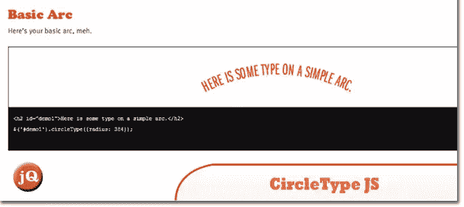
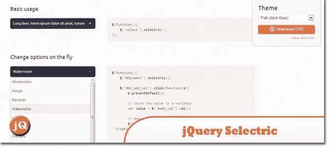
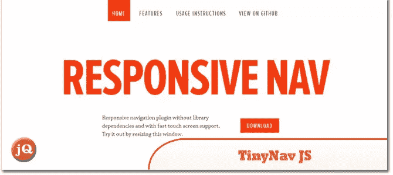
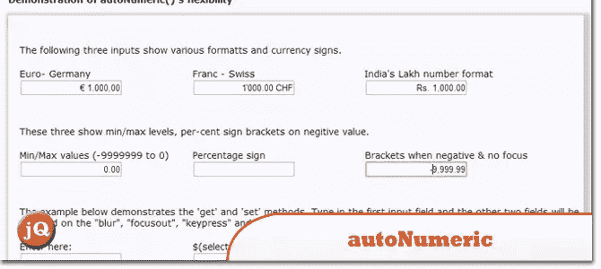
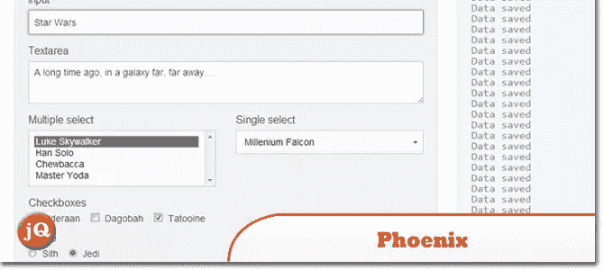
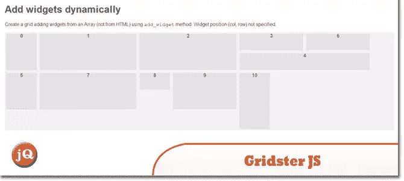
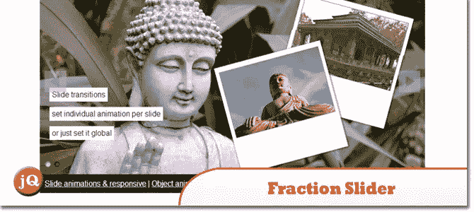

# 10 个新的很酷的随机 jQuery 插件:2014 年 1 月版

> 原文：<https://www.sitepoint.com/10-cool-random-jquery-plugins-3/>

在这篇文章中，是另外一组 **10 个新的酷的随机 jQuery 插件**。真的值得一查！享受=)

## 1.圆圈型 JS

一个小的(2.7kb) jQuery 插件，让你在一个圆上设置类型。

 
[源+演示](http://circletype.labwire.ca/)

## 2.jQuery 选择器

一个 jQuery 插件，旨在帮助设计和操作 HTML 选择

 
[来源](http://lcdsantos.github.io/jQuery-Selectric/) [演示](http://lcdsantos.github.io/jQuery-Selectric/demo.html)

## 3.廷尼夫足球俱乐部

一个很小的 jQuery 插件(443 字节缩小和 gzipped ),将

 
[来源](http://tinynav.viljamis.com/) [演示](http://responsive-nav.com/)

## 4.自动数字 1.9.18

一个 jQuery 插件，当你在表单输入时自动格式化货币和数字。它支持大多数国际数字格式和货币符号，包括在欧洲、北美、南美、亚洲和印度使用的格式和符号(lakhs**)。

 
[源+演示](http://www.decorplanit.com/plugin/)

## 5.姆伦斯

放大镜在沉思，它

 
[源+演示](http://mlens.musings.it/)

## 6.凤凰

用于保存表单字段值的 jQuery 插件

 
[源+演示](http://kugaevsky.github.io/jquery-phoenix/)

## 7.jQuery Raty

生成可定制星级的插件。

 
[源+演示](http://wbotelhos.com/raty/)

## 8.Gridster JS

Gridster 是一个 jQuery 插件，允许从跨越多列的元素构建直观的可拖动布局。您甚至可以动态地在网格中添加和删除元素。

 
[来源](http://gridster.net/) [演示](http://gridster.net/#demos)

## 9.jQuery 无限轮播插件

一个 jQuery 插件，允许你以类似旋转木马的方式展示任意数量的图像和视频。与其他一些旋转木马不同，无论您如何导航，无限旋转木马都会以连续循环的方式显示项目。

 
[源+演示](http://www.catchmyfame.com/catchmyfame-jquery-plugins/jquery-infinite-carousel-plugin/)

## 10.分数滑块

是一个用于图像/文本滑块的 jQuery 插件。它允许你在每张幻灯片上制作多个元素的动画。您可以设置不同的动画方法，如从某个方向淡入淡出或过渡。

 
[来源](http://jacksbox.de/stuff/jquery-fractionslider/) [演示](http://jacksbox.de/fractiondemos/example_slides.html)

## 分享这篇文章