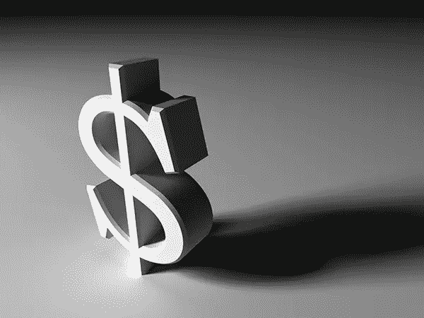
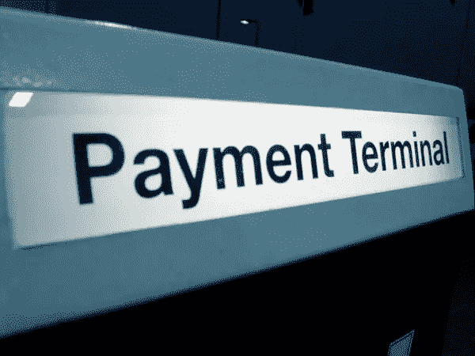
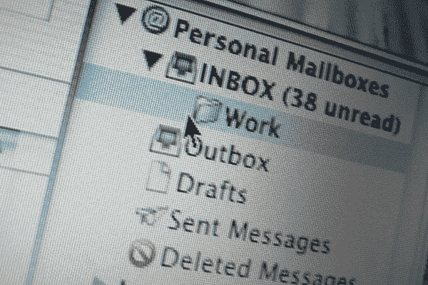

# 取悦设计客户的 10 种经济有效的方法

> 原文：<https://www.sitepoint.com/10-cost-effective-ways-to-delight-your-design-clients/>

设计行业竞争非常激烈。总有人紧跟在你的后面，等着接受下一份工作或抢走你的客户。在这个市场上，能够留住你的客户是至关重要的，而回头客将是让你度过商业低迷的唯一方法。在当前的经济形势下，能够取悦你的客户是必须的。你想给客户最大的回报，而不增加账单。这里有一些省钱的方法来取悦你的客户，让他们一次又一次地回来。

### 附加标志

当你为一个客户设计一个 logo 的时候，你也要在设计中投入大量的工作，并提出基本的概念。你花了很多时间将想法、概念和品味结合在一起，创造出合适的图标形象或文字来代表他们的公司。很多时候，设计师会简单地创建标志的打印文件，他们只给他们的客户。eps 文件。但是，您可以将他们的徽标保存为透明的 PNG 文件，以便在他们的网站上看起来很棒，为将来可能的需要保存一个黑白版本，或者为视频 bug 或其他微妙的用途保存一个小型简化版本。我见过很多次，一家公司专业地设计了他们的标志，但他们自己对他们的标志进行了微小的修改，不完美的结果损害了他们的公司形象。

### 给他们的可交付成果添加一个简单的额外项目

为你的客户增加免费赠品总是好的。每个人都想让自己的钱得到最大的回报。假设您的客户需要一个徽标设计、名片和一封直邮邮件。你可以在几分钟内轻松地设计一个简单的信头，这增加了你的服务的价值，而且不会花费你太多的工作时间和精力。客户说他们“不喜欢惊喜”，但这种惊喜永远是最受欢迎的。

### 项目完成后的跟进

通常，设计师会为他们的客户完成一个项目，收取他们的钱，而客户将永远不会再听到他们的消息。更好的做法是等一两个星期，然后打电话询问他们是否喜欢他们的新标志、文具、网站等。你可以询问他们得到的结果，根据他们的反应，你也许可以提供帮助，或者可能的额外设计工作。这样可以保持收入的流入。也许他们最初没有去网站，因为他们不想花这笔钱，但他们的客户正在抱怨他们没有网站的事实。这就是你来救援的地方。

### 提前交货

这对你最好的回头客特别有效。优先考虑他们，让他们觉得自己是“好客户”，让他们知道你重视他们的业务，你照顾那些和你有合作历史的客户。把这些客户放在其他工作之前会让他们非常高兴，他们会让他们回到你身边，因为他们知道他们是你客户名单上的第一位。

### 在预算内完成项目

如果你给客户一个估价，但你真的想让他们大吃一惊。你可以试着以比平时更快的速度工作。虽然你不能对每个项目都这样做，但当项目以低于预算的速度完成时，客户肯定会很高兴。任何人总是乐于省钱的。将这一点与之前关于提前交付的建议结合起来，你的客户会毫不犹豫地回到你身边。从长远来看，在预算内交付一个项目实际上可能会让你赚更多的钱，因为会有推荐和回头客。

### 接受多种支付方式

接受多种形式的付款会让你的客户更容易向你付款，也会增加你迅速获得付款的可能性。付款通常是客户最关心的问题，所以为你的客户制定公平、方便的条款是让他们开心的好方法。例如，你可以以较低的月成本分散他们的付款，这将使他们摆脱财务约束。您也可以接受多种支付方式，如 Paypal、支票和信用卡。Paypal 和 Square 让你能够使用 Android 或 iOS 手机在网站上接受信用卡支付。让支付变得容易意味着他们不需要做特殊的安排，不需要经历艰辛，也不需要去银行取钱，最终，你会得到好处。

### 免费提供专业见解

只需几分钟的专业注意力，你就可以分析客户的竞争对手，找出弱点和机会。然后，你可以提供建议或策略，帮助他们利用自己在其他业务上的优势。你可以免费提供的另一项服务可能是分析他们的网络流量，或他们的搜索引擎优化质量，并根据你的发现提出一些建议。这显然是一个非常受欢迎的姿态，但它也可能导致额外的工作，如为网站创建更好的副本或利用你已经确定的机会。

### 社交媒体的帮助

为你的客户创造一个好的活动是很棒的，但是如果他们的广告范围有限，他们的效果也会很差。为企业建立社交媒体页面确实有助于推广他们的业务和服务，虽然这对你来说可能很容易，但对你的客户来说，这可能是一个令人困惑的技术术语“黑匣子”。建立一个基本的 Google+页面，或本地商业页面，以及脸书和 Twitter 账户很快，可以让那些被社交媒体和随之而来的所有行话和建议吓倒的客户对你感激不尽。

如果他们已经有强大的社交媒体存在，也许你可以花几分钟时间查看他们的页面，提出他们可以改进或获得更好结果的建议，例如添加视频，提供证明，展示他们的工作样本等。你的客户不需要为此付出任何代价，而且你看起来像个英雄。

### 提供更多额外服务

你可以考虑增加额外的服务来帮助你的客户，增加你服务的价值。如果你建立了一个网站，它的目的是收集感兴趣的个人的电子邮件地址，你可能会预料到下一步，为他们设计一个看起来专业的时事通讯模板。这将使他们的活动更成功，大多数电子邮件服务提供基本的模板开始，节省你的额外费用。你将开始看起来不像一个设计师，而更像一个 T2 顾问。

### 在假期记得他们

你可能会批量购买节日贺卡寄给你的家人，那么为什么不购买足够的贺卡来满足你的客户呢？这是非常好的个人风格，可以增加商业关系，如果是你自己设计的，也可以证明你出色的设计技巧。

这有几个原因对你有帮助:它向客户表明你关心他们，在假期里一直想着他们。你让他们感觉像人，而不仅仅是你钱包里的美元符号。另一个很好的原因是，它使你人性化，他们把你看作一个企业和一个有家庭的人，这将有助于让客户对你产生好感。最后，它可以是一个个人的，发自内心的广告，展示你的才华和创造力。基于一张巧妙的、精心设计的节日贺卡，你会感到惊讶吗？

### 结论

拥有稳定的回头客是让你的生意持续下去的唯一因素。获得并留住客户的最好方法之一就是为他们做得更多，有一些不需要花费很多时间和金钱的方法。这是一个很好的做法，只是记住不要走极端。向你的顾客展示你关心他们，他们不仅仅是你的收入来源，这会建立他们的信任，你的生意也会因为积极的口碑宣传而增长。

你呢？你会做什么事来取悦你的客户？

## 分享这篇文章