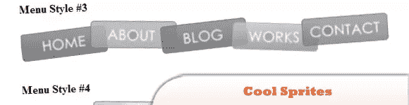
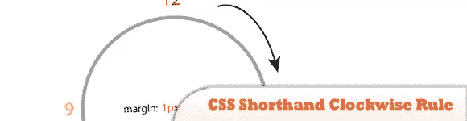
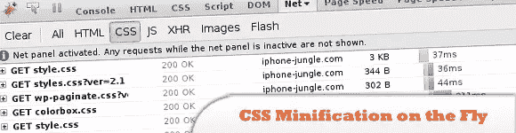
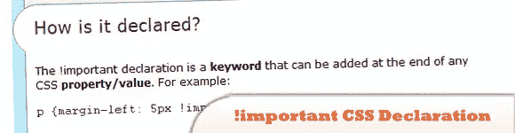
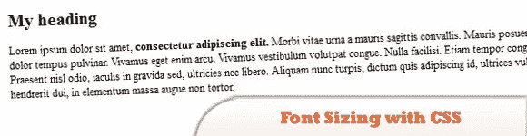
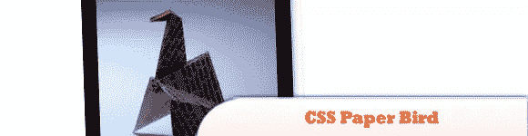
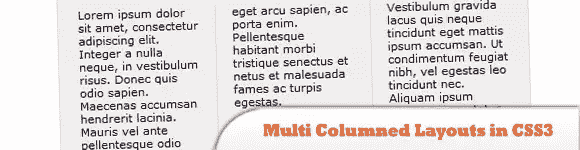

# 10 必须知道 CSS 和 CSS3 的资源和工具

> 原文：<https://www.sitepoint.com/10-css-css3-resources-tools/>

今天，我们与你分享作为一名网页设计师/开发者你需要知道的 10 个“你必须知道的”CSS & CSS3 工具和资源。您可以在此查看 Internet Explorer 支持的 CSS3 功能。虽然，CSS3 令人兴奋的新特性都不被支持，但是微软宣布在 IE9 中支持 CSS3，所以请祈祷好运，享受阅读今天插件列表的乐趣吧！

相关帖子:

*   [**10 种实验性 JS/CSS3 编码技术**](http://www.jquery4u.com/dynamic-css-2/10-brilliant-jscss3-coding-techniques/)
*   [**10 IE CSS3 和 HTML5 现代浏览器模仿**](http://www.jquery4u.com/browser-tweaks/10-ie-modern-css3-html5-tips/)

## 1.酷精灵——使用 CSS 精灵的自由重叠 CSS 菜单

在本教程中，你将学习如何使用 CSS 精灵来叠加 CSS 菜单。

  
[源+演示](http://deepubalan.com/blog/2010/01/18/cool-sprites-free-overlapped-css-menu-using-css-sprites/)

## 2.CSS 速记顺时针规则

基本上第一个是上边距，所有的东西都是顺时针向右，向下，向左。你们中的许多人可能熟悉这条规则，但也有许多人是从 CSS 开始的，所以我希望这篇教程能有所帮助。

  
[源+演示](http://www.vcarrer.com/2010/01/css-shorthand-clockwise-rule.html)

## 3.动态缩小 CSS

一个简单的解决方案来缩小你的网站中嵌入的 CSS。这将涉及到 PHP 和 Apache 重写规则的一点知识。

  
[源+演示](http://shinylittlething.com/2010/01/20/css-minification-on-the-fly/)

## 4.的重要性！重要的 CSS 声明

就算了！重要声明应该谨慎使用，它是一个非常有用和强大的表达式，在我们的 CSS 世界中它应该占有一席之地。这篇文章提供了一个指南，介绍声明是什么，它做什么，以及你应该如何使用它。

  
[源+演示](http://www.webcredible.co.uk/user-friendly-resources/web-dev/css-important.shtml)

## 5.CSS 字体大小指南

在这篇文章中，我试图阐明这个问题并解释原因，以及在网络上调整字体大小的不同方法。

  
[来源](http://www.frederikvig.com/2010/02/guide-to-font-sizing-with-css/)
[演示](https://www.frederikvig.com/wp-content/uploads/font-sizing/font-sizing.html)

## 6.CSS 纸鸟

在这个实验中是我前段时间做的一系列不同光照位置的纸鸟(鹤)照片，我创建了一个纯 CSS 效果——没有 JavaScript——根据滚动条的位置一张一张地显示它们。

  
[源+演示](http://www.romancortes.com/blog/css-paper-bird/)

## 7.纯 CSS 的多级多列多菜单

该菜单的最大特点是:
>纯 CSS(仅 CSS)
>多级
>多列
>单页多菜单:)
>基于 HTML 列表
>支持所有最新的浏览器
>支持 IE6 并带有条件注释
>兼容浏览器
>轻量级
>灵活性–可用于 3 级或更高级别–只需稍加调整即可

  
[来源](http://www.wittysparks.com/2009/09/21/build-multi-level-multi-column-multi-menus-with-pure-css/)
[演示](http://apps.wittysparks.com/tutorials/css/pure_css_menu.html)

## 8.图像中的投影:没有额外的标记

投影为任何设计增加了额外的眩光。它们可以在任何图形编辑器中轻松完成；然而，这在 web 编程中有点棘手。

  
[来源](http://www.nitinh.com/2010/01/drop-shadow-in-images-no-extra-markup/)
[演示](http://www.nitinh.com/static/css-shadow/index1.html)

## 9.带有 jQuery 和 CSS3 的漂亮的自定义对话框

在本教程中学习如何用 jQuery 和 CSS3 创建一个漂亮的自定义对话框。

  
[来源](http://www.queness.com/post/1696/create-a-beautiful-looking-custom-dialog-box-with-jquery-and-css3)
[演示](http://www.queness.com/resources/html/project/index.html)

## 10.CSS3 中的多列布局

允许您以报纸风格的形式创建专栏。新闻网站和博客欢欣鼓舞！让我们看看如何使用新模块创建列。

  
[来源](http://jamesblogs.com/2009/07/31/multi-columned-layouts-in-css3/)
[演示](http://jamesblogs.com/wp-content/tutorials/multi-column-module-css3/)

## 分享这篇文章