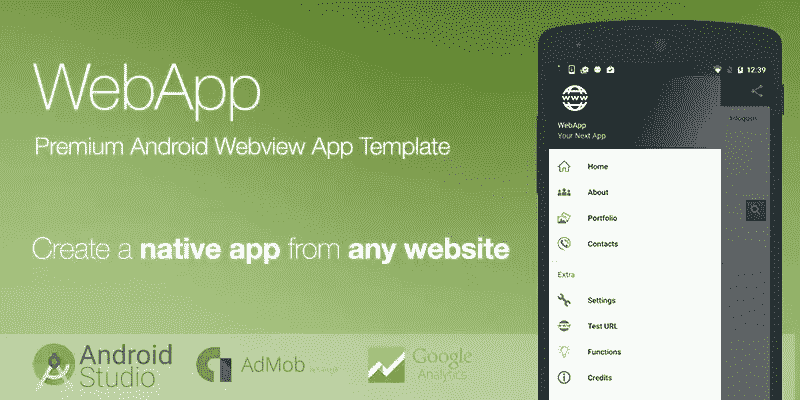
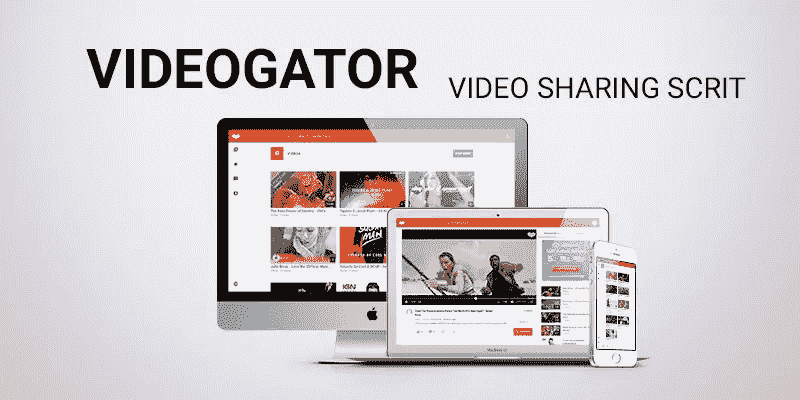
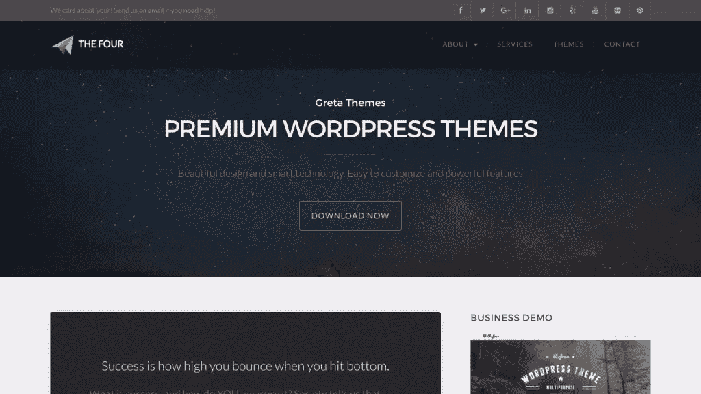
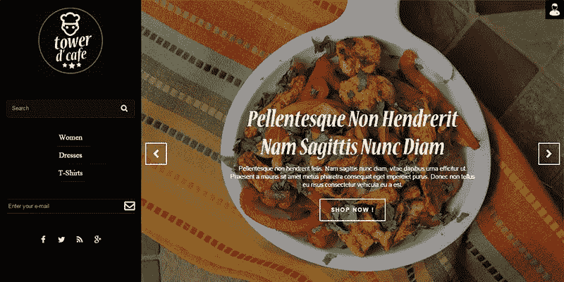
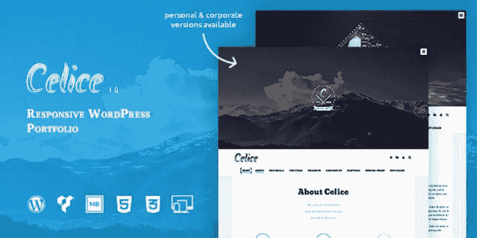
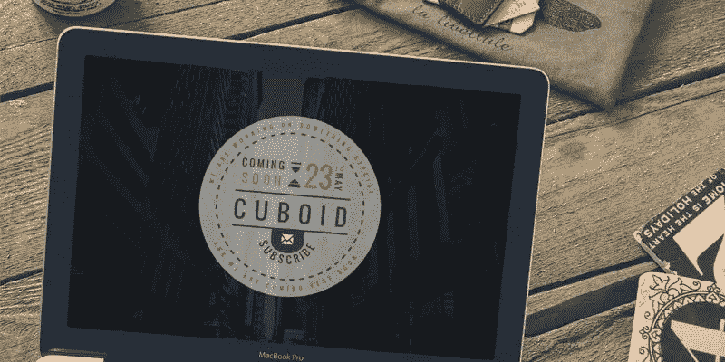

# 帮助你启动下一个项目的 10 项开发资产

> 原文：<https://www.sitepoint.com/10-development-assets-to-help-you-kickstart-your-next-project/>

*本文由[主编](https://www.codester.com/)赞助。感谢您对使 SitePoint 成为可能的赞助商的支持。*

从头开始一个新的网站或应用程序是令人兴奋的，即使前路漫漫。不过，我们可以走一条不同的路，这条路包括采购现成的代码资产并在它们的基础上进行构建，减少开发时间，更好的是降低开发成本。让我们来看看来自 [Codester](https://www.codester.com/) 的 10 项开发资产，它们可以帮助你启动下一次创业。

Codester 是一个在线市场，向寻求上述优势的开发人员和设计人员出售现成的 web 开发资产。Codester 出售 [PHP 脚本](https://www.codester.com/categories/10/php-scripts)、 [app 模板](https://www.codester.com/categories/44/app-source-codes)、 [WordPress 主题](https://www.codester.com/categories/33/wordpress-themes)、 [PrestaShop 主题](https://www.codester.com/categories/63/prestashop-themes)、 [logo 模板](https://www.codester.com/categories/61/logo-templates)和[图形](https://www.codester.com/categories/57/graphics)。

## web App–高级 Android Webview 应用模板

曾经想开发一个 Android 应用程序，但不知道如何开发？使用 [WebApp](https://www.codester.com/items/1873/webapp-premium-android-webview-app-template) 你可以像往常一样用 HTML 和 CSS 编写应用程序，然后在 WebApp 中配置一些设置，这样应用程序就可以在应用程序框架中显示网站，没有浏览器界面，只有一个应用程序图标。

由于你不会使用原生 Android 代码，你需要确保你的“应用”运行得很快。性能是关键，否则这个应用看起来只是一个应用，但它会让人感觉像一个缓慢的网站——你的用户 T2 会知道其中的区别。如果你让你的 HTML 网站感觉像一个应用程序，使用 Android 平台可以*大幅*削减你的应用程序开发成本。

## 视频分享 PHP 脚本

视频是最容易理解的媒体类型之一，它有趣、信息丰富，参与度通常高于其他类型的媒体。Videogator 是一个 PHP 脚本，以谷歌的“材料设计”风格提供了一个基本的社交视频共享网络，并带有一个易于使用的 CMS 来帮助管理从 YouTube、Vimeo 和 Dailymotion 导入的视频。

## 单词搜索游戏——Android 源代码

[单词搜索:马来语](https://play.google.com/store/apps/details?id=com.lipandes.game.carikata)是一款非常成功的安卓 4 星单词搜索应用，下载量超过 50 万次。您可以使用[源代码](https://www.codester.com/items/1160/word-search-game-android-source-code)作为基础来构建您自己版本的应用程序(使用不同的语言或不同的设计)。

## the four–Business WordPress 主题

如果你需要一个反应灵敏的网站设计，有漂亮的排版和大量灵活的选项，用干净的 HTML 和较少编译的 CSS 构建，那么这个 WordPress 主题就是为你准备的。更好的是，它内置了社交分享按钮和两个令人惊叹的(高度可定制的)“大标题”组件——一个用于主页，另一个用于博客布局。

## WordPress 移动包专业版

WordPress Mobile Pack 允许你在移动设备上运行不同版本的网站。你不是提供一个完整的响应解决方案，而是将你的内容重新用于移动网络，并将其设计成一个跨平台的移动*应用*。你甚至可以将它添加到设备的主屏幕上，全屏查看“应用程序”。它仍然是 HTML，但是没有了移动网站真正不需要的桌面版标记。

## 塔楼咖啡厅-餐厅 PrestaShop 主题

全世界有 250，000 家电子商务商店使用 PrestaShop，这是任何想在网络世界中开店的人的理想选择。虽然针对餐馆主题的网站，但这款[易于安装的 PrestaShop 主题](https://www.codester.com/items/989/tower-cafe-restaurant-prestashop-theme)可以适用于任何库存，凭借其黑暗的视觉美感和侧边栏导航，您可以展示一些简约和时尚的东西。

## 杀死僵尸——Unity 游戏源代码

如果文字搜索不是你的风格，也许一个 24 级僵尸杀手手机应用程序会更适合你。应用内购买(删除广告)和 Unity 广告都受支持，由于该应用是用 Unity 构建的，它可以在 iOS，Android 甚至 Windows 设备上工作。如果你不确定如何修改或编辑源代码，有一个方便的视频可以帮你做到这一点。

## ce lice——多用途 WordPress 主题

Celice 是一个灵活的、多用途的 WordPress 主题，适用于个人和公司团队。它使用 Google 字体、jQuery 和 Bootstrap CSS 框架——所有你知道和喜欢的代码资产。更好的是，CSS 和 JavaScript 代码被精简了，所以你仍然可以确保快速的加载时间，这对于任何具有流畅滚动动画的网站来说都是必不可少的。

## 长方体–即将推出的 HTML 模板

[长方体](https://www.codester.com/items/1535/cuboid-coming-soon-html-template)是一个以城市为主题的“即将到来”模板，它使用(除了常见的谷歌字体、jQuery 和 Bootstrap) [CircleType.js](http://circletype.labwire.ca/) 和 [Lettering.js](http://letteringjs.com/) 来创建最令人惊叹的网络排版——没错，那个令人敬畏的圆形“即将到来”徽章完全由 HTML 制成——不需要沉重的图像。

## Planax 响应式 WordPress 主题

Planax 是一个响应式的 WordPress 主题，面向代理、博客、电子商务商店和几乎所有其他东西。它还配备了一系列 WordPress extras，如 Drag & Drop Page Builder、Visual Composer 和 Revolution Slider，更不用说主题也是 SEO 和 retina-ready，具有一系列灵活的布局选项；一个你可以自己制作的主题。

## 分享这篇文章