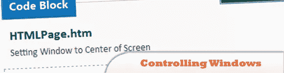
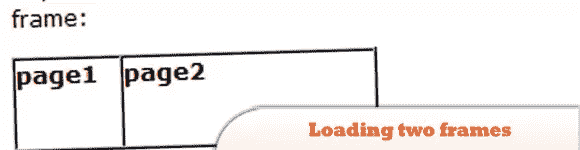
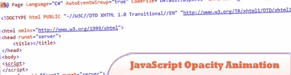
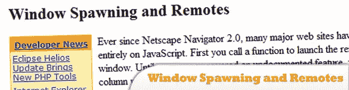
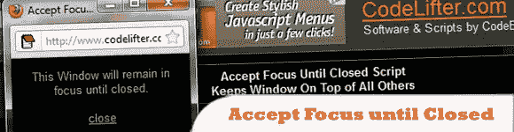
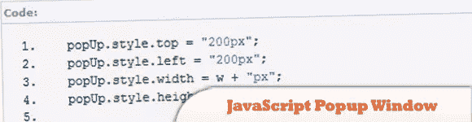
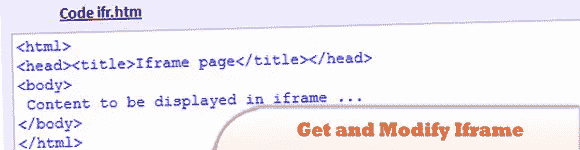
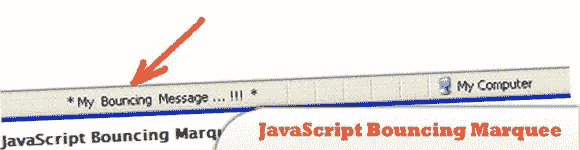
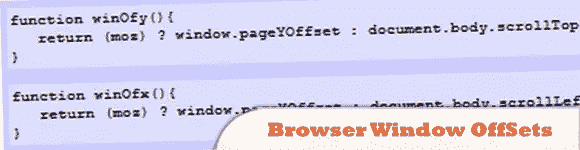

# 10 JavaScript 对话框/窗口教程

> 原文：<https://www.sitepoint.com/10-dialog-window-tutorials/>

我们都知道 JavaScript 为网页添加功能，执行有用的任务，验证数据等等。你也应该知道 JavaScript 和 jQuery 可以用来创建一些很棒的对话框。放弃警告窗口…这里有一些教程让你开始！尽情享受吧！

以下是之前一些关于对话框的帖子:

*   [14 个 jQuery 模态对话框](http://www.jquery4u.com/windows/14-jquery-modal-dialog-boxes/)
*   [10 个 jQuery 预警窗口和提示](http://www.jquery4u.com/plugins/10-jquery-alert-windows-prompts/)
*   [移动对话框](http://www.jquery4u.com/tag/jquery-mobile-dialog/)

## 1.用 JavaScript 控制窗口

了解如何使用 JavaScript 控制你的窗口。

[来源](http://javascriptatoms.com/2011/04/controlling-windows-with-javascript/)

## 2.用一个链接加载两个帧

本教程向你展示了如何使用 JavaScript 通过一个链接加载两个框架。

[来源](http://www.javascriptkit.com/javatutors/twoframes1.shtml)

## 3.JavaScript 不透明度动画

在您的网站上创建带有控件的不透明度动画。在本教程的最后，你将能够使用 JavaScript 使一个控件变暗和变暗。

来源

## 4.窗口生成和远程

本文讨论了用 HTML 和 JavaScript 启动新窗口的不同方法。

## 5.接受焦点直到关闭

一个小代码片段，允许你将一个窗口保持在所有其他窗口的“顶部”,直到关闭。

[来源](http://www.codelifter.com/main/javascript/acceptfocus1.html)

## 6.JavaScript 弹出窗口

创建弹出窗口可能是最常用的 JavaScript 用例之一。然而，现在传统的弹出窗口并不是最好的选择，因为它几乎总是被浏览器屏蔽。在本教程中，我将学习如何用 JavaScript 创建一个基于层的弹出窗口。

[来源](http://www.javascriptf1.com/tutorial/javascript-popup-window.html)

## 7.使用 jQuery 自定义 LightWindow

了解如何从头开始创建自己的 LightWindow。

[来源](http://www.prodevtips.com/2010/10/01/custom-lightwindow-with-jquery-from-scratch/)

## 8.获取和修改 Iframe 内容

在本教程中，我们将介绍如何使用 JavaScript 从主页获取和修改 IFRAME 中的内容。

[来源](http://www.coursesweb.net/javascript/get-modify-content-iframe_t)

## 9.网页浏览器状态栏中的 JavaScript 弹跳字幕文本滚动

在 JavaScript 的帮助下，我们可以在网页浏览器的状态栏中添加我们最喜欢的消息，并使用滚动字幕效果。

[来源](http://www.xfunda.com/index.php?option=com_content&view=article&id=108:javascript-bouncing-marquee-text-scroll-at-status-bar-of-web-browser&catid=40:javascript&Itemid=75)

## 10.浏览器窗口偏移(滚动补偿器)

当你试图保持一个动态元素在视图中或者通过返回页面滚动的像素数来发现用户是否滚动了页面时，这两个方便的函数非常有用。

[来源](http://www.maxxblade.co.uk/bits/browser_window_offsets.php)

## 分享这篇文章