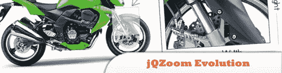
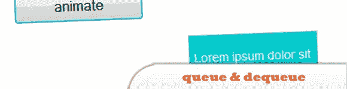
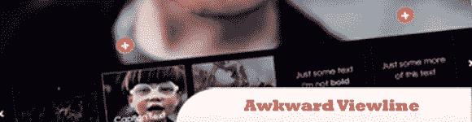
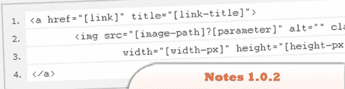
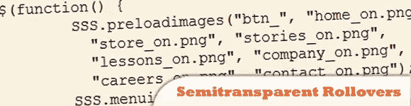
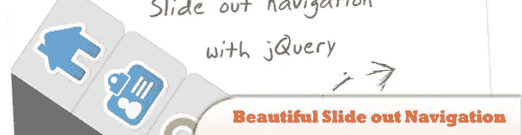
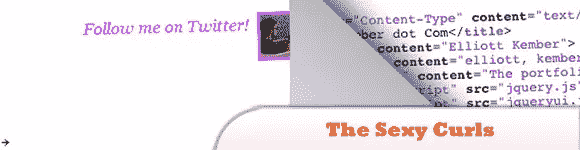
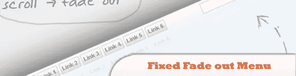
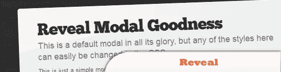

# 10 个易于使用的 jQuery 插件

> 原文：<https://www.sitepoint.com/10-easy-jquery-plugins/>

这里我们收集了另外一组 10 个随机易用的 jQuery 插件——我们知道你喜欢它们！你们中的大多数人可能以前没有使用过或见过这些插件，所以值得一看！然而你已经看到了 *8。性感卷发 jQuery 插件*不过还是蛮牛逼的！

相关帖子:

*   [**随机 jQuery，JavaScript &网上开发东西——2011 年 9 月**](http://www.jquery4u.com/random/september-2011/)

## 1.jQZoom 进化

是一个 JavaScript 图像放大器，构建在流行的 jQuery JavaScript 框架之上。jQzoom 是一个非常棒而且非常容易使用的脚本，可以放大你想要的东西。

  
[源+演示](http://www.mind-projects.it/projects/jqzoom/)

## 2.伫列与取消伫列

一对核心数据工具，帮助你添加你自己的定制动画。

  
[来源](http://jqueryfordesigners.com/api-queue-dequeue/)
[演示](http://jqueryfordesigners.com/demo/queue.html)

## 3.尴尬的视线

是一个 jQuery 插件，现在集成了笨拙的 Showcase——一个 JavaScript 框架 jQuery 插件。

  
[来源](http://www.awkwardgroup.com/sandbox/awkward-showcase-a-jquery-plugin/)
[演示](http://demo.awkwardgroup.com/showcase/)

## 4.jQuery-Notes 1.0.2

是一个简单易用的 jQuery 插件，允许你给你的网站或博客上的任何图片(甚至是外国图片)添加注释。

  
[来源](http://jquery-notes.rydygel.de/index.php)
[演示](http://jquery-notes.rydygel.de/samples.php)

## 5.快速翻转 jQuery 翻转插件变得更快更简单

jQuery QuickFlip 获取任何一段 HTML 标记，然后像翻卡片一样翻过来。效果类似于 iPhone 上的 UI 动画。

  
[源+演示](http://jonraasch.com/blog/quickflip-2-jquery-plugin)

## 6.半透明翻车

背景具有渐变效果，因此您可以看到发光的边框在鼠标经过时平滑流动。用 gif 试试吧！

  
[源+演示](http://coderseye.com/files/demos/pngrollover/index.html)

## 7.漂亮的滑出式导航:CSS 和 jQuery 教程

导航几乎是隐藏的——只有当用户将鼠标悬停在项目旁边的区域时，项目才会滑出。这给了一个美丽的效果，使用这种技术可以节省你的网站空间。

  
[来源](http://tympanus.net/codrops/2009/11/30/beautiful-slide-out-navigation-a-css-and-jquery-tutorial/)
[演示](http://tympanus.net/Tutorials/FixedNavigationTutorial/)

## 8.性感卷发 jQuery 插件

是一个由 Elliott Kember 开发的开源 jQuery 插件，它可以让你分享页面折叠的美妙之处。

  
[源+演示](http://elliottkember.com/sexy_curls.html#none)

## 9.修正淡出菜单:CSS 和 jQuery 教程

目的是当用户滚动时，有一个固定的导航跟随用户，并通过淡出和变得几乎透明来微妙地显示自己。当用户悬停在它上面时，菜单会再次变得不透明。

  
[来源](http://tympanus.net/codrops/2009/12/11/fixed-fade-out-menu-a-css-and-jquery-tutorial/)
[演示](http://tympanus.net/Tutorials/FixedFadeOutMenu/)

## 10.揭示:jQuery 模态变得简单

易于实现，跨浏览器兼容现代浏览器(当然有一些优雅的降级)，重量轻，只有 1.75KB。这对你来说意味着它是快速，性感和公正的工作。

  
[源+演示](http://www.zurb.com/playground/reveal-modal-plugin)

## 分享这篇文章