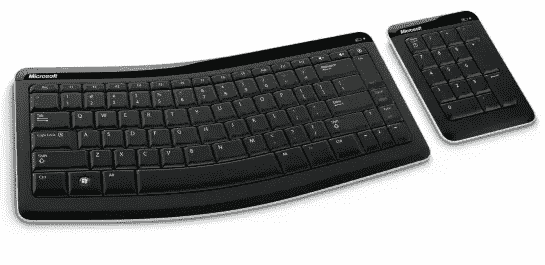
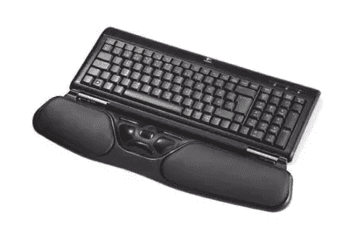
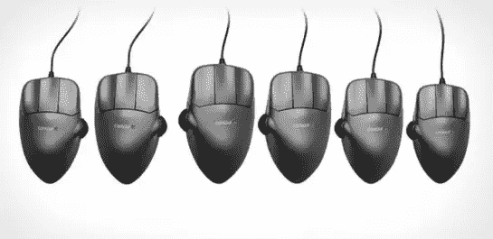
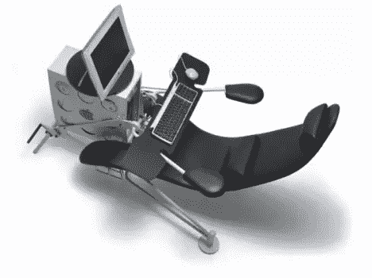
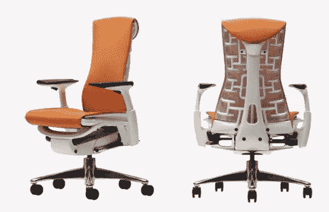
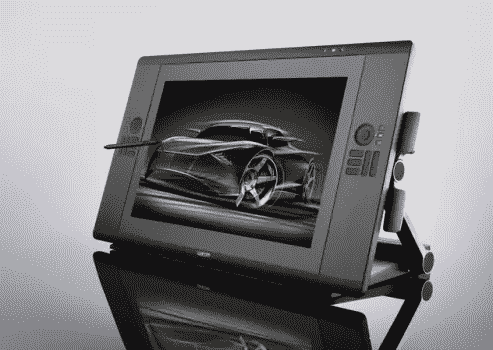
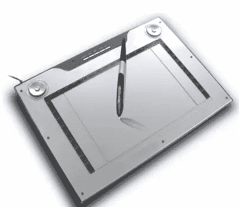
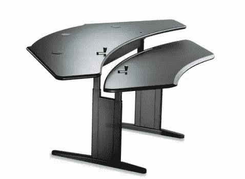
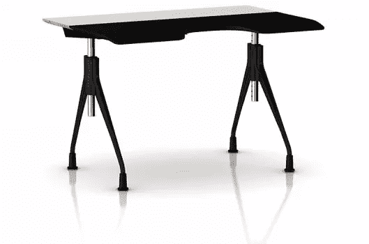

# 10 个符合人体工程学、值得流口水的设计小工具

> 原文：<https://www.sitepoint.com/10-ergonomic-drool-worthy-design-gadgets/>

作为一名设计师，你花了无数的时间在电脑后面处理客户的工作，打磨自己个人项目的像素。不管你是否意识到，如果你不适当照顾自己，长时间坐在电脑前会对你的健康有害。我绝不是说你不应该设计或者设计会伤害你的健康，但是如果没有适当的预防措施，你可能会把自己引上一条包含关节和颈部疼痛等问题的道路。

像生活中的所有事情一样，太多的好东西——在这种情况下是设计——在某些方面可能是有害的。不管你是这个行业的新手还是老手，你都应该照顾好你的身体，还有什么比给自己配备一些令人愉快的新玩具来进一步发挥你的才能更好的方式呢……同时照顾好你的健康？即使是年轻的设计师也要处理腕管和关节炎等问题。我认为我们都应该得到一些符合人体工程学的爱，谁不喜欢用健康利益来证明购买的合理性呢？这里有一些工具可以改善你的健康，同时给你在办公桌前度过的每一分钟增添一些乐趣。

### 蓝牙移动键盘 6000

Microsoft Bluetooth Mobile Keyboard 6000 不仅利用了蓝牙技术，还允许您在空间不足时收起数字键盘。

### 运动优势

Kinesis Advantage 是一款真正独一无二的键盘。居中的按键用于拇指，指尖的凹陷用于正确、自然的手部定位。

### Rollermouse 免费 2

这可能看起来只是一个键盘，但它有一个内置在腕带中的集中式鼠标，以实现舒适和经济的移动。

### 轮廓鼠标

手的大小变化很大，但很少有老鼠有自己的尺寸来适应。这些鼠标甚至提供给左手鼠标用户。

### 网上冲浪符合人体工程学的电脑椅

这个瑞典杰作是使你的台式电脑现代化的终极方式。

### 赫曼米勒体现椅

这种椅子经过精心设计，为那些长时间在办公桌前辛勤工作的人提供平衡、脊椎调整、舒适和其他健康益处。

### Wacom Cintiq 24HD

Wacom 的高清晰度 LED 平板电脑意味着您在另一个屏幕上进行跟踪时不再需要看着一个屏幕。直接在屏幕上绘图，并立即看到清晰的结果。

### Aiptek 媒体平板电脑 14000U

这款出色的德国工程产品体积庞大，反应灵敏，对压力非常敏感，拥有数十个可定制的按键和宏指令。

### Biomorph 个人办公桌

名副其实的 Biomorph 个人书桌可以根据您的具体需求量身定制，将房间角落变成理想的书桌位置。每层的表面和标高完全由用户决定。

### 信封桌

赫曼米勒以巧妙的设计而闻名，这件作品也不例外。桌子的整个表面根据需要轻轻地滑向或滑离使用者。

你有喜欢的人体工程学设计小工具吗？以上哪一个是你最想要的？

## 分享这篇文章