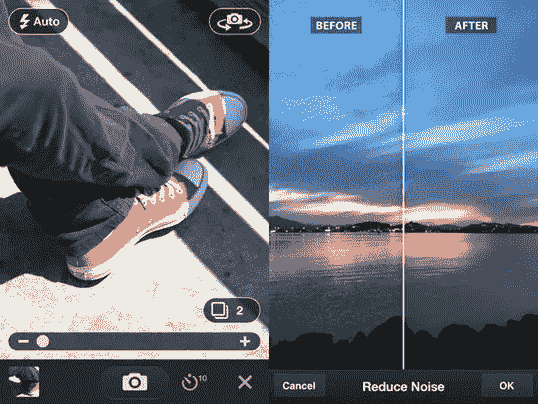
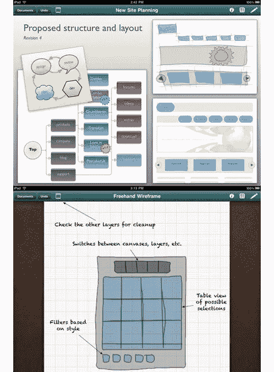
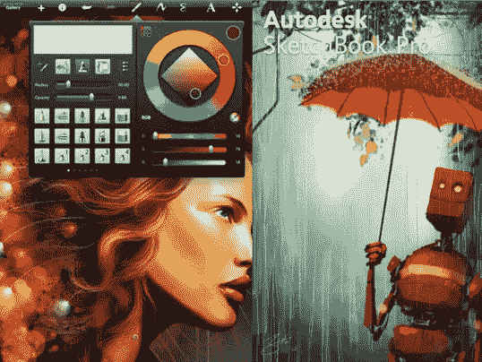
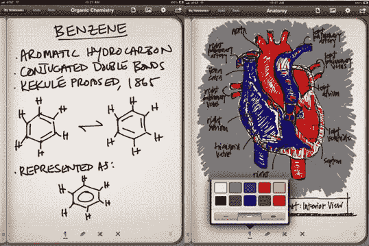
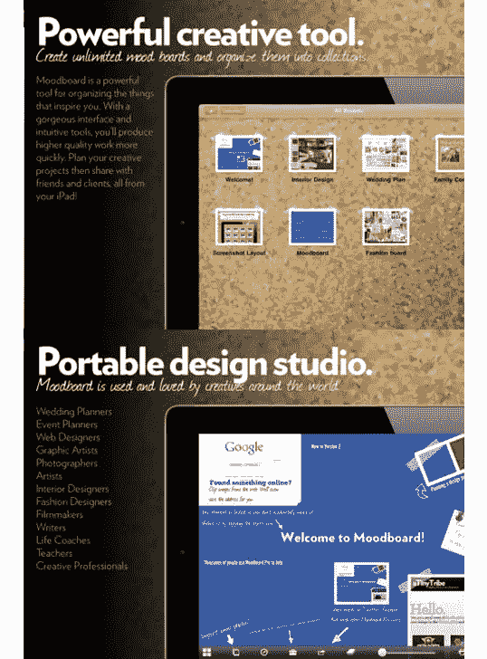
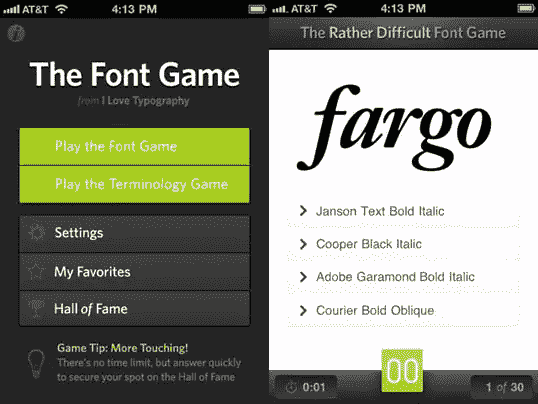
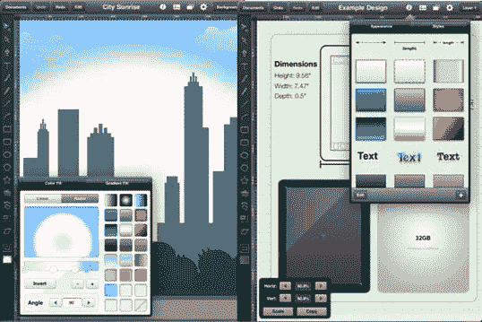
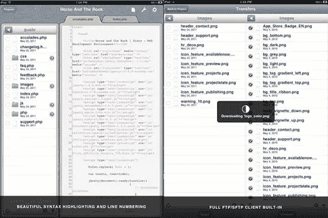
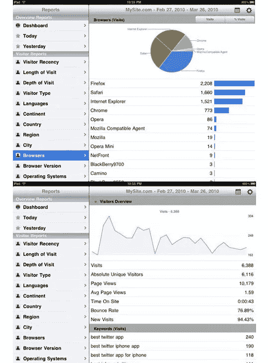

# 网页设计师必备的 10 款 iPad 应用

> 原文：<https://www.sitepoint.com/10-essential-ipad-apps-for-web-designers/>

在不断增长的应用商店中，你很难找到一套可以作为设计师依赖的 iPad 应用程序，大多数文章都充满了不相关的应用程序，如社交媒体客户端，以及具有重复功能的应用程序，如三个做相同事情的 vector 应用程序。在这篇文章中，我想帮助你把范围缩小到十个非常有用的应用程序，每个应用程序都有一个特定的功能，这对任何网页设计师都是有用的。你可能已经找到了适合你口味的替代品，但对于拥有新 iPad 的设计师来说，这应该是一个很好的起点。

### Adobe 创意

Adobe Ideas 是一款适用于 iPad 的草图应用程序，可以让你在外出时记下想法，以供日后参考。它位于列表之首，因为这可能是 iPad 上设计工作最常见的用例——为以后捕捉想法。这个应用程序可以让你配置调色板，使用不同的笔刷大小和不透明度，并且非常简单。尽管它有局限性，但一些用户已经用它做了一些有趣的事情，正如你在截图中看到的。奇怪的是，在花了 5.99 美元购买应用程序后，如果你想使用图层，你需要再花 0.99 美元购买应用程序内的内容。

### Adobe Photoshop Express

Photoshop Express 是一个方便的创意伴侣，可以让你编辑照片，从基本的裁剪、颜色调整到一些新奇的效果。从表面上看，它是一款免费应用，但和 Ideas 一样，它通过 4.99 美元的名为 Camera Pack 的应用内购买提供了额外的功能。相机包引入了降噪，相机定时器和自动审查。该应用还具有通过 Photoshop.com 分享的功能。

### 全格拉夫勒

延续了让你在 iPad 上充实想法并在电脑上实现的应用程序的风格， [OmniGraffle](http://itunes.apple.com/us/app/omnigraffle/id363225984?mt=8) 是一个很棒的应用程序，用于线框布局和开发网站地图。和 Omni Group 的大多数 iOS 应用一样，它的价格高达 49.99 美元，但受到强烈推荐。如果你是 Mac 版的 OmniGraffle 用户，你甚至可以在 iPad 上使用大部分模板库。

### SketchBook Pro

如果你想要一些有力量的东西， [SketchBook Pro](http://itunes.apple.com/us/app/sketchbook-pro/id364253478?mt=8) 可能是值得一试的应用程序。SketchBook 拥有一套高质量的笔刷和其他工具，包括动态对称绘制，是少数几个经常用于创建伟大艺术的应用程序之一，这些艺术不需要以后在计算机上“真正”重做。售价 4.99 美元，你可以在 1024 x 768 像素分辨率的 iPad 2 上获得多达 12 层，或 2048 x 1536 像素分辨率的 4 层。

### 倒数第二的

倒数第二个是一个笔记本应用程序，你可以做笔记，画简单的草图，甚至包括照片，这使它成为一个组织大量想法甚至 moodboarding 的伟大应用程序。倒数第二个是 1.99 美元，非常便宜，你可以通过各种应用内购买来扩展它，给你任务列表、音乐纸等模板。

### 情绪板

[Moodboard](http://itunes.apple.com/us/app/moodboard/id355893506?mt=8) 顾名思义，是一款纯粹用来创建 moodboards 的 app。这些板允许设计师通过放置和处理颜色、字体、图像和纹理，有机地为他们的下一件作品建立美学，无论你是在网站上工作，还是在印刷品上工作，还是在整个品牌的外观上工作。Moodboard 会给你 9.99 美元。

### 字体游戏

字体游戏不会帮助你完成任何设计工作，但它会帮助你在一个充满更有经验的设计师的房间里保持领先。它被描述为一个“快速识别字体”游戏，帮助你训练自己识别 1000 多种流行字体。甚至有一个游戏模式来识别类型的元素，如上升和倾斜的茎。字体游戏 1.99 美元。

### iDraw

如果没有 vector 应用程序，这个集合将是不完整的，而 [iDraw](http://itunes.apple.com/us/app/idraw/id363317633?mt=8) 就扮演了这个角色。只需 8.99 美元，你就可以使用矢量来创建插图，如果 OmniGraffle 的价格对你的口味来说太贵了，你甚至可以制作图表。iDraw 使用 Dropbox 集成和 SVG 导入和导出来确保您可以使用桌面资源在 iPad 上进行设计。

### 爱好

没有什么比当你远离电脑却无能为力的时候，发现自己设计的网站上有一个 bug 更让人恼火的了。在你回到办公室之前，这可能会一直困扰着你。幸运的是，使用 [Gusto](http://itunes.apple.com/us/app/gusto/id364906873?mt=8) 连接到 FTP 并修改代码很简单，价格为 9.99 美元，并带有所有的附加功能，如处理多个文件的标签和语法颜色编码。

### 高清分析

我不知道有多少设计师能忍住每天查看网站流量的冲动。iPad 上有免费的谷歌分析应用程序，但我还没有发现一个不差的——所以价格合理的 6.99 美元的分析高清版(T1)是一个很好的选择，可以完善你为设计师收集的 iOS 应用程序。许多这样的应用程序允许访问你的谷歌分析数据的有限子集，但有了这个，你可以访问网络应用程序本身的任何数据。它也非常适合与客户开会，因为它可以把你的数据变成很棒的全屏图表。

我们错过了你最喜欢的与设计相关的 iPad 应用程序吗？为 iPad 的小兄弟 iPhone 找到了一个与设计相关的好用途？请在评论中告诉我们。

## 分享这篇文章