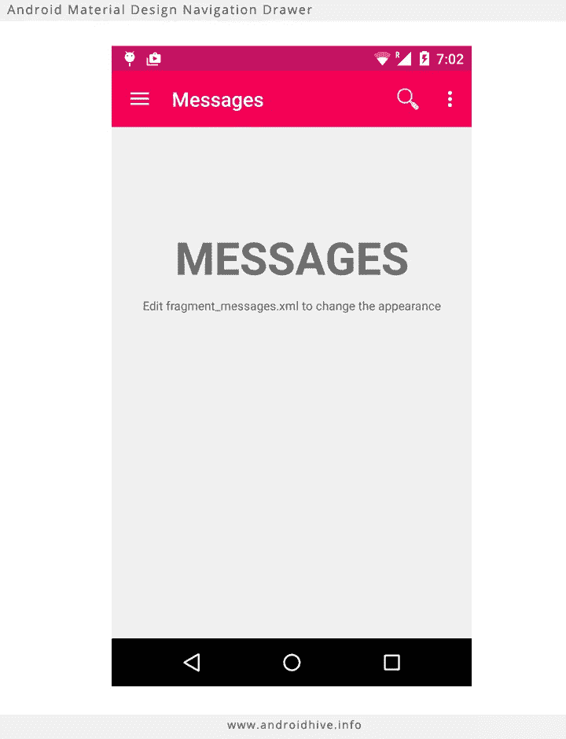
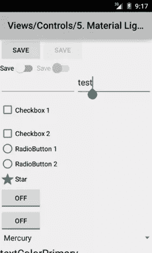
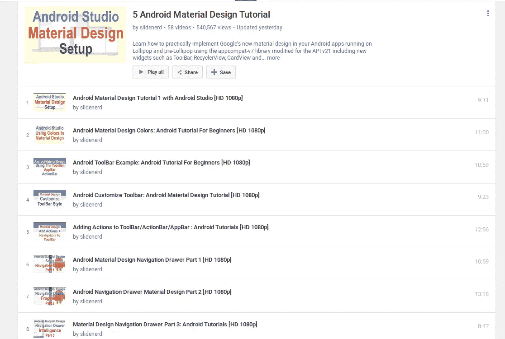
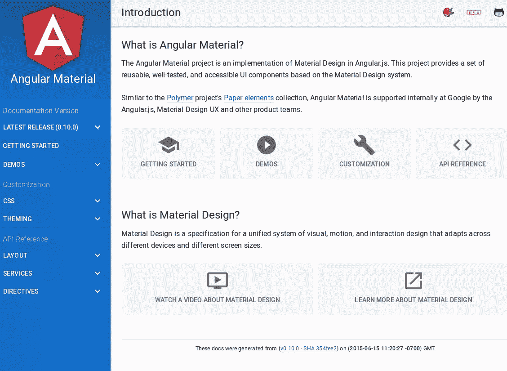
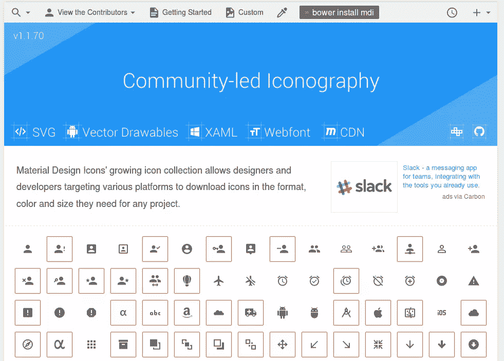
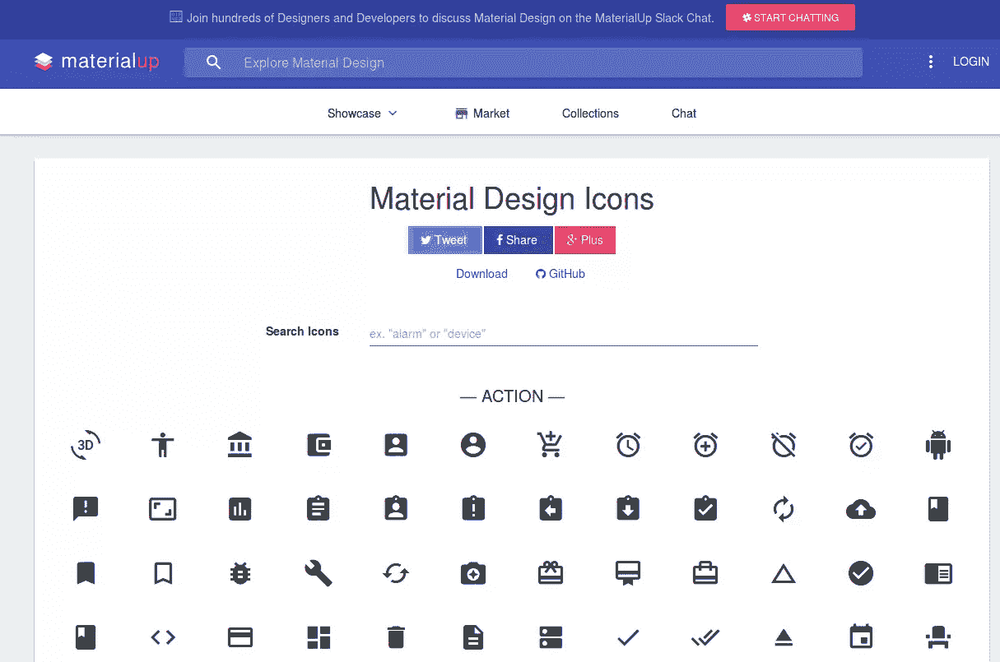
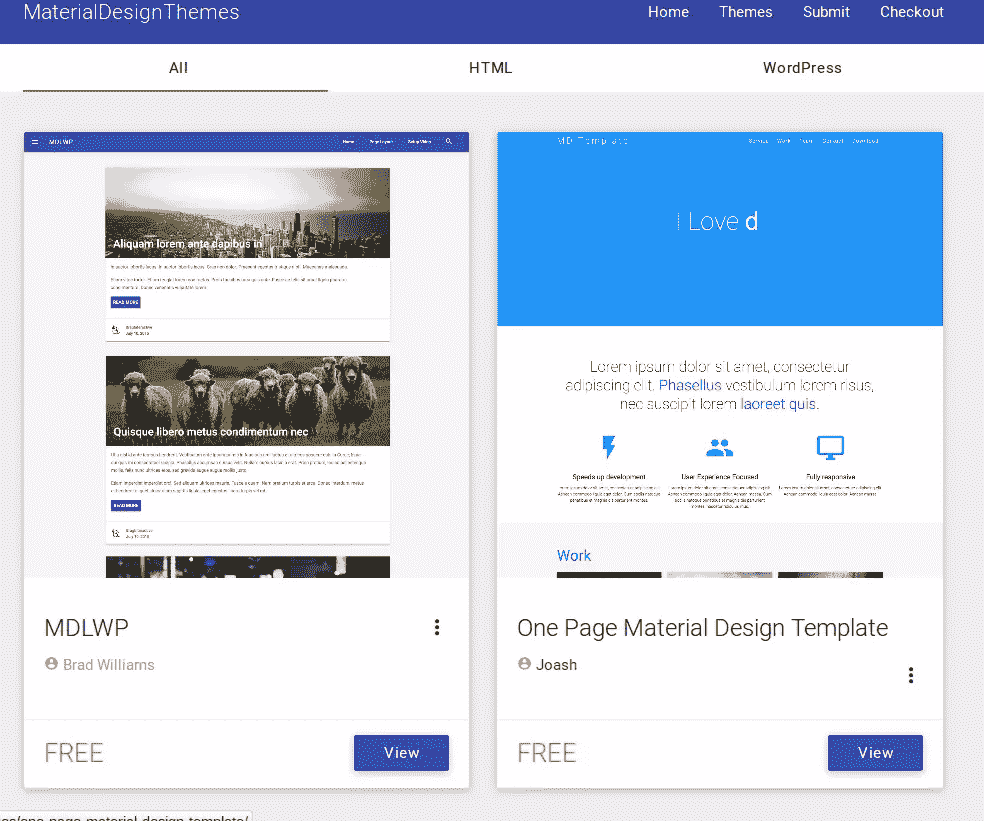
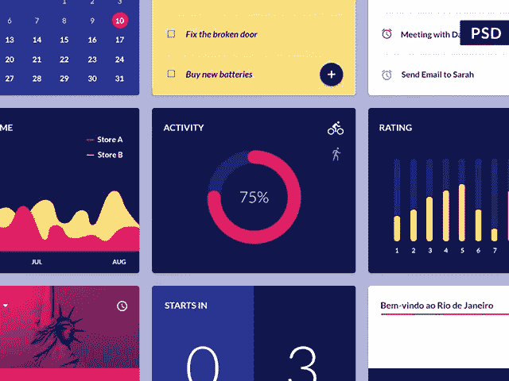
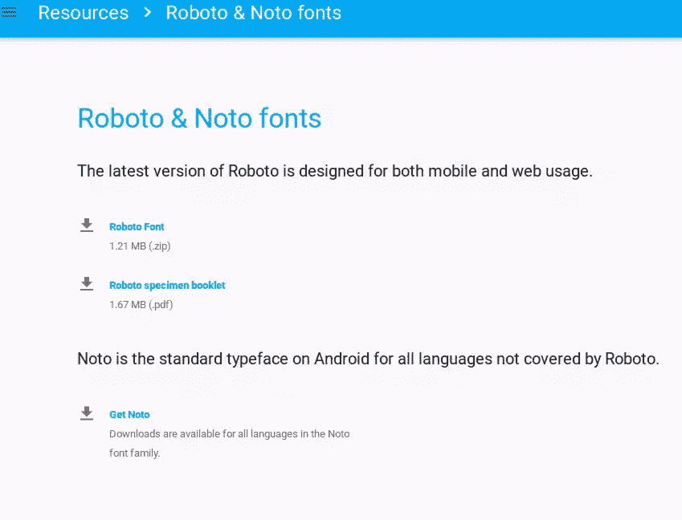

# 10 种基本材料设计资源和教程

> 原文：<https://www.sitepoint.com/10-essential-material-design-resources-and-tutorials/>

当谷歌宣布 Material Design 时，它在 Android 社区内外引起了轰动。对于谷歌的材料设计来说，这是一条漫长的道路，但这段旅程是值得的。

材料设计已经不是什么新鲜事了，但还是和发布日一样受欢迎。材料设计有很多好的资源，但是如果你对这些概念不熟悉，你可能不知道从哪里开始。

最合理(但不是最容易)的起点是材料设计规范本身。

## 1.谷歌的材料设计规范和教程

Google 的[材料设计规范](http://www.google.com/design/spec/material-design/introduction.html)是对材料设计主要目标和原则的介绍。它定义了基本概念，如材料、材料属性、立面、动画、样式、布局、组件、图案等。

如果你是一名开发人员，你可能也想阅读[开发人员材料设计](http://developer.android.com/training/material/index.html)指南。

## 2.Android 材料设计入门

规范是有帮助的，但是没有什么比一本关于如何实现规范的实用指南更好的了。其中最好的是 [Android 入门材质设计](http://www.androidhive.info/2015/04/android-getting-started-with-material-design/)教程。这是一个深入的，但易于遵循的教程，我全心全意地推荐它。我敢打赌，即使那些有更多经验的人也会从本教程中学到很多。

## 3.Android 开发教程:棒棒糖材质设计

另一个我觉得有用的深度教程是[这个](http://www.intertech.com/Blog/android-development-tutorial-lollipop-material-design/)。它涵盖了材质设计的主要方面，如视图立面和阴影，裁剪视图，SVG 可绘制性，如调色板和颜色提取，动画等。与之前的教程不同，本教程没有包含太多代码。它更像是对规范的澄清，而不是产生可交付成果的教程。

## 4.材料设计视频教程

很多设计师更喜欢视频教程，所以这里有一系列关于材料设计的[视频教程](https://www.youtube.com/playlist?list=PLonJJ3BVjZW6CtAMbJz1XD8ELUs1KXaTD)。对于视频教程狂热者来说，这是一个宝库，因为该系列有超过 58 个视频教程，其中大多数都超过 10 分钟长！它们是高清教程，所以你不会因为模糊的图像而过度疲劳。

## 5.材料设计框架

材料设计框架是材料设计的重要组成部分，没有它们很难工作。我不打算详细讨论这些，因为它们已经包含在 2015 年文章中使用的[五大材料设计框架中。本文包括您需要的主要框架，例如:](https://www.sitepoint.com/top-5-material-design-frameworks-use-2015/)

*   [角状物质](https://material.angularjs.org/latest/#/)
*   [物化](http://materializecss.com/) ( [你可能也想看看他们的教程](https://scotch.io/tutorials/make-material-design-websites-with-the-materialize-css-framework)，真的很不错)
*   [材料界面](http://material-ui.com/#/)
*   [MUI CSS 框架](https://www.muicss.com/)
*   [聚合物](https://www.polymer-project.org/0.5/docs/elements/material.html)

## 6.材料设计图标

图标是一个你离不开的界面组件。虽然你可以自己设计你的图标，但是现成的图标更有效。例如，这些[材料设计图标](https://materialdesignicons.com/)是一个很好的选择。这是一个很大的图标集合，其中大部分是由社区提交的，可以免费使用。在使用它们之前，尤其是在商业项目中，一定要检查它们的版权/许可。

## 7.更多材料设计图标

因为你永远不会有太多的图标(或其他设计资源)，所以一定要看看这些[材料设计图标](http://www.materialup.com/tools/icons)。这些更易于导航，因为它们是按主题排列的，即警报、通信、内容、设备、导航、通知等。

## 8.材料设计主题

可以快速定制的现成材料设计主题是必备的。[材料设计主题](http://materialdesignthemes.com/themes/)是一个很好的起点。该网站提供 HTML 和 WordPress 的免费和付费主题。

## 9.材料设计部件 PSD UI 套件

这里有一个[小部件套件](http://freebiesbug.com/psd-freebies/material-design-widgets/)，一包 16 个彩色材料设计的小部件。这些小工具是 PSD 格式的，你可以使用 Photoshop 来编辑它们。我喜欢这个包的原因是它干净的形状和明亮的颜色。

## 10.robo 与 Noto Fonts

Roboto & Noto 字体是材质设计的官方字体。你不能没有他们！Roboto 是为移动和网络使用而设计的。它附有一本样本小册子。

Noto 是 Roboto 没有涵盖的所有语言的标准 Android 字体。你可以访问 [Roboto & Noto fonts](https://www.google.com/design/spec/resources/roboto-noto-fonts.html) 页面并从那里下载。

我可以继续列举有用的材料设计资源，因为有太多了！你可能会发现阅读这篇[用材料设计制作 Android 原型](https://www.sitepoint.com/prototyping-android-material-design/)的文章很有用。它回顾了伟大的原型资源，如 [IconShock 材质设计图标](http://www.iconshock.com/material-design-icons/)、[材质设计 UI 套件](http://theultralinx.com/2014/11/material-design-ui-kit-free-download)、[草图就绪材质设计图标](http://www.sketchappsources.com/free-source/916-material-design-icons-bounds-sketch-freebie-resource.html)和 [CSS 材质设计按钮](http://codepen.io/iraycd/pen/dHrxv)。

## 结论

材料设计在这里停留。熟悉它是有意义的。我希望文章中包含的资源对新手和更高级的设计师/开发人员都是一个很好的开始。让我知道你喜欢和哪些人一起工作，我欢迎任何意见。

## 分享这篇文章