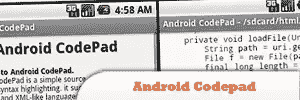
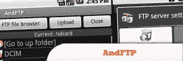
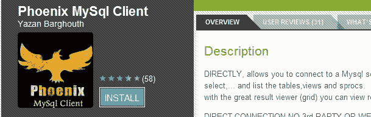
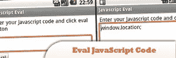
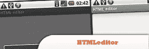
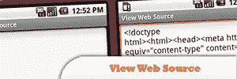
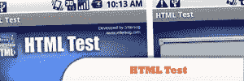
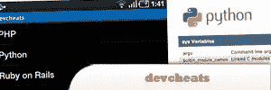

# 面向网络开发者的 10 款免费安卓应用

> 原文：<https://www.sitepoint.com/10-free-android-web-dev-apps/>

Here is a list of FREE Android applications that can certainly help with your mobile development, especially Android based devices. You may not have heard of most of them but they’re definitely worth checking out! Enjoy!

以下是之前一些关于 Android 移动开发的帖子:

*   [10 款 Android 风格的 jQuery 插件](http://www.jquery4u.com/mobile/10-android-style-jquery-plugins/)
*   [50 个 jQuery 移动开发技巧](http://www.jquery4u.com/tag/jquery-mobile-dialog/)
*   [移动开发的 10 个移动备忘单](http://www.jquery4u.com/mobile/10-mobile-cheat-sheets-iphone-android-blackberry-app-development/)

## 1.Android 代码板

是一个简单的源代码查看器，支持所有类似 C、类似 Bash 和类似 XML 的语言，并根据文件自动突出显示语法。

[来源](https://market.android.com/details?id=com.bean.androidpad&hl=en)

## 2.和 FTP

是一个 FTP，SFTP，SCP，FTPS 客户端，允许您管理几个服务器。它带有一个设备文件浏览器和一个 FTP 文件浏览器。

[来源](http://www.lysesoft.com/products/andftp/)

## 3.凤凰 Mysql 客户端

允许您连接到 Mysql 服务器，执行 sql 查询、插入、删除、选择……并列出表格、视图和存储过程。

[来源](https://market.android.com/details?id=com.yazan.msc&hl=en)

## 4.评估您的 JavaScript 代码

是一个简单的工具，可以直接在你的 Android 上测试运行 JavaScript 代码片段。

[来源](https://market.android.com/details?id=jp.gr.netfort.dancer.JsEval&hl=en)

## 5.html 编辑器

是一个超级简单的 HTML、ASP、JS 和 CSS 编辑器，当您在移动中时可以快速编码。

[来源](http://www.androidzoom.com/android_applications/tools/htmleditor_bidc.html)

## 6.touchqode 代码编辑器

您可以查看和编辑带有语法高亮、自动完成和其他常规桌面 IDE 功能的源代码。目前支持 Java、HTML、JavaScript、Python、C++、C#和 Ruby。

[来源](http://www.touchqode.com/)

## 7.火狐极光移动版

目前可用于大多数 Android 2.0+设备。浏览器本身很棒，功能丰富，但伴随着一些当前可用的开发者扩展。

[来源](http://www.mozilla.com/en-US/m/firefox/channel/)

## 8.查看 Web 源

使用这个应用程序，你可以查看任何网站的源代码。您还可以选择文本、搜索文本、复制和粘贴 HTML，并与您的朋友和同事分享片段。

[来源](http://jimmithy.tumblr.com/tagged/View_Web_Source_App)

## 9.HTML 测试

这种交互式测试方法用于动态的真实环境中，以测试和培训专业的 Web 开发人员。

[来源](http://www.appbrain.com/app/html-test/org.intersog.html_test)

## 10.开发作弊软件

这个免费的应用程序是每个开发者的必备品，它提供了一个简明的清单集合，包括:PHP、Python、Ruby on Rails、jQuery、CSS、SEO、Apache、正则表达式、SVN、C++、Drupal、HTML5、Javascript、Mysql、WordPress 等等。

[来源](http://www.androidpit.com/en/android/market/apps/app/miquelco.devcheats/devcheats)

## 分享这篇文章