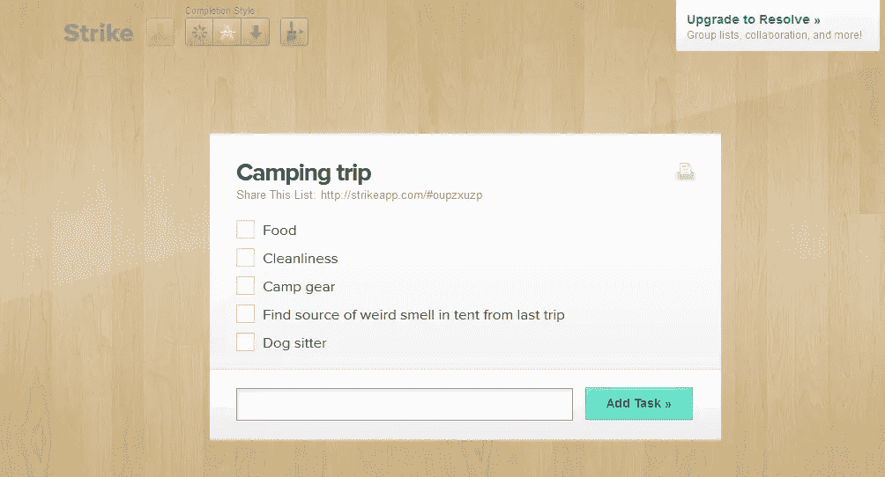
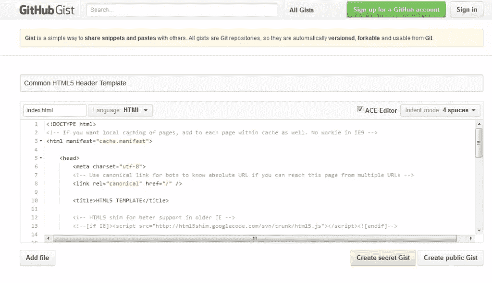
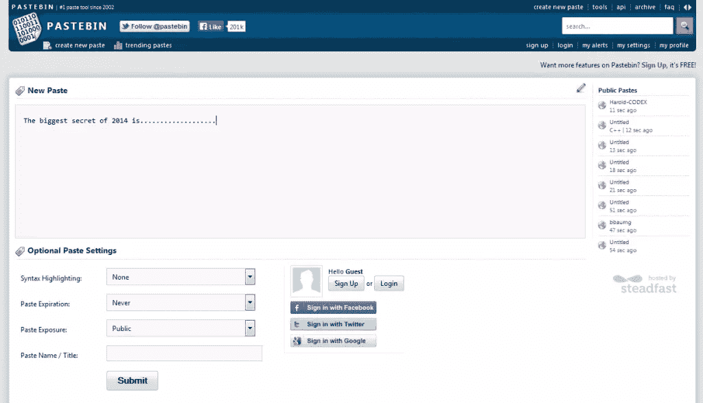
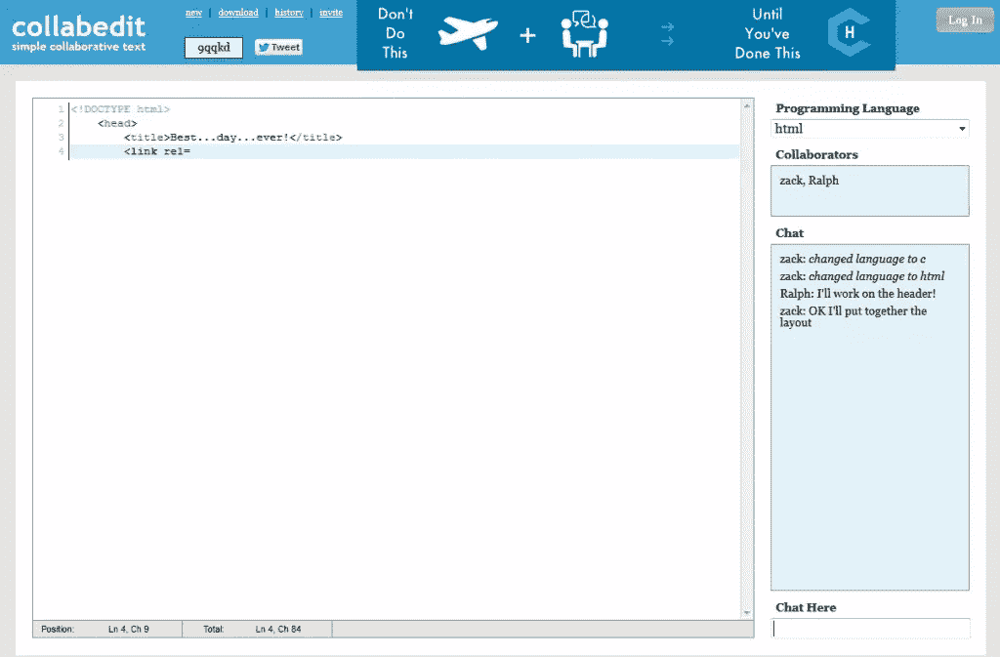
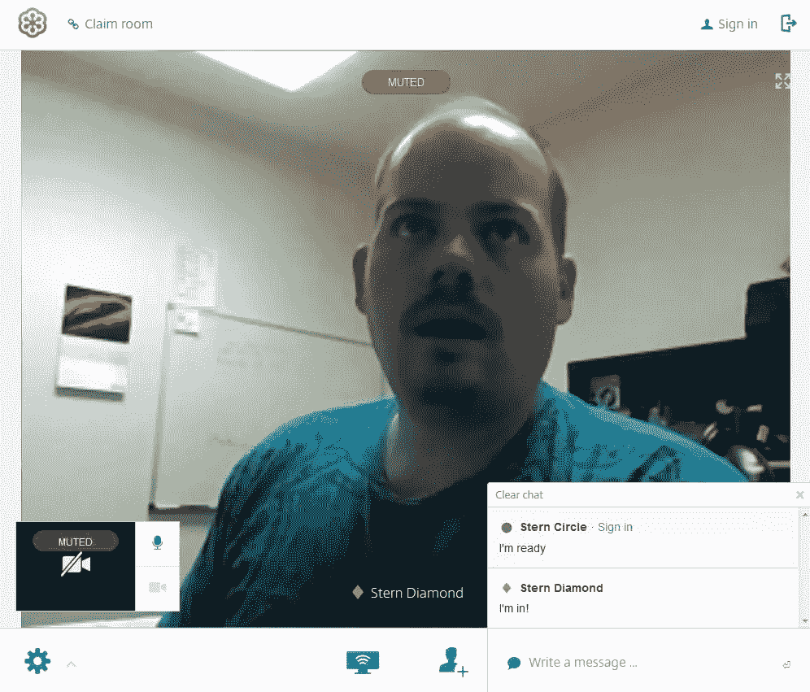
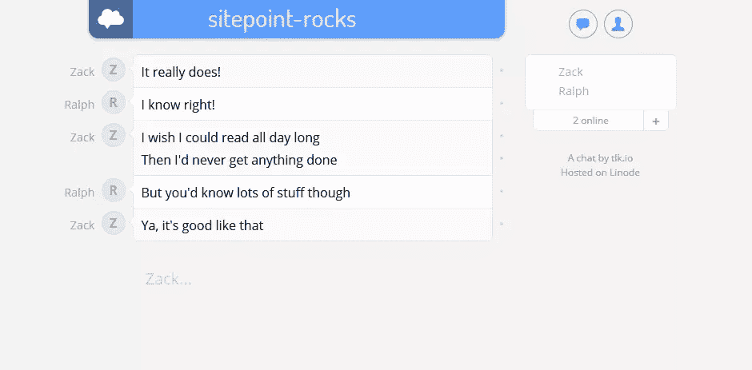
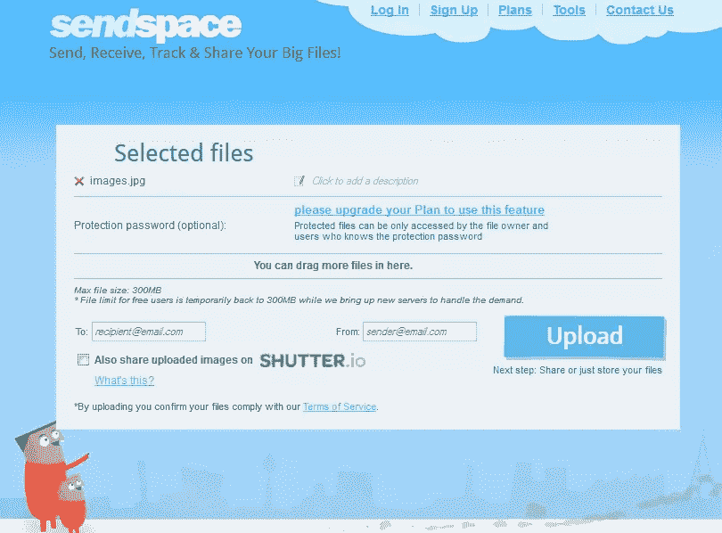
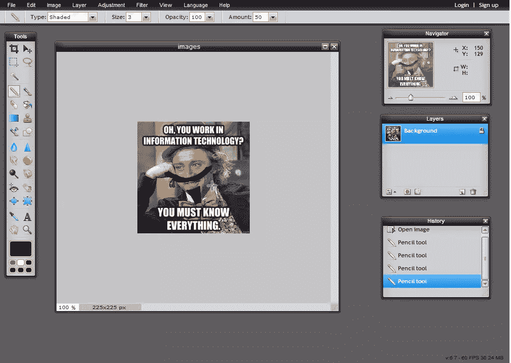
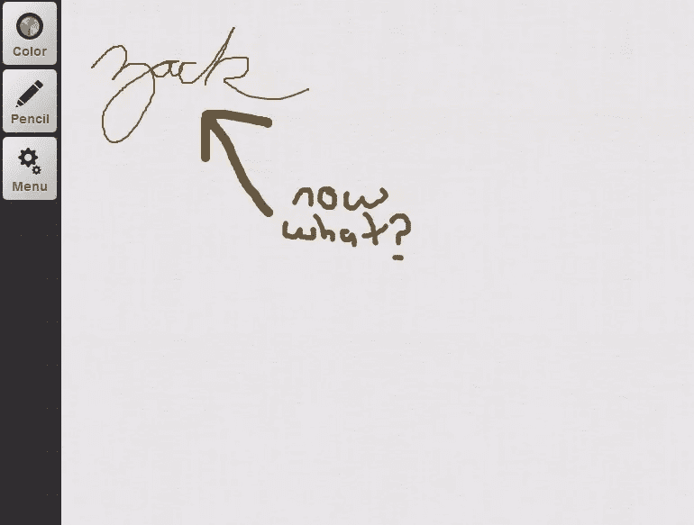

# 10 项便捷的一次性在线服务

> 原文：<https://www.sitepoint.com/10-handy-disposable-online-services/>

并非网上所有有用的东西都需要登录或下载软件。有些服务可以更灵活一点，也不那么永久。在这篇文章中，我将介绍一系列这样的服务，我称之为“一次性服务”。

在本文的上下文中，一次性服务是指无需帐户或注册即可免费使用的服务。通常只需打开有问题的网站，然后开始工作。通常会创建一个唯一的 URL，然后您可以与他人共享该 URL 以实现协作功能。

在这里，我将列出 10 种这样的服务，它们可能会帮助你即时协作或提高工作效率。在任何情况下，你都应该把它们收藏起来以备将来使用！

这些工具分为以下 10 类:

*   待办事项列表
*   代码共享
*   文本共享
*   协作编辑
*   视频会议
*   闲谈
*   代码演示
*   文件共享
*   图像编辑
*   白板

再加上一些额外的工具。我们开始吧

## 待办事项列表:罢工

罢工是 ZURB 的好人做的一个清单项目。与任何人分享这份清单，一起努力！

界面快速而干净，当你完成后，你可以打印出来。

## 代码共享:GitHub Gist

GitHub Gist 是一个代码共享工具，可以让你粘贴任意语言的代码。该代码可以被任何人使用，可以被复制或下载。

如果你是一名程序员，并且喜欢分享令人惊奇的代码片段，这是为你准备的。无论您是否关心共享您的代码片段，它仍然是一种免费且易于使用的为您自己或您的团队存储可重用代码片段的方法。

如果您登录 Github，Gist 将与您的帐户相关联，并将被完全版本化。如果你匿名创建了一个要点，你以后就不能再回来编辑或删除它了。Gists 可以设置为 public 或 private，private 只能通过知道 URL 来访问。

## 文本共享:Pastebin

大家都知道[Pastebin](http://pastebin.com/)；这是一个很酷的免费文本共享工具，它揭示了政府机密和无处不在的商业秘密。

如果你有什么想匿名对世界说的，那就在 Pastebin 上说。如果需要，您可以选择代码突出显示并选择语言。你可以让它公开上市，也可以不上市。

你也可以在你的粘贴上设置一个有效期，这样它就会过期并被自动删除。

Pastebin 并不是镇上唯一的游戏，有许多这种类型的服务，如 [Tinypaste](http://tny.cz/) 允许对你的粘贴进行密码保护，如果你注册，他们甚至可以在广告上分享利润。试试 [Hastebin](http://hastebin.com/) ，它有一个超级干净的界面，支持自动语法高亮等等。

就像 Github Gists 一样，如果你有一个帐户，你会获得一些额外的功能和与文本的关联。

## 协作编辑:Collabedit

与 Pastebin 或 Hastebin 类似， [Collabedit](http://collabedit.com/) 是一个文本共享工具，它还有一个额外的好处:与他人协作。只需点击“新建文档”并输入您的姓名，您将拥有一个与他人共享的 URL。任何“加入”你的文档的人都会被列出来，你们可以一起处理文本，也可以聊天。

这一类别中的另一个好工具是 [Stypi](https://code.stypi.com) 。只要您打开链接，就会自动生成一个新文档，并准备好进行共享和协作。

如果你是开发人员，你可以在你的*自己的项目*中安装 [Firepad](http://www.firepad.io/) 作为协作编辑器。流行的 Nitrous.io 使用 Firepad 作为其编辑器， [Socrates.io](http://socrates.io/) 也是如此，它允许在 Markdown 文档上进行协作。

Collabedit 创建了一个非常小的 URL，很容易向某人描述或以文本形式发送。不过你可能更喜欢 Stypi 的界面。

## 视频会议:GoToMeeting

免费的 [GoToMeeting](https://free.gotomeeting.com/) 应用程序可以让你安排一个多达 3 人的快速音频/视频会议。共享您的屏幕、麦克风和网络摄像头以及聊天功能。

如果你和你的合作者碰巧有谷歌账户(谁没有？)，那么当然 Google+ Hangouts 是一个非常受欢迎的会议工具，当你登录后，你可以相对轻松地使用它。

名为 [vline](https://vline.com/) 的 GotToMeeting 服务的替代服务，使用 WebRTC 技术提供另一种免费的在线即时视频聊天服务。

这里我们最后要提到的是 [appear.in](https://appear.in) ，支持视频、音频、聊天，每个房间最多八个人，也使用 WebRTC。

## 聊天:tlk。我

我们已经看到了基于视频、代码编辑或屏幕共享等的协作。 [Tlk.io](http://tlk.io/) 纯文字聊天，做的很好。

通过自定义 URL 名称立即创建一个房间(假设它没有被占用，并且您加入了其他人的房间！)如果你用 Twitter 登录，你可以对你的房间进行管理。

最酷的功能之一是你可以获得嵌入代码，将一个聊天框直接放入你自己的网站！

它支持@+用户名提及以及链接到其他频道的#标签。图像可以通过 URL 内嵌粘贴，链接可以自动点击。支持基本的降价语法。

## 现场代码演示:JSFiddle

如果你是一个 web 开发者，你可能已经离不开 [JS Fiddle](https://jsfiddle.net/) ！它是汇集 HTML、Javascript 和 CSS 以进行测试并与实时预览共享的最佳场所。

你会经常在 Sitepoint 上看到粘贴代码示例的“小提琴”,以及在整个堆栈交换网络和任何人们需要调试代码或显示某些东西如何工作或不工作的地方。

你可以访问 JSFiddle，使用内置的框架和扩展，比如 jQuery、Bootstrap、Mootools、YUI 等等，立即开始编码。

准备就绪后，您可以选择协作并邀请其他人与您一起编码。

JSFiddle 的一个接吻表哥是 [Codepen.io](http://codepen.io/) 。它有许多相同的特性，包括 Sass 和更少的支持，但是您必须通过 URL 而不是简单的复选框添加外部库，如 jQuery。Codepen 会在你输入的时候更新实时预览，但是 JSFiddle 要求你在准备好测试的时候点击“运行”按钮。

如果你只是想要 HTML/CSS，一个方便的服务是 [CSSDESK](http://www.cssdesk.com) 。您可以共享项目，但它本质上不是协作性的。

## 文件共享:发送空间

有时候你只需要给人们一个文件的链接！Sendspace 让你可以上传任何文件，并获得一个链接供任何人下载。体验不张扬，很轻松。一旦上传完毕，你甚至可以把它通过电子邮件发送给某人。

我使用的另一个竞争者是 [Speedyshare](http://www.speedyshare.com/) 。它有一个简单得多的界面，使用起来非常快。

当然，如果你有谷歌或微软账户，或者任何文件存储服务，你可能已经可以在需要的时候分享文件了。然而，这些服务允许更多的匿名，你不必担心在你的个人文件存储帐户中保存随机文件。

如果你想确保你的文件不会持续太久，尝试使用 [ExpireBox](http://expirebox.com/) ，它们会持续 2 天，然后文件就结束了。

## 图像编辑:Pixlr

[Pixlr](http://apps.pixlr.com/editor/) 是为数不多的值得使用的高级在线图片编辑 app。它支持图层，蒙版，图层样式，以及几乎所有你需要的基本工具和编辑。

以常用格式导出您的图像:JPG、PNG、BMP、TIFF，甚至自定义格式以便在 Pixlr (PXD)中重复使用。如果注册，您还可以导出到脸书、Picasa、Flickr 或 Pixlr 图库。

对于稍微更基本的编辑体验，可以试试 [picmonkey](http://www.picmonkey.com/) 。您可以添加许多一键式效果，然后进行调整，而不必担心图层和遮罩以及其他高级功能。如果你只是想裁剪，调整曝光和对比度等，先试试 Picmonkey。

## 白板:Awwapp

我的最后一个类别是协作白板。我个人觉得这些比什么都有趣，但对你来说可能更方便。Awwapp 有一个简单，干净的界面，只有几个工具和出口到 PNG。它支持手机和触摸屏，所以它可以是一种创建签名或任何你喜欢的方式。

如果您需要一些额外的编辑功能和工具，请尝试使用[网络白板](http://webwhiteboard.com/)。

对于最高级的选项，您必须尝试一下 [Twiddla](http://www.twiddla.com/) 。这款应用不仅有白板功能，还可以在网页快照上绘图，编辑文档或图像等。您可以将 HTML 代码片段作为“小部件”嵌入，甚至可以使用数学公式。

我发现标记网页的选项是一个非常酷的功能。另外，你可以和房间里的其他人聊天，它甚至支持音频。

## 特别提及

这些只是很酷的工具，请随意用你自己的来评论！

[JSON 解析器](http://json.parser.online.fr/)–粘贴一个 JSON 字符串，以更易读的形式查看解析的内容。

[Regexr](http://regexr.com/)–获得构建正则表达式字符串的帮助。

[代码美化](http://codebeautify.org/)–抓取一大块代码，粘贴到这里，让它美化！许多支持的语言。

使用一个简单的 URL 自动加载一个图像作为你的项目的占位符。这个用小猫，我们都喜欢小猫。另外两个是 [placehold.it](http://placehold.it/) ，它为图片使用简单的灰色方框，还有 [lorempixel](https://lorempixel.com/) ，它让你根据类别随机选择图片。

这个列表远非详尽无遗，也没有涵盖任何特定的行业。你可以找到分享照片、音频、提供数据的网站，等等。

你还有其他离不开的一次性在线工具吗？数据管理工具、事件列表、文本解析、音频、内容分析如何？下面分享一下！

## 分享这篇文章