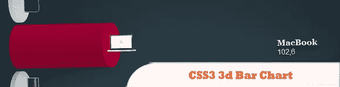
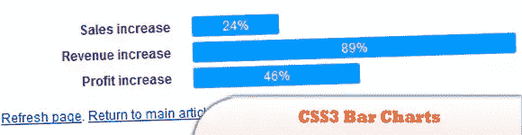
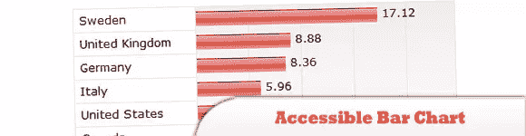
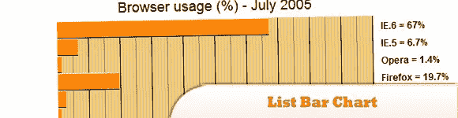
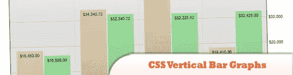

# 10 个有用的 CSS 图形和图表教程和技术

> 原文：<https://www.sitepoint.com/10-helpful-css-graph-chart-tutorials-techniques/>

级联样式表(CSS)是一种用于描述文档格式的语言，该文档是用 HTML、XHTML 等标记语言编写的。CSS 图表的重要特征是它允许用户通过减少 HTML 页面的带宽需求来轻松下载。在 CSS3 图形和图表中创建一种风格涉及到许多技术。在任何网络行业中，一个好的和优秀的数据展示在让客户理解你的分析内容中扮演着重要的角色。

在本帖中，我们收集了 **10 个有用的 CSS 图表教程和技巧**，你肯定会发现它们非常有用！享受吧。

相关帖子:

*   [**十大 jQuery 图形和图表**](http://www.jquery4u.com/plugins/top-10-jquery-graphs/)

## 1.带有 HTML5 和 jQuery 的时髦动画饼图

了解如何使用 HTML5 canvas 元素、CSS3 和 jQuery 来创建一个漂亮的交互式动画饼图。完整的代码供您自己使用。

  
[来源](http://www.elated.com/articles/snazzy-animated-pie-chart-html5-jquery/) [演示](http://www.elated.com/res/File/articles/development/javascript/snazzy-animated-pie-chart-html5-jquery/)

## 2.动画邪恶 CSS3 三维条形图

当鼠标悬停时，会显示动画，条会增长到适当的大小。

  
[来源](http://www.marcofolio.net/css/animated_wicked_css3_3d_bar_chart.html) [演示](http://demo.marcofolio.net/css3_bar_chart_animated/)

## 3.CSS3 条形图

CSS 中的条形图既不是很新，也不是很难。使用一些非常基本的样式，你可以很容易地将列表等变成类似的图形和图表。然而，使用一些丰富的 CSS3 和渐进式增强，您可以真正开始将这些通常令人厌烦的文档的显示和呈现推向下一个层次。

  
[来源](http://csswizardry.com/2010/02/css-bar-charts-styling-data-with-css3-and-progressive-enhancement/) [演示](http://csswizardry.com/demos/graphs/)

## 4.CSS3 条形图

这是一组干净的 3D 风格的纯 CSS3 条形图。您可以轻松地可视化数据，而不必使用 JavaScript 或 PHP 甚至图像。这一套带有 9 个预定义的图形样式-单一和分组条形图。

  
[来源](http://codecanyon.net/item/css3-bar-graphs/238008?clickthrough_id=42787785&redirect_back=true&ref=designmodo&ref=designmodo) [演示](http://codecanyon.net/video_player/player.swf)

## 5.CSS3 图形动画

了解如何使用 CSS3 动画创建图表。

  
[来源](http://www.alessioatzeni.com/blog/css3-graph-animation/) [演示](http://www.alessioatzeni.com/wp-content/tutorials/html-css/CSS3-Graph-Animation/index.html)

## 6.可访问的条形图

主要特征:
>表头是有的，但是用 aural text 类隐藏了。
>使用被拉伸到适当大小的图像创建一个条。
>计算相对于最大值的条形宽度。
>数值单元格有一个重复的背景图像，显示垂直线。
>浏览没有 CSS 或者图片的图表会呈现一个普通的表格。
>值标签可以通过使用听觉文本类来隐藏。

  
[源+演示](http://www.standards-schmandards.com/exhibits/barchart/)

## 7.列表条形图

这些图表只不过是一个样式化的定义列表，只包含定义每一行的类。

  
[源+演示](http://www.cssplay.co.uk/menu/barchart.html)

## 8.创建图表

使用百分比背景图像创建图表。

  
[源+演示](http://www.maxdesign.com.au/articles/percentage/)

## 9.CSS 垂直条形图

这里的区别是，整个事情是一个简单的嵌套列表和 CSS 集。

  
[源+演示](http://meyerweb.com/eric/css/edge/bargraph/demo.html)

## 10.基于 Web 标准的可访问数据可视化

这个简单的技术只是在文本后面的条目列表中添加一些条(查看完成的例子，了解我们的目标)。它适用于任何长度的列表。较长的列表受益于按计数排序，因为条形的相对值在连续时更容易阅读。

  
[来源](http://www.alistapart.com/articles/accessibledatavisualization) [演示](http://www.alistapart.com/d/accessibledata/example-barchart.html)

## 分享这篇文章