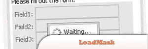
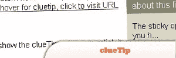
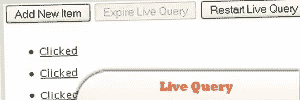
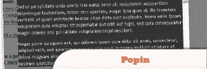
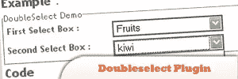
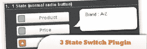
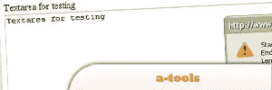

# 10 个有助于设计和开发的 jQuery 插件

> 原文：<https://www.sitepoint.com/10-helpful-jquery-plugins-design-development/>

Today while we were searching for a decent plugins to share on the blog we stumbled across some **jQuery plugins which we think might help you one day with your web development** projects. Enjoy.Related Posts:

*   [**20 个有用的 jQuery 插件**](http://www.jquery4u.com/plugins/20-helpful-jquery-plugins/)

## 1.负载屏蔽

一个插件，它可以在 DOM 元素的内容加载或更改时屏蔽 DOM 元素，以防止用户交互并通知某些后台任务仍在运行。

[源头](http://code.google.com/p/jquery-loadmask/)

## 2.线索提示

一个插件，当用户的鼠标悬停在(或者，可选地，点击)你在脚本中指定的任何元素时，你可以很容易地显示一个漂亮的工具提示。

来源

## 3.悬停意图

一个试图确定用户意图的插件…就像一个水晶球，只是随着鼠标的移动！它的工作方式类似于(并且是从)jQuery 内置的 hover。

来源

## 4.jQuery 实时查询插件

Live Query 利用 jQuery 选择器的强大功能，自动绑定事件或触发匹配元素的回调，甚至在页面加载和 DOM 更新之后。

来源

## 5.JavaScript 浮动框 JQuery 插件

大多数情况下，网页内容不适合屏幕，我们将不得不向下滚动到页面来阅读全部内容。这样做的话，我们将会丢失上面的那些信息。这个 JavaScript 浮动菜单将完成这个任务，并保持指定的内容可见。

## 6 .波平

用自动 Ajax 请求创建一个简单的模式窗口。

## 7.具有可选时区支持的 AJAX 日历小部件

Any+Time JavaScript 库包括一个高度可定制的、jQuery 兼容的 datepicker/ timepicker(日历/时钟小部件)和一个强大的日期/字符串解析/格式实用程序。

来源

## 8.jQuery Doubleselect 插件

根据第一个选择框填写第二个选择框。

来源

## 9.jQuery 3 状态切换插件

是一个 jQuery 插件，它同时使用单选按钮和复选框来表达列表项的选择和一些状态。

来源

## 10.工具

建立在 jQuery 库之上的跨浏览器文本选择和修改插件。使用 Opera 9.5 (Windows)和 Opera 9.6 (Linux)、Mozilla Firefox 3.0 (Windows 和 Linux)、Internet Explorer 7、Chrome 2.0 和 Safari 4.0 进行了测试。也适用于 jQuery 1.4。

来源

## 分享这篇文章