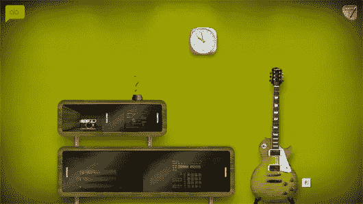
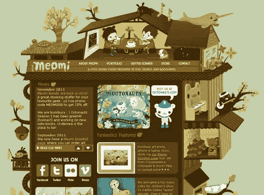
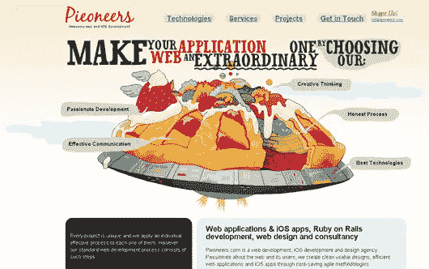
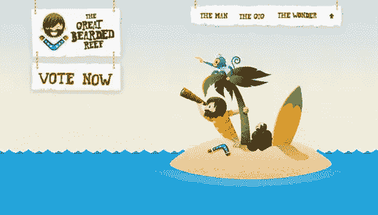
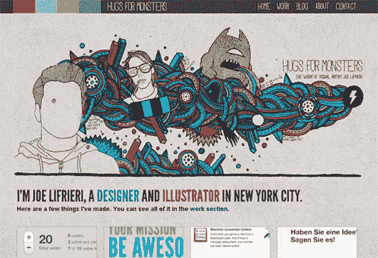
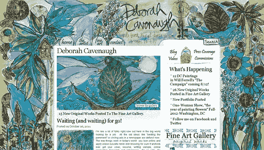
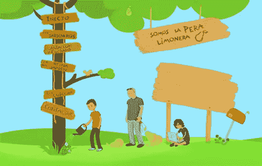
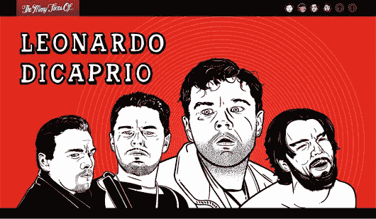
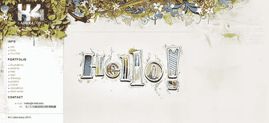
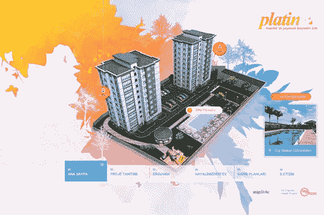

# 10 个高度互动、插图精美的网页设计

> 原文：<https://www.sitepoint.com/10-highly-interactive-beautifully-illustrated-web-designs/>

如今，成千上万的网站都有着非常相似的外观和感觉。除了独特的徽标和配色方案，许多“标准”网站很大程度上与同行没有什么区别。由于网页上的一致性，在你的设计中加入一些插图元素是一个很好的机会，可以让你的设计脱颖而出。今天，我想和你们分享十个独特的、奇妙的网站，它们将插图融入到设计中。有些人使用简单的 PNG 和 JPEG 文件来实现这一点，而其他人则使用 Flash 来使页面具有交互性。我希望你喜欢这个列表。

### 亚历克斯·布加

这是我见过的最原创的个人网站之一。通过与主页上的对象进行交互，可以查看网站的每个区域。或者，你可以通过点击设计左上角的 AB 标志来导航网站，使传统的导航菜单出现。从墙上显示实际时间的时钟到让你随着节拍和声音玩耍的音乐播放器，Alex Buga 的网站是一个值得访问的有趣网站，也是他所能做的一个很好的例子。

### [喵咪](http://www.meomi.com/)

Meomi 可以说是网络上最可爱的网站，它的互动设计会让任何人微笑。每当你滚动设计(由 Flash 驱动)的外部时，就会发生一些事情。比如页面右侧的小动物会弹他的班卓琴，旁边的钢琴会弹钢琴曲。

### [馅饼](http://www.pieoneers.com/ "Pieoneers")

Pieoneers 设计的底部是一个插图冰淇淋角色，坐在一艘宇宙飞船上，上面放着一个水果馅饼，对着月亮微笑。我不知道空间和冰淇淋之间有什么联系，但这个设计非常有创意，绝对是独一无二的。

### [大胡子礁](http://www.thegreatbeardedreef.com/ "The Great Bearded Reef")

大胡子礁是一个尖锐的设计，是为自称“大胡子一号”的乔希·威利斯(Josh Willis)创造的，目的是为了申请澳大利亚“岛屿看守人”的职位。

### [拥抱怪物](http://hugsformonsters.com/ "Hugs For Monsters")

《拥抱怪物》是设计师兼插画师乔·利弗里耶的主页。每一页的顶部都有一幅独特的彩色图画，展示了他独特的插图风格。

### 黛博拉·卡文诺

黛博拉·卡文诺的主页看起来更像一幅画，而不是一个网页设计。丰富多彩的方面融入了内容区域，最引人注目的是右上角的搜索按钮。

### [Somos La Pera Limonera](http://www.somoslaperalimonera.com "Somos La Pera Limonera")

三个设计师坐在梨树下的奇妙插图。

### 的多面性

这是一个有趣的网站，展示了莱昂纳多·迪卡普里奥、七宝奇谋、约翰·库萨克和艾伦·瑞克曼的各种面孔。每个部分在标题中都包含一个大插图，以及贯穿内容区域的插图。

### [K4 实验室](http://www.k4lab.info/ "K4 Laboratory")

在过去的几年里，K4 实验室网站已经出现在许多设计列表中(这是理所当然的)。它仍然是一个很好的例子，说明 Flash 如何补充网站设计，而不是阻碍它。

### [铂](http://www.erguvanplatin.com/ "Platin")

Platin 展示了一个基于 Flash 的彩色互动插图，用于宣传一个新的公寓楼。从一个部分到另一个部分的过渡是美丽的。

你最喜欢哪一幅插图设计？你认为非传统的设计通常更好，还是大多数项目更适合更标准、更熟悉的布局？你会用 Flash 设计一个有创意的布局，还是会倾向于其他技术？

## 分享这篇文章