# 10 个不可思议的角色和 3D 动画场景

> 原文：<https://www.sitepoint.com/10-incredible-characters-and-3d-animation-scenes/>

在过去的几年里，3D 动画在视觉质量上有了巨大的飞跃。新的软件和技术使得动画师将他们的工作推向新的高度成为可能。视频游戏、短片、电视节目和完整长度的电影——3D 动画在每个媒体渠道中都变得相当真实。

虽然观看动作中的动画是无法被击败的，但有时更令人鼓舞的是详细和近距离地查看角色和背景元素。下面的综述包括来自各种 3D 动画媒体的人物和风景。当你观看它们的时候，请注意每一幅作品中精美的艺术品、令人难以置信的效果和细微的细节。那么，请告诉我们哪些是你最喜欢的。如果你真的被打动了，去看看艺术家的作品集，告诉他们你有多欣赏他们的作品！

[光晕 4–从 Polynoid 进入黎明揭幕战](http://www.behance.net/gallery/HALO-4-Forward-Unto-Dawn-Opener/6213291)

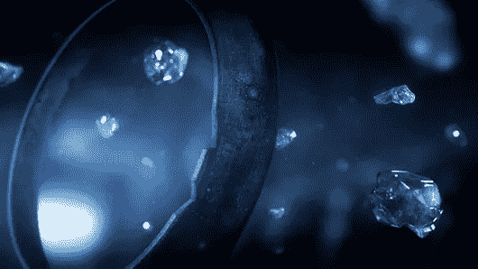

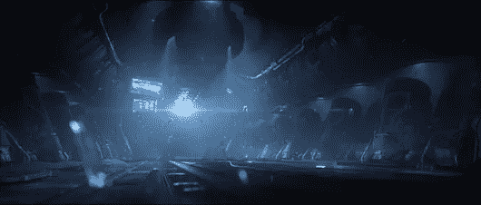

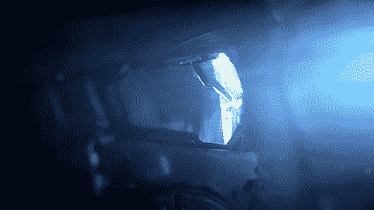

* * *

Meindbender Team Loro 来自 Techno Image

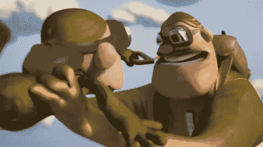

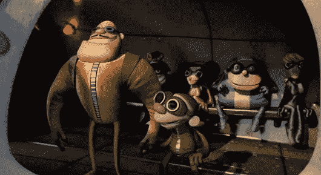

* * *

[Sperlari《商店》](http://www.motionserved.com/gallery/Sperlari-The-shop/2410068)由免税电影

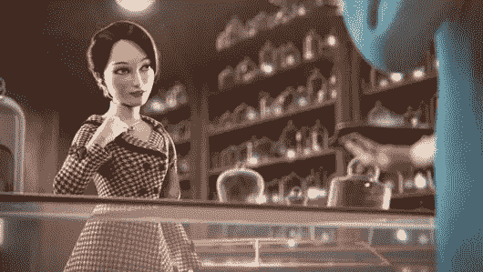

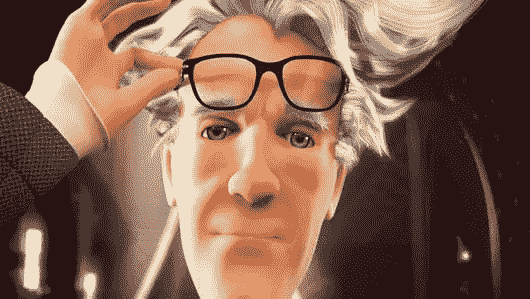

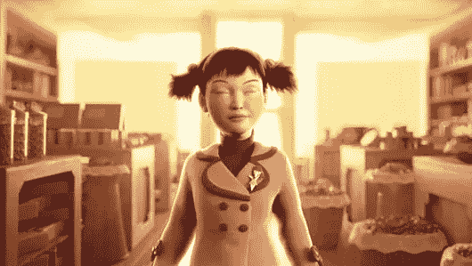

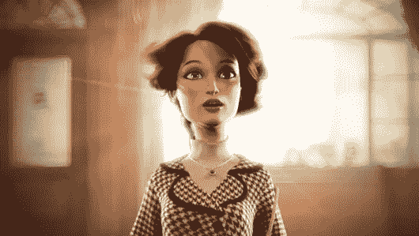

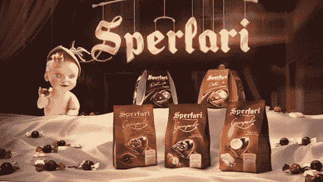

* * *

[《魔镜，魔镜》VFX](http://www.motionserved.com/gallery/Mirror-Mirror-VFX-Breakdown/6011615) 由 Rodeo FX

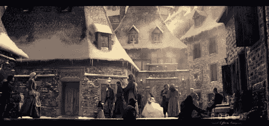

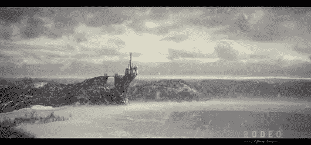

* * *

米拉里&公司的 MTV 夏季识别

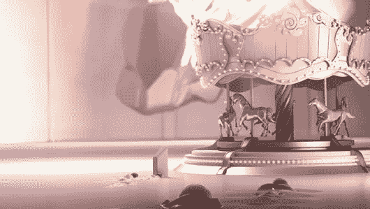

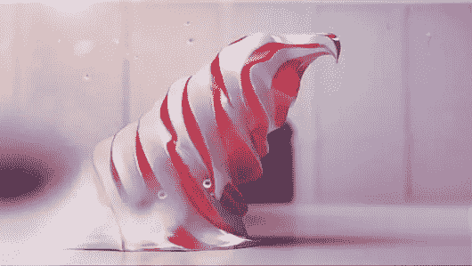

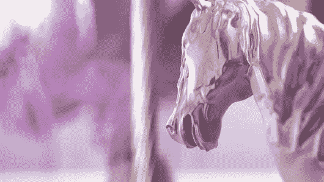

* * *

乔纳森·金

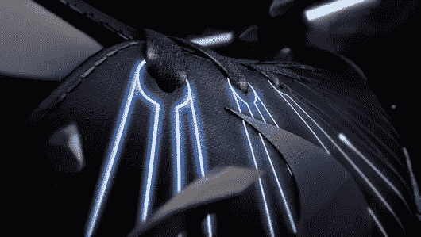

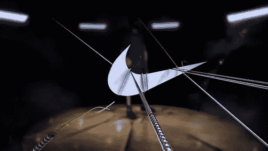

* * *

龙达的《狐狸犯罪》

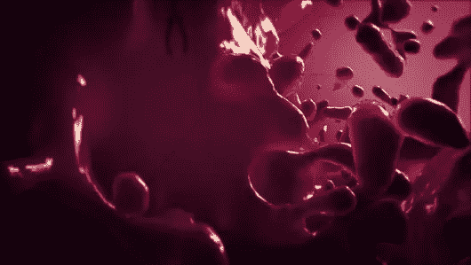

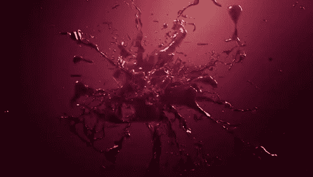

* * *

马克·林德纳的《希腊 100》

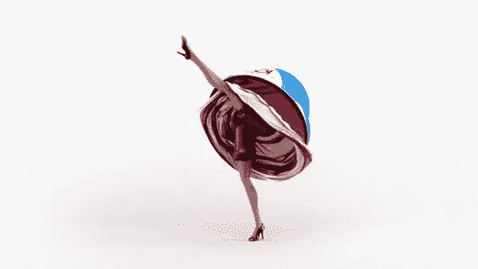

* * *

[贝泽格舞](https://vimeo.com/20977833)来自重力

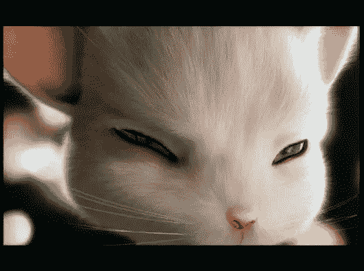

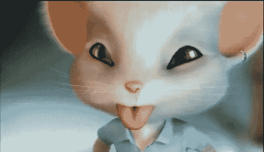

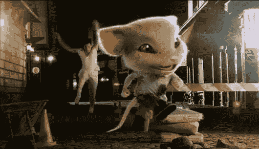

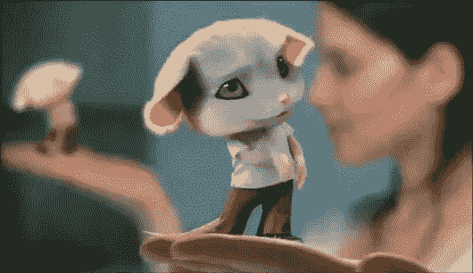

* * *

[来自 Lani Pixels 的乐高故事](http://www.shortoftheweek.com/2012/08/14/the-lego%C2%AE-story/)

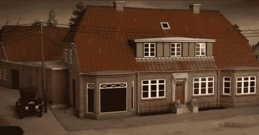

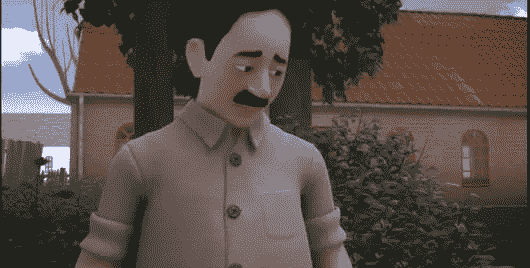

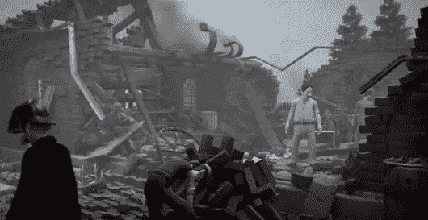

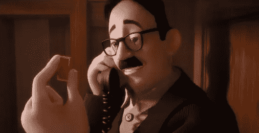

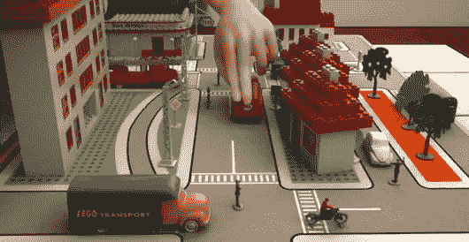

你最喜欢哪个场景？你能想到其他值得包括的吗？

## 分享这篇文章