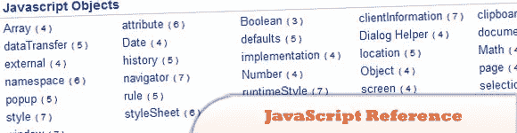
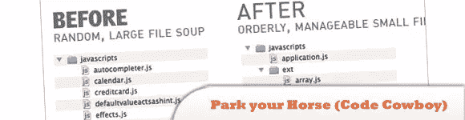
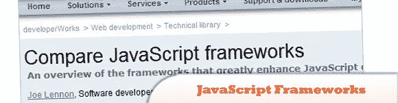
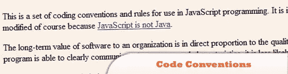
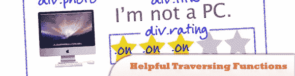
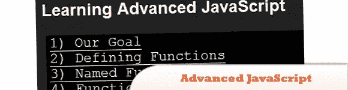
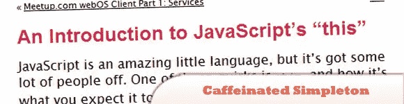

# 10 个信息丰富的 JavaScript 资源和教程

> 原文：<https://www.sitepoint.com/10-informative-javascript-resources-tutorials/>

这是我们多年来收集的最有价值的 JavaScript 资源和教程的汇编。尽情享受吧！

相关帖子:

*   [**庞大的 jQuery 链接&资源列表**](http://www.jquery4u.com/jquery-links/)
*   [**10 jQuery/JavaScript 文档资源**](http://www.jquery4u.com/javascript/10-jquery-javascript-documentation-resources/)

## 1.wtfjs

JavaScript 是一种我们喜欢的语言，尽管它让我们讨厌。这是网络语言中非常特殊的不规则性、易变性和简单而痛苦的不直观时刻的集合。

  
[源+演示](http://wtfjs.com/)

## 2.JavaScript 参考示例(示例源代码)

JavaScript 参考示例，按对象、属性、方法和集合组织。还提供了一些事件处理程序参考。

  
[源+演示](http://www.java2s.com/Code/JavaScriptReference/CatalogJavaScriptReference.htm)

## 3.JavaScript 最佳实践

把下面的建议记在心里，把它放在你大脑中有快速通道的地方，这样你就可以不假思索地应用它。

  
[源+演示](http://dev.opera.com/articles/view/javascript-best-practices/)

## 4.放马过来吧，代码牛仔:专业 JavaScript 工作流，第 1 部分

在这个系列中，我们将讨论一些工具和技术，您可以用它们来掩盖这些“不”,并从您的 JavaScript 体验中减少许多冲突和尴尬。

  
[源+演示](http://dailyjs.com/2010/01/27/pro-practices-1/)

## 5.比较 JavaScript 框架

在本文中，您将发现 JavaScript 框架如何使创建高度交互式和响应性的网站和 Web 应用程序变得更加容易和快速。

  
[源+演示](http://www.ibm.com/developerworks/web/library/wa-jsframeworks/index.html)

## 6.JavaScript 编程语言的代码约定

这是一组用于 JavaScript 编程的编码约定和规则。

  
[源+演示](http://javascript.crockford.com/code.html)

## 7.jQuery 中 10 个非常有用的遍历函数

用 jQuery 选择 HTML 元素简单得可笑。但有时，我们可能希望进一步细化选择，当 HTML 结构复杂时，这可能是一个麻烦。在本教程中，我们将探索十种方法来提炼和扩展我们希望操作的一组包装元素。

  
[源+演示](http://net.tutsplus.com/tutorials/javascript-ajax/10-super-helpful-traversing-functions-in-jquery/)

## 8.学习高级 JavaScript

这是一个非常好的学习 JavaScript 的教程，包含了 John Resig 即将出版的《JavaScript 忍者的秘密》一书中的代码和讨论。

  
[源+演示](http://ejohn.org/apps/learn/)

## 9.关于 JavaScript 作用域你需要知道什么

本文讨论 JavaScript 如何处理作用域，各种 JavaScript 库如何提供处理作用域的方法，以及它们如何消除一些障碍。

  
[源+演示](http://coding.smashingmagazine.com/2009/08/01/what-you-need-to-know-about-javascript-scope/)

## 10.含咖啡因的傻瓜

JavaScript 是一种令人惊叹的小语言，但是它有一些怪癖，让很多人望而却步。其中一个怪癖是“这个”，以及它不一定是你所期望的那样。“这”并没有那么复杂，但在互联网上很少有关于它如何工作的解释。本文试图解释这是如何工作的，以及如何正确使用它。

  
[源+演示](http://justin.harmonize.fm/index.php/2009/09/an-introduction-to-javascripts-this/)

## 分享这篇文章