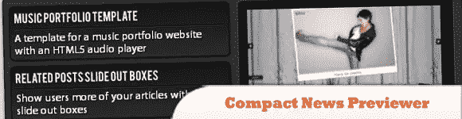
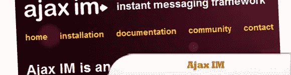
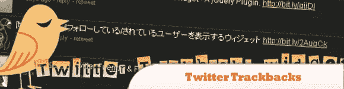
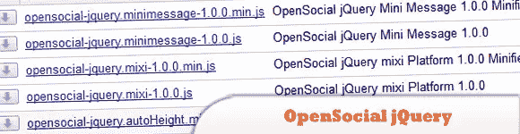
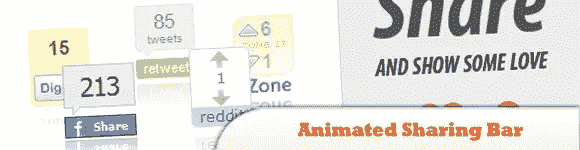

# 10 个交互性和通信 jQuery 插件

> 原文：<https://www.sitepoint.com/10-interactivity-communication-jquery-plugins/>

我们收集了 **10 个交互性和交流 jQuery 插件**来帮助你创建一个在线应用程序、新闻预览器、显示相关文章的小部件、blogroll 滑块，它们可以被使用或集成到你的网站中。玩得开心！

相关帖子:

*   [**10 AJAX 和 JavaScript 创作工具**](http://www.jquery4u.com/ajax/10-ajax-javascript-authoring-tools/)
*   [**创建自己的手机条码玩意儿**](http://www.jquery4u.com/mobile/create-mobile-phone-barcode-thingy/)

## 1.用 jQuery、CSS3 和 PHP 实现交互式图像拼接

在本教程中，您将创建一个在线应用程序，为一幅图像添加一些有趣的内容。您可以使用 jQuery 和 jQuery UI 来拖动和调整小胡子、眼镜和嘴唇等漂亮的小元素。

  
[来源](http://tympanus.net/codrops/2010/03/22/interactive-image-vamp-up-with-jquery-css3-and-php/)
[演示](http://tympanus.net/Tutorials/ImageVampUp/)

## 2.带有 jQuery 的紧凑新闻预览器

在本教程中，您将学习如何创建一个新闻预览器，让您以紧凑的方式显示您的最新文章或新闻。

  
[来源](http://tympanus.net/codrops/2010/10/03/compact-news-previewer/)
[演示](http://tympanus.net/Tutorials/CompactNewsPreviewer/)

## 3\. Ajax IM

是一个基于浏览器的即时消息客户端。它使用 AJAX 创建一个接近实时的 IM 环境，可以与社区、内部网和社交网站结合使用。演示用户名为“测试”和“测试(1 到 4)”。密码是“测试”。

  
[源+演示](http://ajaxim.com/)

## 4.相关文章滑动框–jQuery 和 CSS3

在本教程中，你将学习如何创建一个小部件，可以用来在任何页面上显示相关的文章。

  
[来源](http://tympanus.net/codrops/2010/07/21/related-posts-slide-out-boxes/)
[演示](http://tympanus.net/Tutorials/RelatedPostsSlideOuts/)

## 5.Twitter Trackbacks Widget–jQuery 插件

高度可定制的 Twitter trackbacks 小部件，用于将提及您的帖子的推文集成到您的博客中。每条推文都附有回复和转发链接，让更多读者参与到你的故事对话中。

  
[来源](http://www.moretechtips.net/2009/11/twitter-trackbacks-widget-jquery-plugin.html)
[演示](http://twitter-trackbacks-widget.googlecode.com/svn/v1/demo1.htm)

## 6.更好的 Blogroll——simple pie 和 jQuery 带来的动态乐趣

传统的 blogroll 是其他网站的简单列表，通常在侧边栏中。让我们改进 blogroll 的概念，不仅列出站点，而且动态地从中提取最近的标题，并使用一些有趣的 jQuery 动画。

  
[来源](http://net.tutsplus.com/tutorials/javascript-ajax/building-a-better-blogroll-dynamic-fun-with-simplepie-and-jquery/)
[演示](http://d2o0t5hpnwv4c1.cloudfront.net/036_BetterBlogRoll/sourceFiles/index.html)

## 7.最新博文 Blogroll 滑块——jQuery 和 PHP

在本教程中，你将学习如何创建一个 blogroll 滑块来显示你最喜欢的博客的最新帖子。您将使用一些 jQuery、PHP 和 XSL。目标是获得博客的给定 RSS 提要，并在 PHP 的帮助下解析 XML 数据。

  
[来源](http://tympanus.net/codrops/2010/06/17/latest-post-blogroll-slider/)
[演示](http://tympanus.net/Tutorials/LatestPostSlider/)

## 8.使用 jQuery 的 Digg 风格的帖子共享工具

Kevin Liew 将向你展示如何创建一个类似 digg 的社会化书签工具。他还包括了 komodomedia 的社会书签图标和一长串点击书签的提交 URL。

  
[来源](http://www.queness.com/post/309/create-a-digg-style-post-sharing-tool-with-jquery)
[演示](http://www.queness.com/resources/html/shareit/index.html)

## 9.OpenSocial jQuery Mixi 平台

是一个基于 jQuery 的简洁 JavaScript 库，用于快速 OpenSocial 应用程序开发 jQuery mixi 平台是一个专门使用 mixi 扩展的插件。

  
[源+演示](http://code.google.com/p/opensocial-jquery/downloads/list)

## 10.动画共享栏

通过使用纯 JavaScript 和 jQuery 框架，鼓励你的访问者在网络上分享你的内容，制作一个动画分享栏，这将使你的网站访问者能够在许多社交网络上分享帖子。

  
[来源](http://tutorialzine.com/2009/12/animated-share-buttons-jquery-css/)
[演示](http://demo.tutorialzine.com/2009/12/animated-share-buttons-jquery-css/demo.html)

## 分享这篇文章