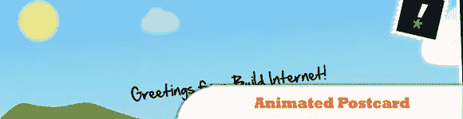
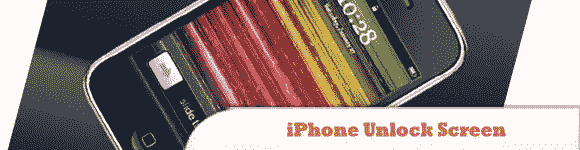
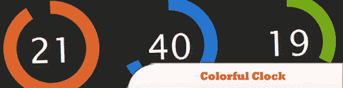
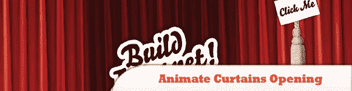
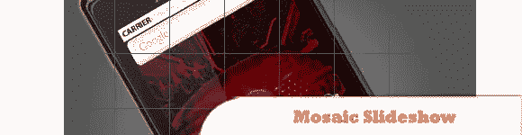
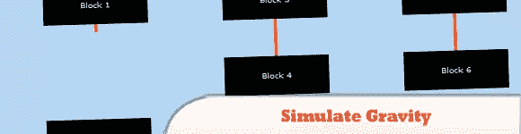
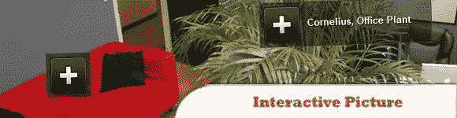
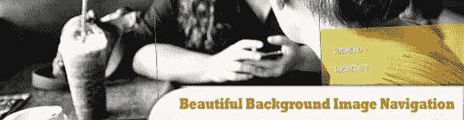

# 10 个有趣的高级 jQuery 插件

> 原文：<https://www.sitepoint.com/10-interesting-advanced-jquery-plugins/>

另一组**高级 jQuery 插件，你肯定会发现在你的网页中使用**会很有趣。你可以很容易地在你的网站上使用你选择的插件，而不用花一分钱，因为它们是完全免费的！

相关帖子:

*   [**10 个有趣又高级的 jQuery 插件**](http://www.jquery4u.com/news/interesting-jquery-facts-stats/)
*   [**随机、酷、有趣的网络开发——2011 年 10 月**](http://www.jquery4u.com/random/october-2011/)

## 1.带有 jQuery 的动画明信片

在本教程中，我们将学习设置一个连续动画的基本知识，这个动画几乎可以应用到任何地方。

  
[来源](http://buildinternet.com/2009/08/crafting-an-animated-postcard-with-jquery/)
[演示](https://buildinternet.s3.amazonaws.com/live-tutorials/postcard/index.html)

## 2.xHTML、CSS 和 jQuery 中的 iPhone 解锁屏幕

了解如何用 xHTML、CSS 和 jQuery 创建 iPhone 解锁屏幕。
功能:
> XHTML 和 CSS 有效。
>“计时器”显示当前时间(就像 iPhone 一样)。
>“日期”显示当前日期(跟 iPhone 一样)。
>漂亮圆滑的界面，包括透视元素(就像 iPhone 一样)。
>多变的背景。
>在 Firefox 3、Internet Explorer 7 和 Safari 3 上测试并运行。

  
[来源](http://www.marcofolio.net/webdesign/the_iphone_unlock_screen_in_xhtml_css_and_jquery.html)
[演示](http://demo.marcofolio.net/iphone_unlock/index.html)

## 3.带有 CSS 和 jQuery 的彩色时钟

我们将制作一个彩色的 jQuery & CSS 时钟，它将帮助你记录一年中那些宝贵的最后几秒钟。

  
[来源](http://tutorialzine.com/2009/12/colorful-clock-jquery-css/)
[演示](http://demo.tutorialzine.com/2009/12/colorful-clock-jquery-css/demo.html)

## 4.用 jQuery 制作窗帘打开的动画

如果没有图形，本教程就没有什么特别的了，所以让我们确保你已经掌握了这些。

  
[来源](http://buildinternet.com/2009/07/animate-curtains-opening-with-jquery/)
[演示](http://buildinternet.com/live/curtains/)

## 5.碳纤维注册表单与 PHP，jQuery 和 CSS3

碳纤维风格的形式，建立使用渐进增强。这意味着，我们首先要确保表单在没有 JavaScript 和花哨的 CSS 支持的情况下也能很好地工作(想想这里的 IE6 ),然后再继续在酷酷的样式、AJAX 和 jQuery magic 上分层。

  
[来源](http://tutorialzine.com/2010/04/carbon-signup-form/)
[演示](http://demo.tutorialzine.com/2010/04/carbon-signup-form/demo.html)

## 6.带有 jQuery 和 CSS 的马赛克幻灯片

马赛克，因为当从一张幻灯片移动到另一张幻灯片时，它将具有有趣的平铺过渡效果。

  
[来源](http://tutorialzine.com/2010/03/mosaic-slideshow-jquery-css/)
[演示](http://demo.tutorialzine.com/2010/03/mosaic-slideshow-jquery-css/demo.html)

## 7.jQuery 和 CSS3 的上下文滑出提示

知道了 HTML 标准的重要性，我们用 jQuery & CSS3 制作了一套上下文幻灯片提示，非常适合产品页面和在线旅游。另外，它们对搜索引擎优化很友好，所以所有的内容对搜索引擎都是可见的。

  
[来源](http://tutorialzine.com/2010/04/slideout-context-tips-jquery-css3/)
[演示](http://demo.tutorialzine.com/2010/04/slideout-context-tips-jquery-css3/demo.html)

## 8.用 jQuery 模拟重力

本教程旨在通过 jQuery 提供逼真的重力动画。

  
[来源](http://blog.themeforest.net/tutorials/simulate-gravity-with-jquery/)
[演示](http://themeforest.s3.amazonaws.com/74_jquery/jquerygravitysource/index.html)

## 9.使用 jQuery 的交互式图片

在本教程中，我将向你展示如何拼凑一个交互式图片，也就是包含工具提示和弹出框的图片。这对于展示照片的特定方面(如物品或人物)非常有用。

  
[来源](http://buildinternet.com/2009/11/making-an-interactive-picture-with-jquery/)
[演示](http://static.buildinternet.com/live-tutorials/interactive-picture/index.html)

## 10.用 jQuery 实现漂亮的背景图像导航

在本教程中，我们将创建一个漂亮的导航，有背景图片幻灯片效果。主要思想是有三个列表项，它们包含相同的背景图像，但是位置不同。

  
[来源](http://tympanus.net/codrops/2010/05/05/beautiful-background-image-navigation-with-jquery/)
[演示](http://tympanus.net/Tutorials/BeautifulBackgroundImageNavigation/)

## 分享这篇文章