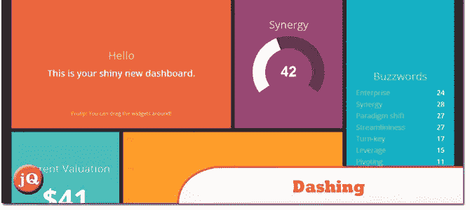
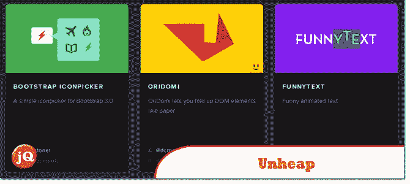
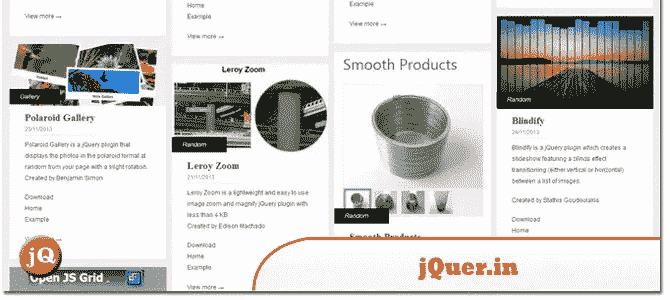
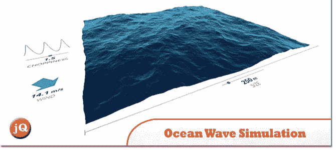
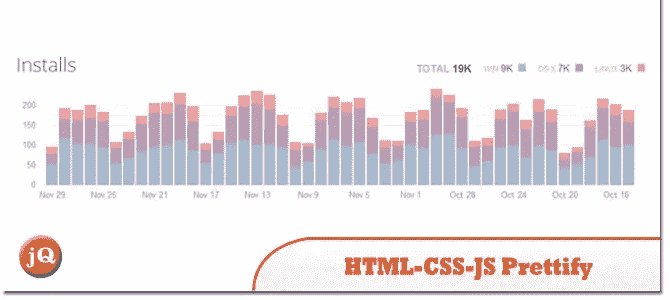

# 10 个有趣的网络开发发现——2013 年 12 月(第一部分)

> 原文：<https://www.sitepoint.com/10-interesting-web-dev-finds-december-2013-part-1/>

12 月份发现了一些很酷的网络开发工具。这是发现。请关注我们下一篇文章的第二部分。玩得开心！=)

## 1.浮动标签模式

浮动标签模式是如何开始的。

 
[来源](http://mattdsmith.com/float-label-pattern/)

## 2.Setapp

这是一个面向技术人员、他们的应用和工具的网络。

 
[来源](http://setapp.me/)

## 3.Paul Irish 谈 Web 应用程序开发工作流

Google 的 Paul Irish 将展示如何真正地将它们整合到一个实用且现实的开发人员工作流程中。此外，Paul 还向我们概述了 Yeoman，并展示了这套工具和库如何帮助开发人员快速构建优雅且引人注目的 web 应用程序。

 
[来源](http://www.youtube.com/watch?v=vDbbz-BdyYc)

## 4.Lift Do 应用

Lift 帮助你实现或大或小的目标。

 
[来源](https://www.lift.do/login)

## 5.时髦的

基于 Sinatra 的框架，让你建立美丽的仪表板。

 
[来源](http://shopify.github.io/dashing/) [演示](http://dashingdemo.herokuapp.com/sample)

## 6.开源成绩单

请务必记住，GitHub 不是你的简历，这些数据只是提供了一个有偏见的片面观点。这只是一个玩具。不要太当真！

 
[来源](http://osrc.dfm.io/sdeering)

## 7.打开盖子

一个整洁的 jQuery 插件库。

 
[来源](http://www.unheap.com/)

## 8.耶，进去

jquery 插件和 javascript 库的集合。

 
[来源](http://jquer.in/)

## 9.海浪模拟

使用 CSS 3D + Canvas UI 在 WebGL 中模拟海浪。

 
[来源](http://david.li/waves/)

## 10.美化

通过 node.js 升华文本 2 和 3 的 HTML、CSS、JavaScript 和 JSON 代码格式化程序

 
[来源](https://sublime.wbond.net/packages/HTML-CSS-JS%20Prettify)

## 分享这篇文章