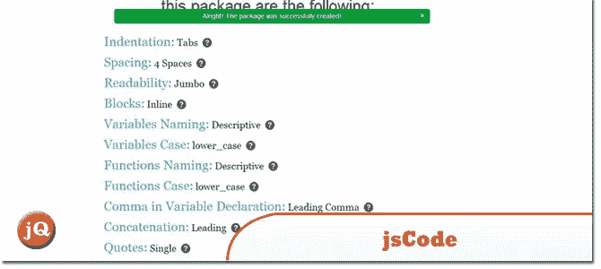
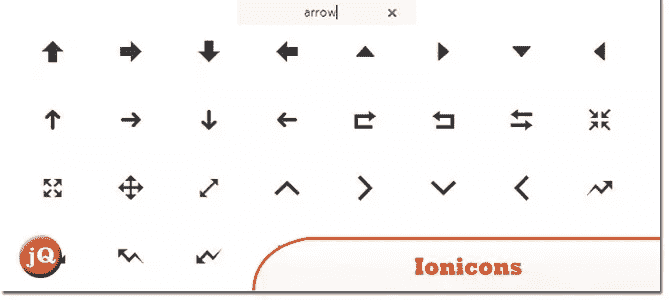
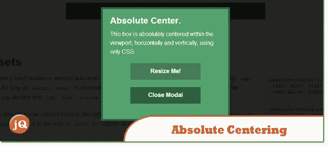
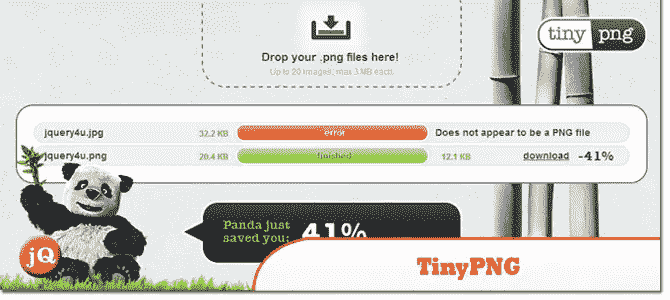
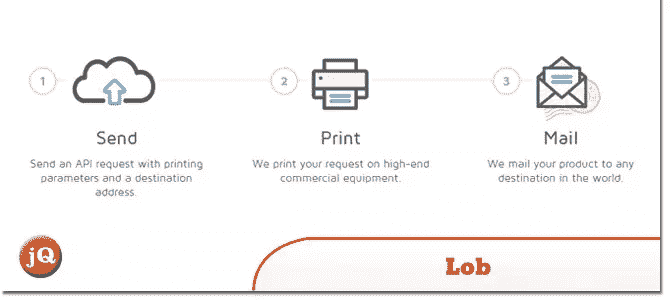
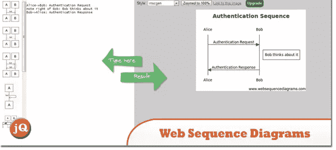
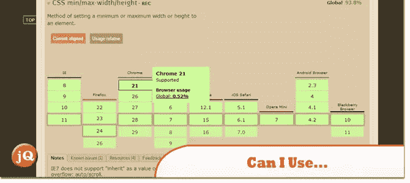
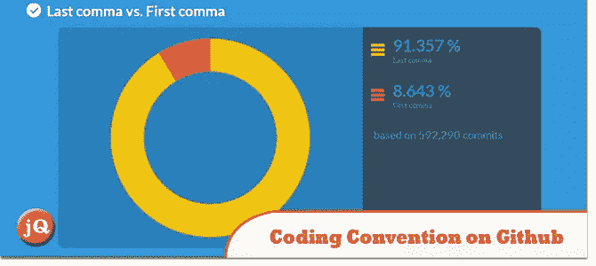
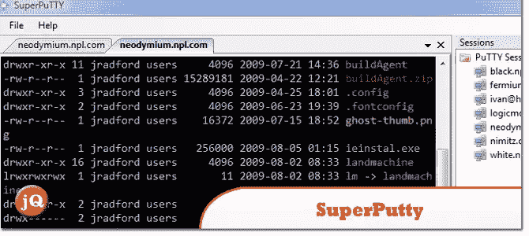

# 10 个有趣的网络开发发现——2013 年 11 月(第一部分)

> 原文：<https://www.sitepoint.com/10-interesting-web-dev-finds-november-2013-part-1/>

11 月份发现了一些很酷的 web 开发材料(sa far！)这里是发现。玩得开心！=)

## 1.jsCode

生成并分享你自己的 JavaScript 编码指南。

 
[源+演示](http://jscode.org/)

## 2.离子体

Ionic 框架的高级图标字体。100%免费开源。

 
[源+演示](http://ionicons.com/)

## 3.绝对居中

CSS 中的绝对居中。

 
[源+演示](http://codepen.io/shshaw/full/gEiDt)

## 4.TinyPNG

TinyPNG 使用智能有损压缩技术来减小 PNG 文件的大小。

 
[源+演示](http://tinypng.org/)

## 5.高球

一个简单的 API，将打印和邮件解决方案集成到您的应用程序中。

 
[来源](https://www.lob.com/)

## 6.谷歌不再支持 IE9

正如之前宣布的，Internet Explorer 11 于 2013 年 10 月 17 日发布，因此，我们已经停止对 Internet Explorer 9 的支持。

 
[来源](https://support.google.com/a/answer/33864)

## 7.Web 序列图

绘制和编辑序列图..

 
[源+演示](https://www.websequencediagrams.com/)

## 8.Caniuse.com 贝塔宣布

桌面和移动浏览器中支持 HTML5、CSS3、SVG 等的兼容性表。

 
[来源](http://beta.caniuse.com/)

## 9.Github 上流行的编码惯例

分析 Github 提交，了解哪种约定是流行的。

 
[来源](http://sideeffect.kr/popularconvention#javascript)

## 10.超级财产

一个 Windows 应用程序，主要用作 PuTTY SSH 客户端的窗口管理器。

 
[来源](https://code.google.com/p/superputty/wiki/SuperPutty)

## 分享这篇文章