# 10 多个 JavaScript 和 jQuery MVC 教程

> 原文：<https://www.sitepoint.com/10-javascript-jquery-mvc-tutorials/>

由于 2011 年即将过去，几周后我们将迎来另一个崭新的一年，我们想在 2012 年之前为您提供我们收集的超过 **10 个 JavaScript 和 jQuery MVC 教程**。MVC ftw！玩得开心！

## jQuery MVC

### 1.AJAX——Spring MVC 3 和 jQuery 集成

在本教程中，我们将使用 jQuery 构建一个简单的具有 AJAX 功能的 Spring MVC 3 应用程序。我们将探索如何使用 jQuery.post()发布数据并处理结果。

 [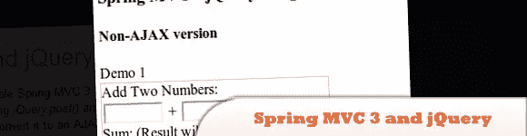](http://krams915.blogspot.com/2011/01/spring-mvc-3-and-jquery-integration.html) 
[源+演示](http://krams915.blogspot.com/2011/01/spring-mvc-3-and-jquery-integration.html)

### 2.渐进增强技术

如果你写了很多 JavaScript，你真的应该考虑采用渐进增强作为你工作的标准方式。这基本上是你写一个没有脚本的网站，然后用脚本增强它。

 [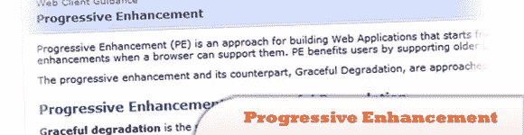](http://blogs.msdn.com/b/simonince/archive/2010/04/20/jquery-mvc-progressive-enhancement.aspx) 
[源+演示](http://blogs.msdn.com/b/simonince/archive/2010/04/20/jquery-mvc-progressive-enhancement.aspx)

## 使用 ASP.NET MVC 的 jQuery

### 3.构建联系我们表单

正如您所看到的，当用户访问我们启用了 JavaScript 的站点并点击联系我们链接时，他们会看到一个漂亮的 jQuery UI 对话窗口。在本教程中，它将向您展示如何使用 jQuery 和 ASP.NET MVC 渐进增强策略构建您自己的联系我们表单。

 [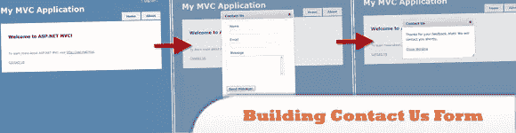](http://www.matthidinger.com/archive/2011/02/22/Progressive-enhancement-tutorial-with-ASP-NET-MVC-3-and-jQuery.aspx) 
[源+演示](http://www.matthidinger.com/archive/2011/02/22/Progressive-enhancement-tutorial-with-ASP-NET-MVC-3-and-jQuery.aspx)

### 4.简介和基本控制器

这里的目标不是教如何使用 jQuery，而是教如何针对新的 ASP.NET 3.5 MVC 扩展使用 jQuery。

 [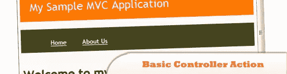](http://www.chadmyers.com/Blog/archive/2007/12/13/using-jquery-with-asp.net-mvc.aspx) 
[源+演示](http://www.chadmyers.com/Blog/archive/2007/12/13/using-jquery-with-asp.net-mvc.aspx)

### 5.下拉视频教程

在这个视频中，我们将使用 ASP.NET 和 jQuery 构建一个应用程序，同时学习 CSS 选择器、DOM 操作和使用 jQuery 库的异步通信。(参见视频教程下载链接的源链接)

 [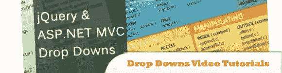](http://www.downeu.net/tutorials/374197-jquery-and-aspnet-mvc-drop-downs.html) 
[源+演示](http://www.downeu.net/tutorials/374197-jquery-and-aspnet-mvc-drop-downs.html)

### 6.带有 jQuery 数据表的 MvcContrib 网格

了解 MvcContrib 和 jQuery 中一些重要的配套部分，包括验证插件和数据表插件。

 [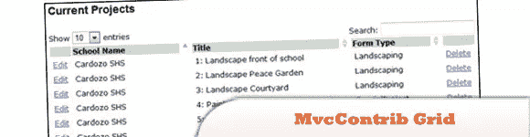](http://blogs.msdn.com/b/paulwhit/archive/2009/03/28/walkthrough-full-example-of-using-mvccontrib-grid-with-jquery-datatable.aspx) 
[源+演示](http://blogs.msdn.com/b/paulwhit/archive/2009/03/28/walkthrough-full-example-of-using-mvccontrib-grid-with-jquery-datatable.aspx)

### 7.使用 ASP.NET MVC 的 jQuery 网格

构建 web 用户界面的一个常见场景是提供可分页和可排序的数据网格。如果它使用 AJAX 使其响应更快、更时髦，那就更好了。由于 ASP.NET MVC 包含了 jQuery，所以本教程使用了一个 jQuery 网格插件进行演示。

 [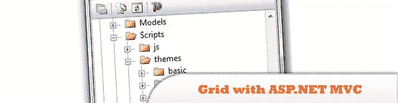](http://haacked.com/archive/2009/04/14/using-jquery-grid-with-asp.net-mvc.aspx) 
[源+演示](http://haacked.com/archive/2009/04/14/using-jquery-grid-with-asp.net-mvc.aspx)

### 8.jQuery 搜索框和自动完成

这是一个关于如何创建一个漂亮的搜索框的简单演示，在输入框下面有建议，并且还可以自动完成。

 [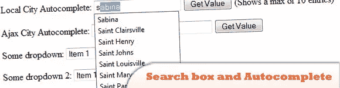](http://ericdotnet.wordpress.com/2009/04/09/jquery-search-box-and-aspnet-mvc/) 
[来源](http://ericdotnet.wordpress.com/2009/04/09/jquery-search-box-and-aspnet-mvc/)
[演示](http://www.pengoworks.com/workshop/jquery/autocomplete.htm)

## JavaScript MVC

### 9.JavaScript MVC 简介

虽然 MVC 对于后端应用程序开发人员来说是一个熟悉的术语——使用 Struts、Ruby on Rails 和 CakePHP 等框架——但是 MVC 起源于用户界面开发，适合于构建客户端应用程序。让我们研究一下什么是 MVC，看看我们如何用它来重做一个示例项目，并考虑一些现有的 MVC 框架。

 [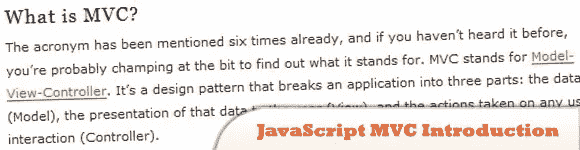](http://www.alistapart.com/articles/javascript-mvc/) 
[源+演示](http://www.alistapart.com/articles/javascript-mvc/)

### 10.JavaScript MVC 模式概述

目标是编写一个简单的 JavaScript 组件，展示该语言的强大功能。该组件是一种 HTML ListBox(“select”HTML 标记)控件，带有一个可编辑的项目列表:用户可以选择项目并删除它，或者向列表中添加新项目。组件将由实现模型-视图-控制器设计模式的三个类组成。

 [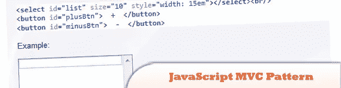](http://www.alexatnet.com/content/model-view-controller-mvc-javascript) 
[源+演示](http://www.alexatnet.com/content/model-view-controller-mvc-javascript)

### 11.JavaScript MVS 库

JavaScriptMVC (JMVC)是一个 MIT 许可的客户端 JavaScript 工具集，它可以帮助你在最短的时间内构建一个可维护的、无错误的、轻量级的应用程序。它将同类最佳的库和工具打包在一起，保证(并经过测试)能够协同工作。它支持 jQuery 支持的所有浏览器。

 [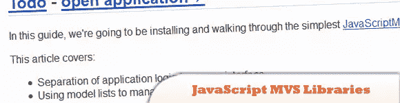](http://javascriptmvc.com/docs.html#!) 
[源+ Demo](http://javascriptmvc.com/docs.html#!)

### 12.用 MVC & Spine.js 构建 JavaScript Web 应用程序

希望在代码中增加更多结构的 JavaScript 开发人员经常寻找简单的方法将流行的 MVC 架构模式应用到他们的应用程序中。利用客户端 MVC 框架对于这样的代码组织可能是有用的，今天我们将关注 Spine.js，这是一个最近发布的帮助完成这项任务的解决方案。

 [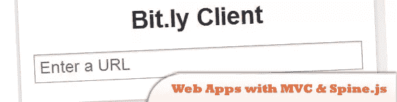](http://addyosmani.com/blog/building-apps-spinejs/) 
[来源](http://addyosmani.com/blog/building-apps-spinejs/)
[演示](http://addyosmani.com/resources/spinebitly/)

## 其他 MVC 资源

### 13.面向 Noobs 的 MVC

模型-视图-控制器(MVC)可能是近年来 web 编程世界中被引用最多的模式之一。目前从事与 web 应用程序开发相关的任何工作的任何人都会听到或读到这个缩写词数百次。今天，我们将阐明 MVC 是什么意思，以及为什么它变得如此流行。

 [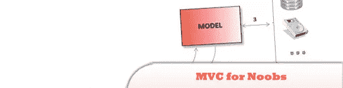](http://net.tutsplus.com/tutorials/other/mvc-for-noobs/) 
[源+演示](http://net.tutsplus.com/tutorials/other/mvc-for-noobs/)

### 14.骨干网. js

Backbone 通过提供具有键值绑定和自定义事件的模型、具有丰富的可枚举函数 API 的集合、具有声明性事件处理的视图，为大量使用 JavaScript 的应用程序提供结构，并通过 RESTful JSON 接口将所有这些连接到您现有的应用程序。

 [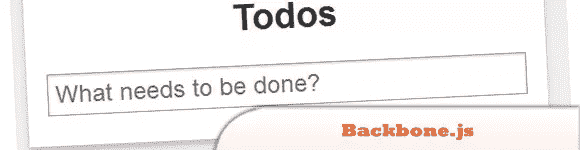](http://documentcloud.github.com/backbone/) 
[来源](http://documentcloud.github.com/backbone/)
[演示](http://documentcloud.github.com/backbone/examples/todos/index.html)

### 15.AFrameJS

由于 AFrame 在插件的使用上有点像 AOP，而且这些插件经常依赖于知道插入的对象何时被初始化，所以推荐使用类的 create 函数而不是 new 操作符来进行对象实例化。

 [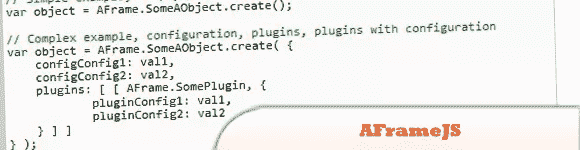](http://www.aframejs.com/tutorial.html) 
[源+演示](http://www.aframejs.com/tutorial.html)

### 16 号，安圭拉

是使用 JavaScript 快速构建 Ajax web 客户端的极好框架。该框架的体系结构使得测试、维护更容易，代码更少。在这篇文章中，我们将从 JQuery UI 添加自动完成功能，以使用 AngularJS 中的双向数据绑定。

 [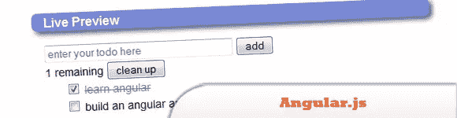](http://angularjs.org/#/) 
[源+演示](http://angularjs.org/#/)

## 分享这篇文章