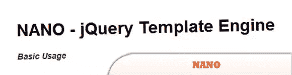
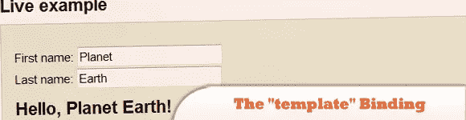
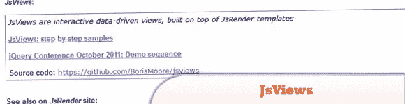
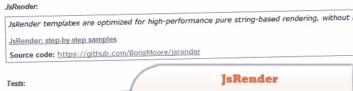
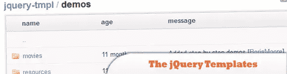
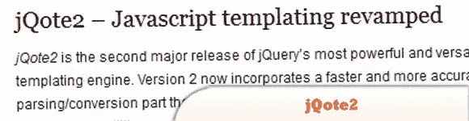
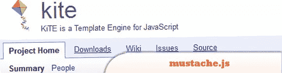
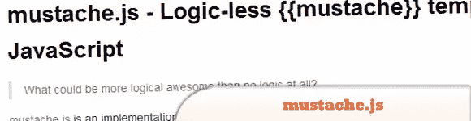
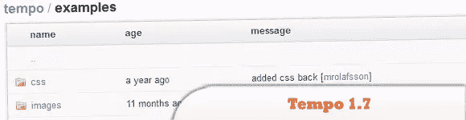

# 10 个 JavaScript 和 jQuery 模板引擎

> 原文：<https://www.sitepoint.com/10-javascript-jquery-templates-engines/>

模板是一种指定函数的方式，该函数使用与所产生的输出相似的语法，从一束数据中产生输出语言的字符串(字符串或 AST 形式)。今天我们带来了 **10 款 JavaScript 和 jQuery 模板引擎**，你可能会觉得学习起来很有趣。享受吧。

**相关帖子:**

*   [**10 jQuery 布局教程**](http://www.jquery4u.com/page-layout/10-jquery-layout-tutorials/)
*   [**sublime 2 vs notepad++**](http://www.jquery4u.com/editors/sublime2-vs-notepad/)
*   [**10 随机 HTML5 Web 工具&资源**](http://www.jquery4u.com/html/html5-web-tools/)

## 1.NANO–jQuery 模板引擎

最简单的 jQuery 模板引擎，非常适合 JSON 解析。

  
[源+演示](https://github.com/trix/nano)

## 2.“模板”绑定

模板绑定用呈现模板的结果填充关联的 DOM 元素。模板是构建复杂的 UI 结构的一种简单而方便的方法——可能带有重复或嵌套的块——作为视图模型数据的一种功能。

  
[来源](http://knockoutjs.com/documentation/template-binding.html)
[演示](http://knockoutjs.com/examples/helloWorld.html)

## 3.JsViews:下一代 jQuery 模板

基于 JsRender 模板构建的交互式数据驱动视图。

  
[来源](https://github.com/BorisMoore/jsviews)
[演示](http://borismoore.github.com/jsviews/demos/index.html)

## 4.JsRender:下一代 jQuery 模板

针对高性能纯基于字符串的呈现进行了优化，不依赖 DOM 或 jQuery。

  
[来源](https://github.com/BorisMoore/jsrender)
[演示](http://borismoore.github.com/jsrender/demos/index.html)

## 5.google-jstemplate

基于 Ajax 的 web 应用程序的简单而健壮的浏览器端模板处理。

  
[来源](http://code.google.com/p/google-jstemplate/)
[演示](http://google-jstemplate.googlecode.com/svn/trunk/jstemplate_example.html)

## 6.jQuery 模板插件

jQuery 的模板插件。贝塔。不再处于活跃的发展或维护中。问题仍然存在，但没有得到解决。

  
[来源](https://github.com/jquery/jquery-tmpl)
[演示](https://github.com/jquery/jquery-tmpl/tree/master/demos)

## 7.jqote 2–JavaScript 模板更新

jQote2 现在返回转换后的模板的平面字符串表示，而它的前身会给出一个 jQuery 对象。

  
[源+演示](http://aefxx.com/jquery-plugins/jqote2/)

## 8.风筝

KiTE 是 JavaScript 的模板引擎

  
[源+演示](http://code.google.com/p/kite/)

## 9.mustache.js

使用 JavaScript 的无逻辑{{mustache}}模板。

  
[源+演示](https://github.com/janl/mustache.js#readme)

## 10.速度 1.7

Tempo 是一个很小的 JSON 渲染引擎，可以让你用纯 HTML 制作数据模板。

  
[来源](http://twigkit.github.com/tempo/)
[演示](https://github.com/twigkit/tempo/tree/master/examples)

## 分享这篇文章