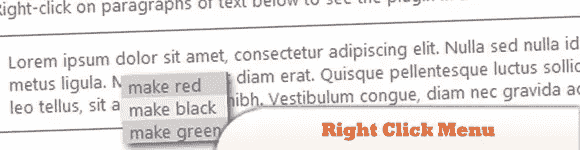
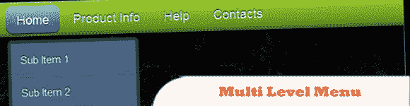
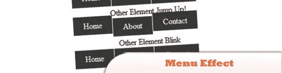
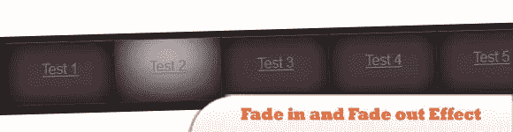
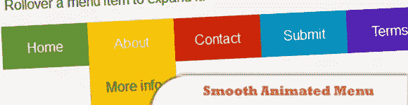
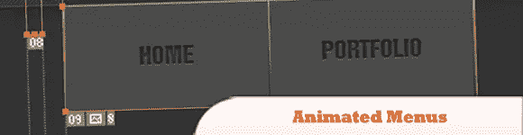
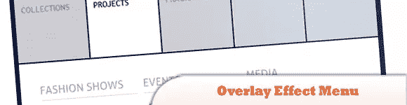
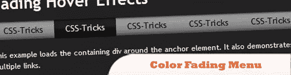
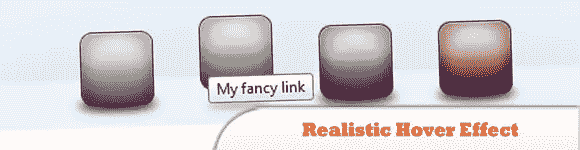
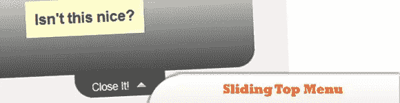

# 10 个 jQuery 酷菜单效果插件

> 原文：<https://www.sitepoint.com/10-jquery-cool-menu-effect-plugins/>

我们已经为您的网站和博客发布了大量的 jQuery 导航菜单插件，现在我们将为您提供另一个令人惊叹的 10 个 jQuery 酷菜单效果插件。尽情享受吧！

相关帖子:

*   [**10 个时髦的 jQuery 导航**](http://www.jquery4u.com/plugins/10-jquery-navigations-2/)
*   [**15 大 jQuery 导航菜单**](http://www.jquery4u.com/navigation/15-great-jquery-navigation/)

## 1.右键菜单

非常容易使用，紧凑的插件，创建一个右键菜单。

  
[源+演示](http://rightclickmenu.freevar.com/)

## 2.jQuery 多级菜单–带子菜单的 FX CSS 菜单

由 jQuery 提供视觉效果的 100% CSS 菜单。Javascript 仅用于效果。包括 IE6 在内的全面跨浏览器兼容性。效果:鼠标悬停和展开子菜单外观上的平滑淡入淡出动画。易于设置:简单的嵌套无序列表，用于无限级别的菜单项。

  
[源+演示](http://apycom.com/menus/11-yellow-green.html)

## 3.jQuery 菜单效果插件

另一个 jQuery 插件，帮助设计者不再需要编写代码来激活他们的菜单栏。这个插件以一种非常抽象的方式为设计者提供效果。

  
[来源](http://hungred.com/useful-information/jquery-menu-effect-plugin/)
[演示](http://hungred.com/wp-content/demo//jQuery-menu-effect-plugin/demo.html)

## 4.具有淡入淡出效果的有吸引力的 jQuery 菜单

不仅仅是简单的淡入淡出效果。需要大量的 CSS 作品和正确的图像，但结果是真棒！

  
[来源](http://www.queness.com/post/411/create-an-attractive-jquery-menu-with-fadein-and-fadeout-effect)
[演示](http://www.queness.com/resources/html/fadein/index.html)

## 5.用 jQuery 制作平滑的动画菜单

有没有见过一些优秀的 jQuery 导航，让你想自己做一个？今天，我们的目标就是通过建立一个菜单，并用一些平滑的效果来制作动画。

  
[来源](http://buildinternet.com/2009/01/how-to-make-a-smooth-animated-menu-with-jquery/)
[演示](http://buildinternet.com/live/smoothmenu/animated-menu.html)

## 6.使用 jQuery 的动画菜单

了解如何创建一个动画菜单(非常类似于龙互动菜单)。

  
[来源](http://www.shopdev.co.uk/blog/animated-menus-using-jquery/)
[演示](http://www.shopdev.co.uk/blog/menuDemo.html#)

## 7.用 jQuery 覆盖效果菜单

创建一个简单的菜单，当我们将鼠标悬停在它上面时，除了菜单之外，用黑色覆盖物覆盖所有的东西。菜单将保持白色，子菜单区域将扩展。我们将使用 jQuery 来创建这种效果。

  
[来源](http://tympanus.net/codrops/2010/11/25/overlay-effect-menu/)
[演示](http://tympanus.net/Tutorials/OverlayEffectMenu/)

## 8.带有 jQuery 的褪色菜单

在本教程中学习如何创建颜色渐变菜单。

  
[来源](http://css-tricks.com/1357-color-fading-menu-with-jquery/)
[演示](http://css-tricks.com/examples/ColorFadingMenu/)

## 9.用 jQuery 实现逼真的悬停效果

为一组图标链接添加上升悬停效果。使用 jQuery 的动画效果，我实验了带有反射和阴影的图标。

  
[来源](http://www.adrianpelletier.com/2009/05/31/create-a-realistic-hover-effect-with-jquery-ui/)
[演示](http://adrianpelletier.com/sandbox/jquery_hover_nav/)

## 10.带有 jQuery 的滑动顶部菜单

滑动菜单在我们空间有限的地方非常有效。这是一个用 jQuery 构建的滑动顶部菜单，可以通过打开和关闭按钮或任何带有相关类名的标签来触发。

  
[来源](http://www.webresourcesdepot.com/sliding-top-menu-with-jquery/)
[演示](http://www.webresourcesdepot.com/wp%2Dcontent/uploads/file/jquery%2Dsliding%2Dmenu/#)

## 分享这篇文章