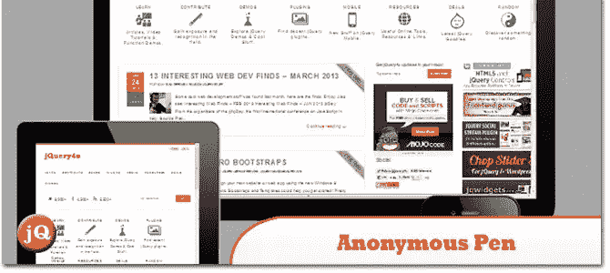
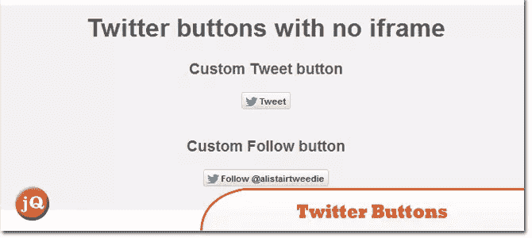
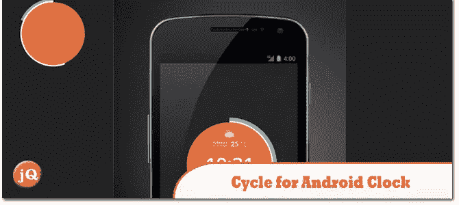
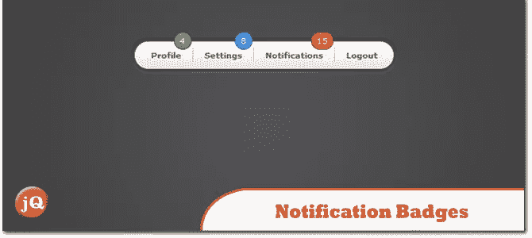
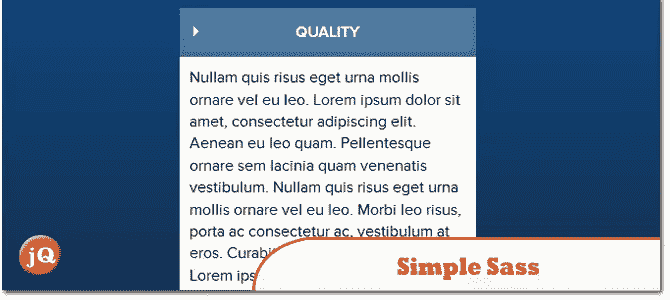
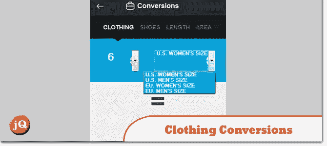
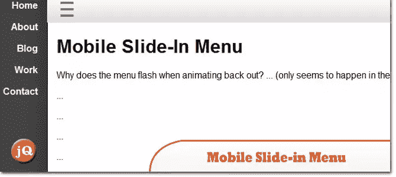
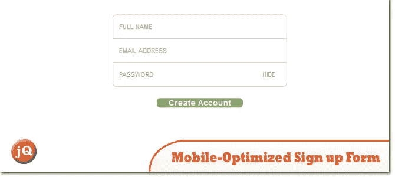
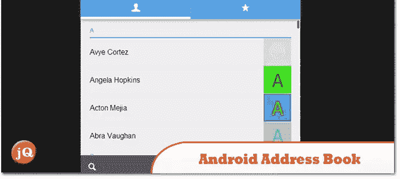

# 10 种 jQuery 和 CSS3 移动应用程序风格

> 原文：<https://www.sitepoint.com/10-jquery-css3-mobile-app-styles/>

今天，我们向您展示 **10 款 jQuery 和 CSS3 移动应用风格**以满足您的移动应用需求！他们真的很酷，值得一试，享受吧！

## 1.匿名笔

jQuery 响应式 Web 设计检查器

 
[源+演示](http://codepen.io/anon/pen/ihwuH)

## 2.没有 iframe 的 Twitter 按钮

在响应式网站上嵌入 Tweet 或 Follow 按钮可能有点棘手。包含它们会大大增加页面加载时间。然而，它们是传播一篇新博文或文章的好方法。

 
[源+演示](http://codepen.io/alistairtweedie/pen/JlFnq)

## 3.android 时钟周期

制作 android 对接时钟的动画。

 
[源+演示](http://codepen.io/pseudoheld/details/ciafg)

## 4.设备切换器

展示响应式布局的动画。

 
[源+演示](http://codepen.io/lloydwheeler/details/iuCGF)

## 5.带通知徽章的应用导航

带有彩色通知标记的简单应用程序导航。徽章是使用 Sass 函数从单一输入颜色生成的，您可以轻松地对其进行定制以创建自己的徽章。

 
[源+演示](http://codepen.io/Thibaut/details/iHlCy)

## 6.简单的 sass/jQuery 手风琴

css3/sass/jquery accordion 有一些简单的动画，箭头都是用 css 完成的(滑动和点击状态是用 jquery 完成的)。

 
[源+演示](http://codepen.io/jonstuebe/details/iyhej)

## 7.服装转换(由拉力赛互动设计)

提交给 dribbble.com

 
[源+演示](http://codepen.io/joacimnilsson/details/jqsmK)

## 8.移动滑入菜单

类似于脸书和 Path 在手机上设计菜单的滑动菜单。

 
[源+演示](http://codepen.io/dganoff/details/CcJhG)

## 9.移动优化注册表单

简单的注册形式为移动优化，可切换密码屏蔽。为每个输入调出正确的上下文键盘。

 
[源+演示](http://codepen.io/peruvianidol/details/Hthyu)

## 10.带有 AngularJs 的 Android 地址簿副本

带有 AngularJs 的 Android 地址簿副本

 
[源+演示](http://codepen.io/danielemoraschi/pen/deyos)

## 分享这篇文章