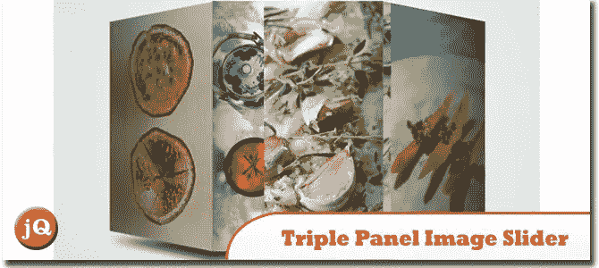
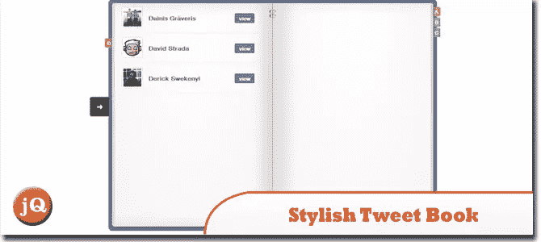
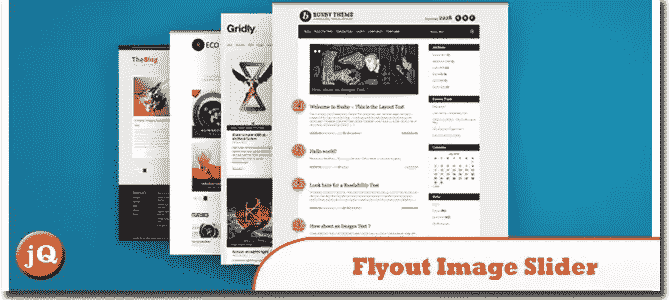
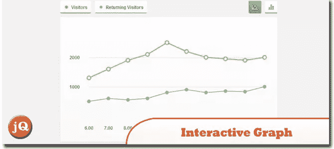
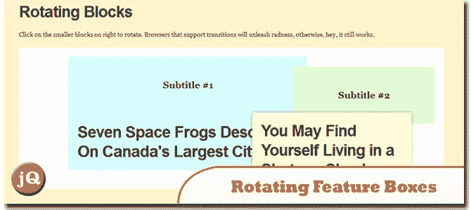
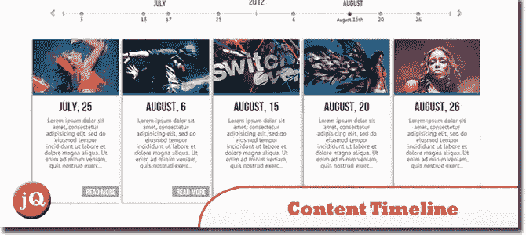
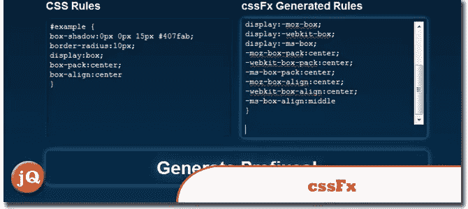
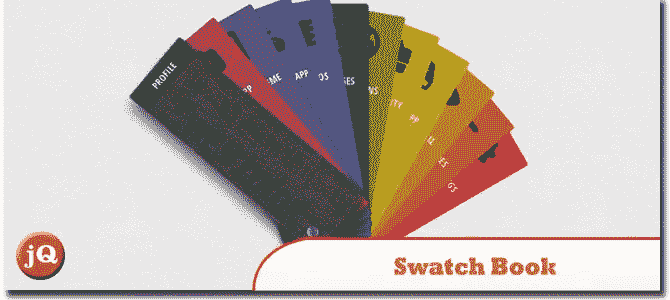

# 10 多个 jQuery/CSS/CSS3 插件

> 原文：<https://www.sitepoint.com/10-jquery-css3-plugins/>

如果你想建立一个有吸引力的博客/网站，那么试试使用我们收集的 10 个 jQuery CSS/CSS3 插件。有了这些教程/插件，你可以非常轻松地开发一个先进的网站，并应用 CSS3 来构建一个华丽的三面板图像滑块，时尚的 Tweet Book 等…玩得开心！

## 1.jQuery & CSS3 中的三面板图像滑块

关于如何创建具有 3D 外观和滑动式过渡的三面板 jQuery 图像滑块的教程。
 
[来源](http://tympanus.net/codrops/2012/08/16/triple-panel-image-slider/) [演示](http://tympanus.net/Tutorials/TriplePanelImageSlider/)

## 2.用 jQuery 和 CSS 创建一个时髦的 Tweet Book

完成本教程后，你将获得使用 jQuery 和 CSS 创建时尚书籍设计的知识。您还将学习使用 jQuery 和 AJAX 使用 Twitter API。
 
[来源](http://www.1stwebdesigner.com/css/create-a-stylish-tweet-book-with-jquery-and-css/) [演示](http://innovativephp.com/demo/tweet-book-ver4/)

## 3.使用 jQuery & CSS3 弹出图像滑块

这个图像滑块是一些图像的堆栈，通过将选定的图像弹出到图像堆栈的前面来工作。我们将使用 CSS3 过渡，动画和转换这个动画和 jQuery 来帮助我们维护点击事件，CSS 过渡和动画。
 
[来源](http://www.webstuffshare.com/2012/07/flyout-image-slider-using-jquery-css3/) [演示](http://webstuffshare.com/demo/FlyoutSlider/index.html)

## 4.如何使用 CSS3 和 jQuery 创建交互式图形

使用 jQuery 和 CSS3 的交互式图形。我们将使用 jQuery 流行的绘图插件“Flot”。Flot 是一个用于 jQuery 的纯 JavaScript 绘图库。
 
[来源](http://designmodo.com/create-interactive-graph-css3-jquery/) [演示](http://designmodo.com/demo/interactivegraph/)

## 5.使用 jQuery 和 CSS3 旋转特征框

它的全部效果(包括过渡动画)将在新的 WebKit 和 Opera 浏览器以及上面的 Firefox 4 中工作。任何其他浏览器将旋转块，而不显示过渡动画。
 
[来源](http://css-tricks.com/rotating-feature-boxes/) [演示](http://css-tricks.com/examples/RotatingBlocks/)

## 6.具有 CSS3 媒体查询的响应式设计

本教程将向你展示如何创建一个跨浏览器的 HTML5 和 CSS3 媒体查询响应设计。
 
[来源](http://webdesignerwall.com/tutorials/responsive-design-with-css3-media-queries) [演示](http://webdesignerwall.com/demo/adaptive-design/final.html)

## 7.内容时间线–jQuery/html 5/CSS3 插件

内容时间线是一个强大的轻量级响应 jQuery/HTML5/CSS3 插件，最适合显示任何有组织的内容。它是完全可定制的，很容易用任何 js 脚本，视频，flash 等实现。
 
[来源](http://codecanyon.net/item/content-timeline-jqueryhtml5css3-plugin/2617834) [演示](http://codecanyon.net/item/content-timeline-jqueryhtml5css3-plugin/full_screen_preview/2617834)

## 8.cssFx:为 CSS3 属性插入供应商前缀

独立的聚合填充，可插入新旧浏览器所需的特定于供应商的 CSS3 特性。这为您节省了大量的时间、维护和带宽！
 
[源+演示](http://imsky.github.com/cssFx/)

## 9.使用 jQuery 和 CSS3 放大图像的放大镜

学习使用 Jquery 和 CSS3 制作一个逼真的放大镜。
 
[源+演示](http://thecodeplayer.com/walkthrough/magnifying-glass-for-images-using-jquery-and-css3)

## 10.带有 CSS3 和 jQuery 的样本书

一个关于如何创建一个样本书一样的组件，让你打开和旋转单个样本揭示一些细节的教程。我们将使用 CSS 转换和过渡，并创建一个简单的 jQuery 插件。
 
[来源](http://tympanus.net/codrops/2012/07/02/swatch-book-with-css3-and-jquery/) [演示](http://tympanus.net/Tutorials/SwatchBook/index.html)

## 分享这篇文章