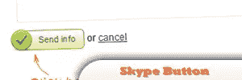
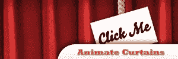
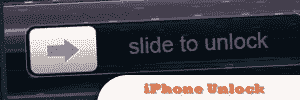
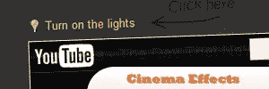
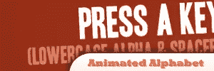
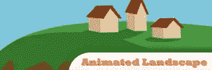
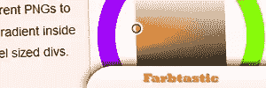

# 10 个 jQuery 可爱插件

> 原文：<https://www.sitepoint.com/10-jquery-cuteness/>

使用这些可爱的 jQuery 插件，让你的网页设计变得可爱而实用。

## [1。Skype like 按钮](http://www.jankoatwarpspeed.com/post/2009/03/11/How-to-create-Skype-like-buttons-using-jQuery.aspx)

Skype 在当今世界广泛使用。这个插件帮助您创建一个在 skype 上看起来完全一样的按钮。

来源

## [2。动画窗帘](http://buildinternet.com/2009/07/animate-curtains-opening-with-jquery/)

了解如何在 jQuery 中制作窗帘打开场景的动画。

[参见现场演示](http://buildinternet.com/live/curtains)
[来源](http://buildinternet.com/2009/07/animate-curtains-opening-with-jquery/)

## [3。熄灯](http://buildinternet.com/2009/08/lights-out-dimmingcovering-background-content-with-jquery/)

添加背景为灰色的弹出消息框。

[参见现场演示](http://buildinternet.com/live/lightsout)
[来源](http://buildinternet.com/2009/08/lights-out-dimmingcovering-background-content-with-jquery/)

## 4.iPhone 解锁

用 xHTML，CSS 当然还有 jQuery 模拟 iPhone 解锁屏幕。

[看现场演示](http://demo.marcofolio.net/iphone_unlock/)

## [5。彩虹变色](http://buildinternet.com/2009/09/its-a-rainbow-color-changing-text-and-backgrounds/)

用 jQuery 制作可爱的彩虹效果。

[参见现场演示](http://buildinternet.com/live/rainbow)
[来源](http://buildinternet.com/2009/09/its-a-rainbow-color-changing-text-and-backgrounds/)

## [6。彩色网站地图](http://www.smashingmagazine.com/2009/01/22/ask-sm-how-to-create-a-colorful-sitemap-with-jquery/)

[看现场演示](http://css-tricks.com/examples/Sitemap)
[来源](http://www.smashingmagazine.com/2009/01/22/ask-sm-how-to-create-a-colorful-sitemap-with-jquery/)

## [7。影院效果](http://www.jankoatwarpspeed.com/post/2009/05/17/Use-jQuery-to-turn-off-the-lights-while-watching-videos.aspx)

用 jQuery 看视频的时候关灯。

来源

## [8。动画字母表](http://buildinternet.com/2009/05/make-an-animated-alphabet-using-keypress-events-in-jquery/)

[看现场演示](http://buildinternet.com/live/jquery-typing/jquery-typing.htm)
[来源](http://buildinternet.com/2009/05/make-an-animated-alphabet-using-keypress-events-in-jquery/)

## 9.动画景观

有一个卡通主题的标题，为内容建立两种不同的状态，并制作它们之间的过渡动画。

[参见现场演示](http://buildinternet.com/live/landscape-header/landscape-header.htm)
来源

## [10 .色彩修饰](http://acko.net/dev/farbtastic)

使用 Farbastic 在页面中添加一个或多个颜色选择器小部件。

[参见现场演示](http://acko.net/dev/farbtastic)
[来源](http://acko.net/dev/farbtastic)

## 分享这篇文章