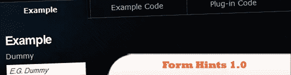
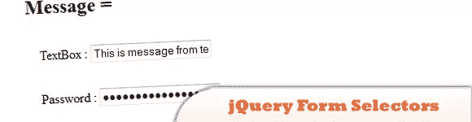
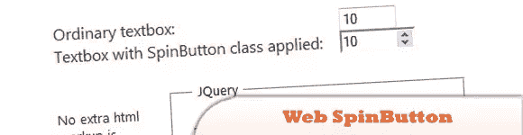
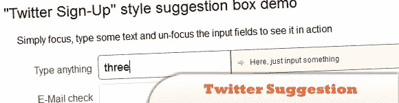
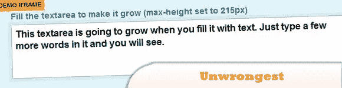
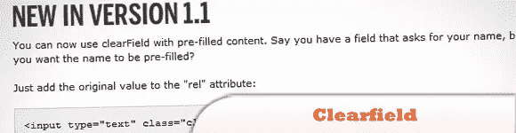
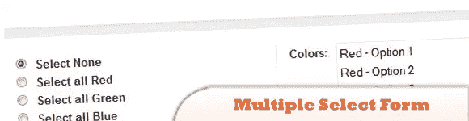
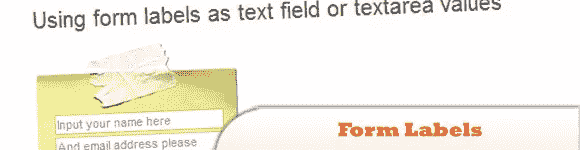
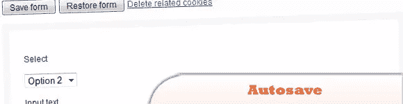

# 10 jQuery 表单-可访问性和功能

> 原文：<https://www.sitepoint.com/10-jquery-form-accessibility-functionality/>

这个 jQuery 表单脚本和插件列表的主要目标是以多种方式提高表单的可访问性和功能性。我们在这个类别中包含了一些非常酷的演示，可能有助于优化您当前的表单，并为您网站的访问者提供更好的体验。

我真的很喜欢#9 使用输入标签作为字段的默认值。尽情享受吧！

相关帖子:

*   [**jQuery 表单> 30 个例子和插件**](http://www.jquery4u.com/forms/30-jquery-forms/)

## 1.表单提示 1.0

使用这个插件，您可以向站点上的任何表单控件添加描述性提示。通过给表单控件一个 title 属性来添加提示。当用户单击控件时，该提示将消失并重新出现。

  
[来源](http://andreaslagerkvist.com/jquery/form-hints/)

## 2.jQuery 表单选择器示例

jQuery 附带了许多表单选择器，可以更容易、更有效地访问表单元素。下面是一个简单的 jQuery 表单选择器参考。

  
[来源](http://www.mkyong.com/jquery/jquery-form-selectors-example/)
[演示](http://www.mkyong.com/wp-content/uploads/jQuery/jQuery-form-selector.html)

## 3\. Web SpinButton

在这一页上，你会发现一个使用单个文本框的 web 微调按钮控件的演示。

  
[源+演示](http://www.softwareunity.com/jquery/JQuerySpinBtn/)

## 4.表单更改警告

一个真正有用的资源，适用于每个人，从普通人到程序员。您将在本页了解如何安装一个警告，避免您在提交表单或类似情况之前离开页面。

  
[来源](http://misterdai.wordpress.com/2010/06/04/jquery-form-changed-warning/)
[演示](http://jsbin.com/amecu3)

## 5.Twitter 建议

一个简单而有趣的练习，显示一个类似 Twitter 的建议框，就像截图上显示的那样。

  
[源+演示](http://www.enricofoschi.com/jquery/twittersuggestion/)

## 6.最长的

就像脸书的增长框一样，这个 jQuery 插件可以让你的文本框根据内容的多少而增长和收缩。

  
[来源](http://www.unwrongest.com/projects/elastic/)
[演示](http://www.unwrongest.com/projects/elastic/#demo)

## 7.Clearfield

另一个有用的提示插件，这个插件在盒子里没有内容的时候显示一个建议。

  
[源+演示](http://labs.thesedays.com/projects/jquery/clearfield/)

## 8.选择多个选择表单元素

很多时候，我们发现自己面临着一个巨大的清单，除了一个接一个地选择我们需要的元素之外，没有别的办法，现在多亏了这个伟大的 jQuery 教程，这一切都结束了。

  
[来源](http://www.chromaticsites.com/blog/jquery-tutorial-selecting-multiple-select-form-elements-on-the-fly/)
[演示](http://blog-media.chromaticsites.com/tutorials/jquery/0001_Select_Multiple_Option_Elements/index.html)

## 9.将表单标签用作文本字段值

正如标题所说，这个链接将向您展示如何利用表单标签作为文本字段或文本区域的值。

  
[来源](http://cssglobe.com/post/2494/using-form-labels-as-text-field-values)
[演示](http://cssglobe.com/lab/label2value/)

## 10.自动保存

旨在通过将字段保存到 cookies 来保存表单的进度，因此如果出现任何问题，您不会丢失任何东西。该插件以一定的间隔(默认为每 10 秒)保存表单字段，并在您离开页面时保存。

  
[来源](http://rikrikrik.com/jquery/autosave/)
[演示](http://rikrikrik.com/jquery/autosave/#examples)

## 分享这篇文章