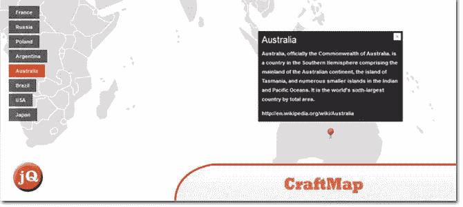
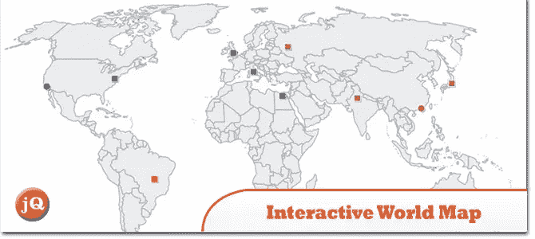
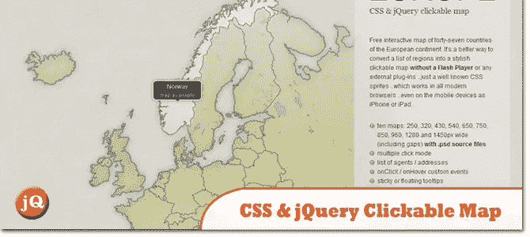
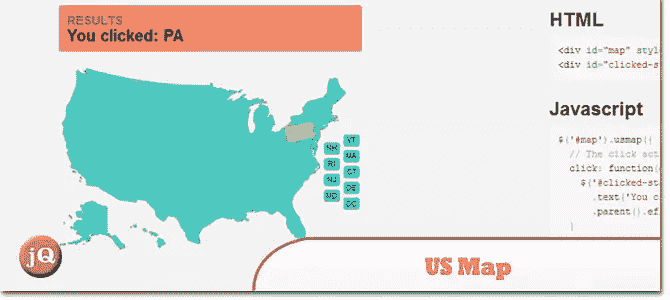
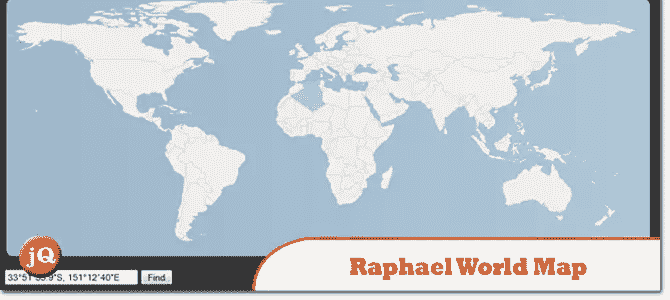
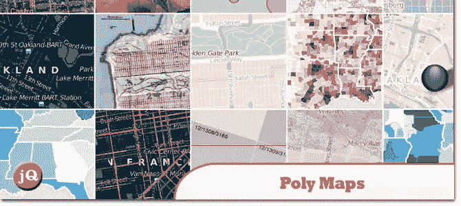
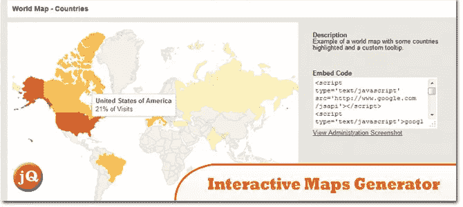
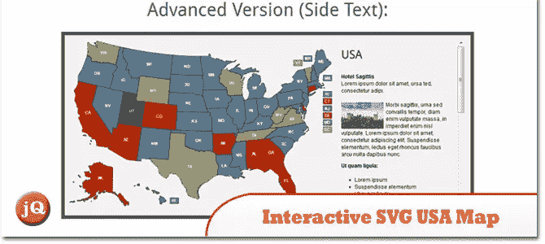
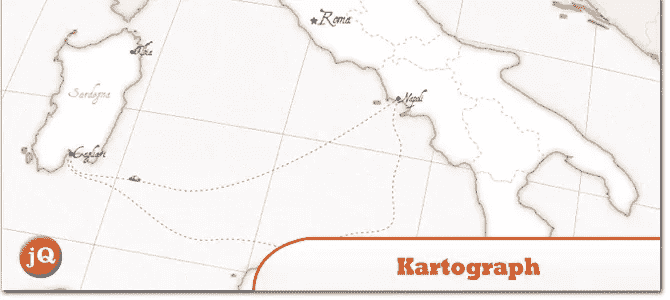

# 10 个 jQuery 全局地图插件

> 原文：<https://www.sitepoint.com/10-jquery-global-map-plugins/>

在本帖中，我们将与您分享一组 **10 个 jQuery 全球地图插件**，如果您想在自己的网站上显示全球地图，您肯定会发现这些插件非常有用。世界或特定国家/地区的 jQuery 交互式地图和图像地图的集合。这些地图插件不需要闪光灯。只有 JavaScript。太好了。享受=)

**相关帖子:**

*   [**10 jQuery 谷歌地图插件**](http://www.jquery4u.com/plugins/10-jquery-google-map-plugins/)

## 1.JQVMap

一个呈现矢量地图的 jQuery 插件。它为 Firefox、Safari、Chrome、Opera 等现代浏览器使用可调整大小的可缩放矢量图形(SVG)..

 
[源+演示](http://jqvmap.com/)

## 2.工艺地图(以前的移动地图)

完全可配置的 jQuery 插件，通过在上面叠加动态元素(如标记)将简单图像转换成功能图。像谷歌地图一样，你可以放置自己的标记图标，并通过可拖动的图像界面向特定标记添加位置信息。

 
[来源](http://www.jscraft.net/plugins/craftmap.html) [演示](http://www.jscraft.net/demo/plugins/craftmap/)

## 3.交互式世界地图

这个地图是用 HTML5 代码构建的，并使用基于可缩放矢量图形(SVG)新技术的 javascript 运行，因此它可以缩放到任何大小而不会损失质量。

 
[来源](http://codecanyon.net/item/interactive-world-map/4757953?ref=sdeering) [演示](http://codecanyon.net/item/interactive-world-map/full_screen_preview/4757953)

## 4.CSS & jQuery 可点击地图

这是一种更好的方法，无需 Flash 播放器或任何外部插件，就可以将地区列表转换为时尚的可点击地图。只是一个众所周知的 CSS sprites，它可以在所有现代浏览器中工作，甚至可以在 iPhone 或 iPad 等移动设备上工作。

 
[源+演示](http://winstonwolf.pl/clickable-maps/europe.html)

## 5.美国地图

无需使用 Flash，轻松地将美国和各州的交互式地图添加到您的网页中。

 
[源+演示](http://newsignature.github.io/us-map/)

## 6.拉斐尔世界地图

使用 Rapahel 插件的世界地图。

 
[源+演示](http://raphaeljs.com/world/)

## 7.多边形贴图

使用 SVG 的图像和矢量平铺地图的 JavaScript 库。

 
[来源](http://polymaps.org/) [演示](http://polymaps.org/ex/)

## 8.交互式地图生成器

一个独立的应用程序，你可以生成尽可能多的地图，并复制嵌入代码和地方的地图在您的任何网站！

 
[来源](http://codecanyon.net/item/interactive-maps-generator/3272382?ref=sdeering) [演示](http://codecanyon.net/item/interactive-maps-generator/full_screen_preview/3272382)

## 9.交互式 SVG 美国地图

用 javascript (raphael)运行，不需要 flash，支持 iPad 和 iPhone。可调整大小的地图，您可以直接在 XML 文件中更改地图的大小。

 
[来源](http://codecanyon.net/item/interactive-svg-usa-map/1021095?ref=sdeering) [演示](http://codecanyon.net/item/interactive-svg-usa-map/full_screen_preview/1021095)

## 10.Kartograph

一个简单的轻量级框架，用于构建交互式地图应用程序，无需 Google Maps 或任何其他地图服务。

 
[源+演示](http://kartograph.org/)

## 分享这篇文章