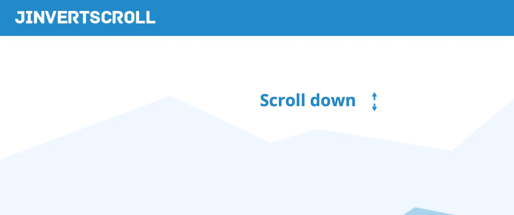
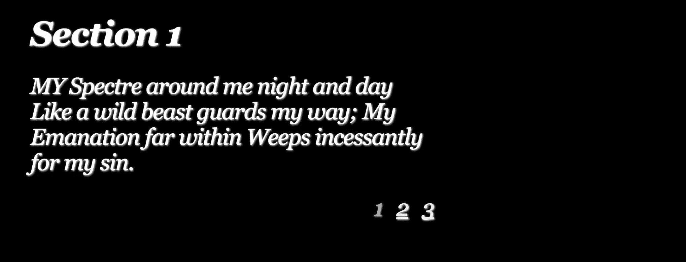
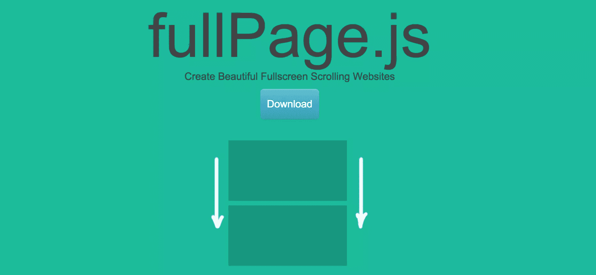
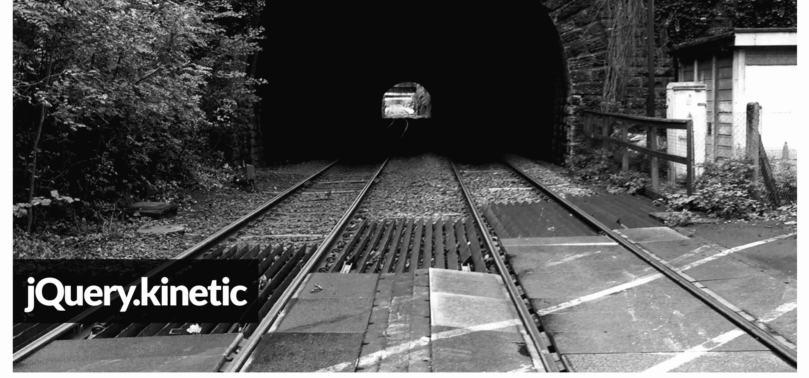
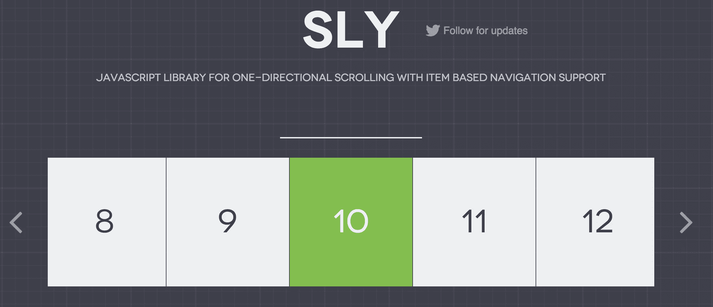
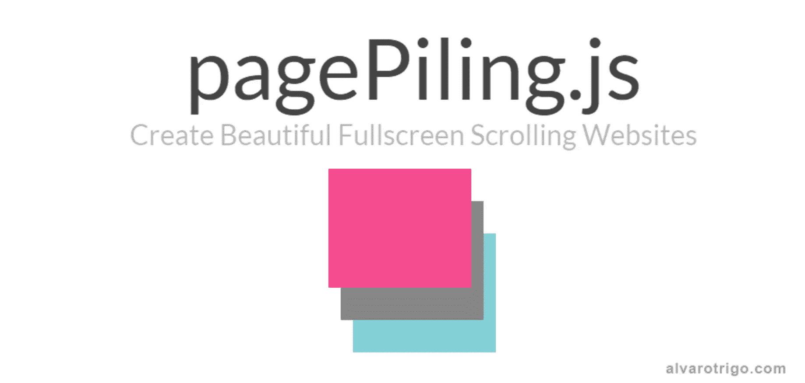
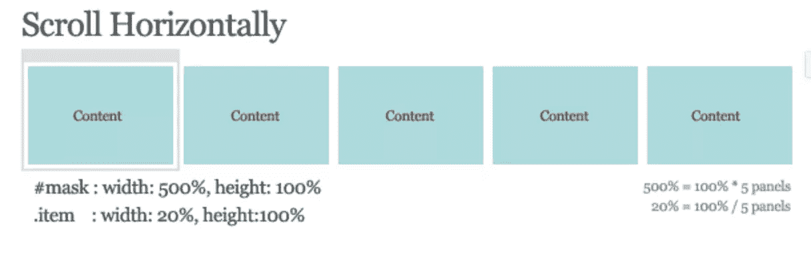

# 10 个 jQuery 水平滚动演示和插件

> 原文：<https://www.sitepoint.com/10-jquery-horizontal-scroll-demos-plugins/>

在今天的帖子中，我们为您带来了 10 个 jQuery 水平滚动演示&对于那些水平看待事物的人很有用的插件。我想我们必须接受一些人双向滚动！:)

**更新:2016 年 3 月**用最新版本更新了所有插件和演示，并增加了一些新的。还删除了不再开发的插件。

## 1.卷轴魔法

[ScrollMagic](http://scrollmagic.io/) 帮助你轻松应对用户当前的滚动位置。它的轻量级(6KB gzipped)和移动友好。它支持两个滚动方向。

[参见演示](http://scrollmagic.io/examples/basic/going_horizontal.html)

## 2.jInvertScroll

jInvertScroll 是 jQuery 的一个轻量级插件，它允许你在向下滚动时以视差效果水平移动。

[参见演示](http://codepen.io/SitePoint/pen/MKExrG)

## 3.水平时间轴

本教程将教你用 CSS 和 jQuery 创建一个易于定制的水平时间轴。

[参见演示](https://codyhouse.co/demo/horizontal-timeline/index.html)

## 4.使用 jQuery 平滑水平滚动

本教程将教你如何使用 jQuery Easing 插件和几行 jQuery 代码创建一个简单平滑的滚动效果。

[参见演示](http://codepen.io/SitePoint/pen/WrZmME)

## 5.简单滚动

simplyScroll 是一个灵活的 jQuery 内容滚动器，支持触摸。它在循环模式下自动支持大小不等的元素。

[参见演示](http://codepen.io/SitePoint/pen/GoMedq)

## 6.使用 fullPage.js 进行水平滚动

fullPage.js 是一个基于 jQuery 的插件，允许我们构建单页滚动网站。它不仅适用于所有现代浏览器，也适用于一些较老的浏览器，如 IE 8 和 Opera 12。

[参见演示](http://codepen.io/ritz078/pen/wMPRzr)

## 7.动态查询

jQuery.kinetic 是一个简单的插件，它为容器添加了平滑拖动滚动和逐渐减速。

[参见演示](http://davetayls.me/jquery.kinetic/)

## 8.狡猾的

Sly 是一个单向滚动的 JavaScript 库，支持基于项目的导航。它可以作为一个简单的滚动条的替代品，作为一个先进的基于项目的导航工具，或作为一个伟大的导航和视差网站的动画界面。

[参见演示](http://codepen.io/ritz078/pen/bEYOov)

## 9\. pagePiling.js

page pilling . js 是一个 jQuery 插件，可以帮助你一个接一个地堆积你的部分，并通过滚动或 URL 访问它们。它完全兼容 IE8 和 Safari 12 等旧浏览器，也可以在移动设备上完美运行。

[参见演示](http://alvarotrigo.com/pagePiling/examples/horizontalScroll.html)

## 10.水平滚动教程

[本教程](http://www.queness.com/post/356/create-a-vertical-horizontal-and-diagonal-sliding-content-website-with-jquery)将教你垂直、水平甚至对角滚动网页内容！不用担心，不会太依赖 JavaScript。它使用 CSS/HTML 进行布局，只使用 JavaScript 进行滚动。

[参见演示](http://codepen.io/SitePoint/pen/MKExqB)

## 结论

本文回顾了 10 个最常用的 jQuery 水平滚动演示和插件。我希望你会发现它们对你的项目有用。你知道其他有帮助的插件吗？你用什么？欢迎在下面的评论中分享你的观点和建议。

## 分享这篇文章