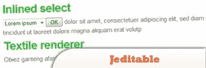
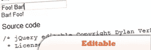
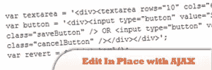
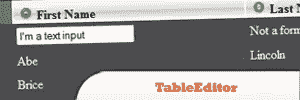
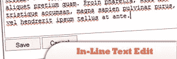
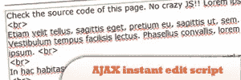
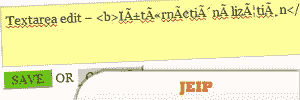

# 10 个 jQuery 行内编辑器插件

> 原文：<https://www.sitepoint.com/10-jquery-inline-editor-plugins/>

10 jQuery Inline Editors to help you manage your page content dynamically just like a CMS but on your webpage live! In search of some decent inplace editors, we found these really interesting scripts. Inplace editing or inline editing is very useful in editing the text on the same page without refreshing it hence making user interface more strong. See our tutorials below.

 

## [1。WYMeditor:基于网络的 XHTML 编辑器](http://www.wymeditor.org/)

一个基于 web 的 WYSIWYM(所见即所得)XHTML 编辑器(不是 WYSIWYG)。主要概念是留下文档视觉布局的细节，专注于它的结构和意义，同时尽可能地给用户带来舒适(至少作为 WYSIWYG 编辑器)。

来源

  

## [2。piment ech-scripts:jquery . jframe . js](http://garage.pimentech.net/scripts_doc_jquery_jframe/)

提供了一种简单的方法，用 AJAX 在 DIV 元素上获得类似 HTML 框架的行为。它带有 Pimentech 脚本库。使用 jFrame，您无需离开主页面，无需一行 JavaScript 就可以构建智能、复杂的现代互联网应用程序！

来源

 

## [3。j editable–jQuery 的就地编辑插件](http://www.appelsiini.net/projects/jeditable)

jQuery 的就地编辑器插件，只有几行 JavaScript 代码，它允许你点击和编辑不同 xhtml 元素的内容。《可编辑的》是根据迪伦·维荷尔的《可编辑的》改编的。

来源

 

## [4。可编辑](http://www.dyve.net/jquery/?editable)

用 jQuery 创建就地编辑字段的简单方法。

来源

## 5.使用 jQuery JavaScript 库使用 AJAX 就地编辑

一个 AJAX(或 AHAH)概念验证页面，允许访问者在不离开页面的情况下编辑他们正在查看的 HTML 页面。

 

## [6。表格编辑器](http://dev.iceburg.net/jquery/tableEditor/demo.php)

提供灵活的 HTML 表格就地编辑。用户定义的处理函数可以很容易地加入进来，例如，通过 AJAX 请求更新数据源。

来源

 

## [7。嵌入式文本编辑](http://www.codenothing.com/archives/2009/inline-text-edit/)

允许用户通过 ajax 调用在浏览器中编辑文本块，而不是重新加载页面。使用半特定的 DOM 树。

来源

 

## [8。AJAX 即时编辑脚本–干净的 HTML](http://www.yvoschaap.com/instantedit/)

这是一个即时编辑脚本，你可能会喜欢。尽情享受吧！

来源

 

## [9。就地丰富编辑器](http://inplacericheditor.box.re/demos)

在 FF 3+，IE 6+，Safari 4+，Chrome 11+和 Opera 10+

[上测试来源](http://inplacericheditor.box.re/demos)

## 10。约瑟夫·斯科特·杰普

一个简单的 jQuery 就地编辑插件。

来源

## 分享这篇文章