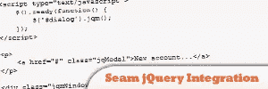
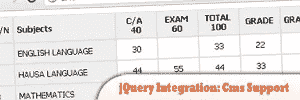
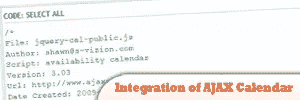
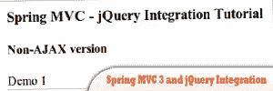
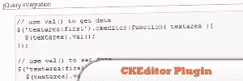

# 10 个 jQuery 集成插件

> 原文：<https://www.sitepoint.com/10-jquery-integrations/>

10 个非常棒的 jQuery 集成插件。jQuery 是一个快速而简洁的 JavaScript 库，它简化了 HTML 文档遍历、事件处理、动画和 Ajax 交互，有助于快速的 web 开发。jQuery 插件是现代网页设计不可或缺的一部分。在这篇文章中，你将学到 10 个简单却令人惊叹的 jQuery 集成。玩得开心！

 

## [1 .jQuery jsContext](http://plugins.jquery.com/project/jsContext)

允许开发人员轻松地向他们的网站/应用程序添加自定义上下文菜单和工具提示。

来源

 

## [2。jQPortal](http://plugins.jquery.com/project/JQPortal)

一套全面的 UI 小部件和视觉效果工具，使用 jQuery 风格、事件驱动的架构，专注于 web 标准、可访问性、灵活的样式和用户友好的设计 UI 框架，是可插拔和可扩展的。

来源

## 3.Seam jQuery 集成

在本教程中学习与 jQuery 的 seaming 集成。

 

## [4。DHTML Datagrid Control::jQuery Integration::Cms 支持](http://www.nairaland.com/nigeria/topic-652050.0.html)

特点:
>它允许你定义列和行
>它以一种容易主题化的方式自动为它们分配 ID。例如，如果我要显示一个 100/1000 的网格，
我可以预测各种文本框的 id。
>它允许使用箭头键从一个可编辑字段移动到另一个可编辑字段。
>在这个演示中，您可以实际提交
>您可以控制一些字段允许的位数，例如这里使用了 2 位数
>跨浏览器兼容性
>支持 jQuery 验证
>与 drupal cck / views
>集成可以以独立格式使用
>和其他几种格式。。。

[来源](http://www.nairaland.com/nigeria/topic-652050.0.html)

 

## [5。AJAX 日历的 jQuery 集成](http://forum.ajaxavailabilitycalendar.com/viewtopic.php?f=22&t=374&start=0)

你现在可以不用 MooTools 来开发 Ajax 日历了。请在本教程中找到答案。

来源

 

## [6。Spring MVC 3 和 jQuery 集成教程](http://krams915.blogspot.com/2011/01/spring-mvc-3-and-jquery-integration.html)

在本教程中，我们将使用 jQuery 构建一个简单的具有 Ajax 功能的 Spring MVC 3 应用程序。我们将探索如何使用 jQuery.post()发布数据并处理结果。我们将首先开发一个非 AJAX 应用程序，然后再将其转换为 AJAX 支持的版本。

来源

 

## 7 .[。Google AJAX API 和 jQuery 集成(带宽免费)](http://www.tlswebsolutions.com/google-ajax-api-and-jquery-integration-bandwidth-free/)

众所周知，谷歌过去发布过一些非常漂亮的东西。今天，我们将看看它对 web 开发人员来说最令人愉快的附加功能之一。谷歌 AJAX API。

来源

 

## [8。jQuery 的 CKEditor 插件](http://dev.ckeditor.com/ticket/4210)

创建一个 jQuery 插件，允许 jQuery 用户轻松地将富文本编辑集成到他们的应用程序中。

来源

 

## [9。黄疸〔t1〕](http://juitter.com/)

一个漂亮的 jQuery twitter 插件，体积小，比其他 twitter 插件更快，实时模式，显示正在发生的事情，显示来自或发给用户的推文，显示包含特定单词的推文和其他酷功能。

来源

## 10.jTweetsAnywhere

一个 jQuery Twitter 小部件，通过几行 JavaScript 简化了 Twitter 服务到您站点的集成。

## 分享这篇文章