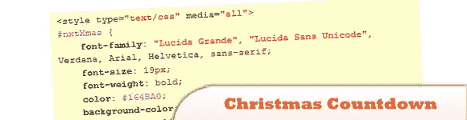
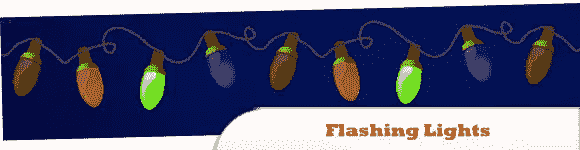
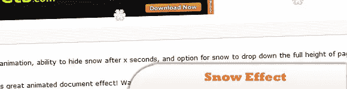
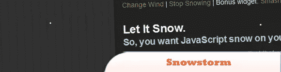
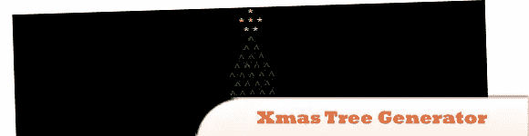
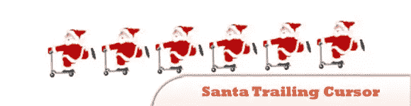
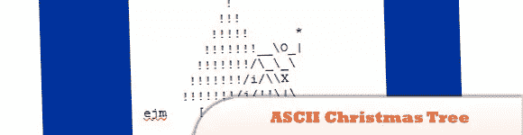

# 10 jQuery 和 JavaScript 圣诞效果

> 原文：<https://www.sitepoint.com/10-jquery-javascript-christmas-effects/>

圣诞节(又一次)就要到了，有那么久吗？嗯，我想当你编码的时候时间过得真快！在这篇文章中，找到一些圣诞精神，在你的网站上放一些用 jQuery 和 JavaScript 制作的圣诞装饰品。节日快乐！lol:)

## 1.JavaScript 圣诞倒计时数字钟

在这篇文章中，我们将设计一个 JavaScript 圣诞倒计时数字钟，使用访问者计算机的时间来倒数圣诞事件。这个脚本非常灵活，它将按照时区工作。

  
[来源](http://www.xfunda.com/index.php?option=com_content&view=article&id=112:javascript-christmas-countdown-digital-clock&catid=40:javascript&Itemid=75)
[演示](http://www.xfunda.com/index.php?option=com_content&view=article&id=112:javascript-christmas-countdown-digital-clock&catid=40:javascript&Itemid=75)

## 2.闪光灯

要在您的网站上放置闪光灯，请将以下代码粘贴到您网站上的 HTML 小部件中。

  
[源+演示](http://tester2.synthasite.com/christmas-lights-top.php)

## 3.谷歌的圣诞涂鸦

随着假期的结束，我们可以充分利用从那家豪华餐厅获得的热量，并努力为接下来的一周保持身材。所以让我们尝试在 jQuery 和一点 CSS 的帮助下重新创建 Google 的动画标志！

  
[来源](http://tutorialzine.com/2010/12/google-christmas-doodle/)
[演示](http://demo.tutorialzine.com/2010/12/google-christmas-doodle/)

## 4.雪效应

用这个伟大的动画文档效果装饰您的网页！看着雪轻轻地顺着书页流下，然后消失。使用的图像是可变的，所以雪肯定不是这个脚本可以渲染的唯一效果…

  
[源+演示](http://www.dynamicdrive.com/dynamicindex3/snow.htm)

## 5.暴风雪

暴风雪是一种 JavaScript 驱动的雪效果，可以很容易地添加到网页中。它是免费使用的，并且易于设置。一个 JavaScript 文件就提供了所需的功能。没有图像用于雪的效果。

  
[源+演示](http://www.schillmania.com/projects/snowstorm/)

## 6.jQuery Snowfall 1.5 更新现在有雪堆积！

在插件中增加了积雪，所以现在你可以在收集选项中传递一个 jQuery 选择器，积雪会在所有匹配的元素上收集。它使用 canvas 标签，因此雪不会在 IE8 或更低版本中聚集。

  
[来源](http://www.somethinghitme.com/2011/10/05/jquery-snowfall-1-5-update-now-with-snow-buildup/)
[演示](http://loktar00.github.com/JQuery-Snowfall/)

## 7.采油树生成器

这段 JavaScript 代码帮助您生成一棵圣诞树。圣诞树的大小是随机的，灯放在随机的地方。

  
[源+演示](http://www.javascriptsource.com/miscellaneous/xmas-tree-generator.html)

## 8.圣诞老人尾随光标或圣诞节光标

这是一个很棒的带有圣诞主题的尾随光标。圣诞老人在你的鼠标光标后面飞驰，在他去的任何地方留下他自己的小图像。奇妙的尾随光标效果照亮你的圣诞页面。

  
[源+演示](http://www.hypergurl.com/santacursor.html)

## 9.用 JavaScript 创建一个浮动的圣诞滚动条

迷人的小圣诞滚动与下雪的动画和引人注目的阴影字体。

  
[源+演示](http://www.hypergurl.com/xmasscroller.html)

## 10.使用 JavaScript 创建 ASCII 圣诞树动画

使用 JavaScript 创建一个动画的 ASCII 字符圣诞树。

  
[源+演示](http://llizard.cwahi.net/ascii-animations/treedecor2.html)

## 分享这篇文章