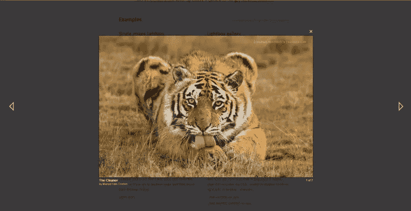
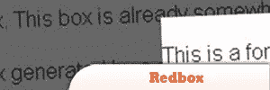
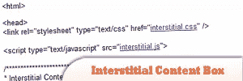
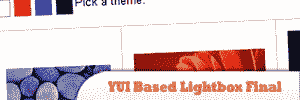
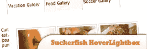
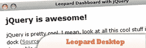
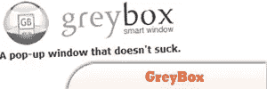
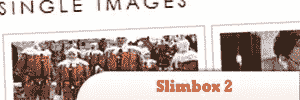

# 10 个 jQuery LightBox 插件

> 原文：<https://www.sitepoint.com/10-jquery-lightbox-plugins/>

Today we listed **10 jQuery lightbox plugins** to get your media displaying elegantly on your website without the need to load a new window, images and videos can load in a pop up style window which overlays on your current page.

[放大响应式弹出灯箱](http://dimsemenov.com/plugins/magnific-popup/)

## 1.梨形盒子

这是 pirobox 的高级版本，我实现了比以前版本更多的东西。最重要的事情之一是能够打开任何类型的文件，从内嵌内容到 swf 文件，从简单的图像到 PDF 文件。其他事情是:自动调整图像大小和拖放。

## 2.基于 Moo 工具的 Lightbox

它支持访问者浏览内容的方式，如缩略图和 HTML。

[来源](http://digitarald.de/project/remooz/)

## 3.red box——兼容 rails 的灯箱

这个新版本打破了一个助手方法和大部分 JavaScript 的向后兼容性(尽管你可能没有直接访问 JS)。

[来源](http://blog.craigambrose.com/articles/2006/09/22/redbox-release-2)

## 4.间隙内容框

这是一个 Interstitial Box 脚本，使用 Ajax 获取并显示服务器上外部页面的内容。

[来源](http://www.dynamicdrive.com/dynamicindex17/interstitial.htm)

## 5.YUI 灯箱决赛

这是一个新发布的基于 YUI 的灯箱。除了导航之外，还增加了许多新功能，并修复了一些错误。

[来源](http://thecodecentral.com/2008/01/01/yui-based-lightbox-final)

## 6.吸血鱼悬浮灯箱

因为 Suckerfish、Hoverbox 和 Lighbox 都是以一种有组织和简单的方式编写的，所以将它们结合起来相当简单。为了便于组织，我将控制 Suckerfish 和 Lightbox 的 JavaScript 文件分开，并使用单独的样式表来控制 Suckerfish 和 Lightbox 的样式。

[来源](http://mondaybynoon.com/2006/03/27/suckerfish-hoverlightbox/)

## 7.使用 jqDock 的带有 jQuery 的 Leopard Desktop

在本教程中，我将教你如何使用 jQuery 创建一个完全编码的仪表板，就像 Leopard 一样。这可以很方便地隐藏大量你没有空间的小工具或部件。

[来源](http://net.tutsplus.com/tutorials/javascript-ajax/leopard-desktop-in-jquery-using-jqdock/)

## 8.灰盒 jQuery 灯箱

可用于以美观的方式显示网站、图像和其他内容。

[来源](http://designresourcebox.com/snippet/greybox-jquery-lightbox/)

## 9.Slimbox 2

Lokesh Dhakar 编写的流行的 Lightbox 2 脚本的 4 KB 可视化克隆，使用 jQuery JavaScript 库编写。它被设计成非常小，高效，标准友好，完全可定制，更方便，并与最初的 light box 2 100%兼容。

[来源](http://www.digitalia.be/software/slimbox2)

## 10.可视化 jQuery 灯箱

> Flickr & Photobucket 支持
> jQuery 插件或原型扩展
>浮动和平滑交叉淡入淡出过渡
>带自动启动选项的幻灯片显示
> Windows & MAC 版
> XHTML 兼容
>带覆盖阴影的缩放效果
>覆盖窗口的圆角
>适合浏览器窗口的大图像
>大量漂亮的图库主题
>图像旋转和高质量图像

## 分享这篇文章