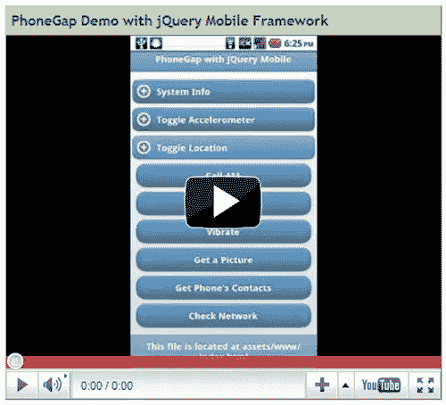
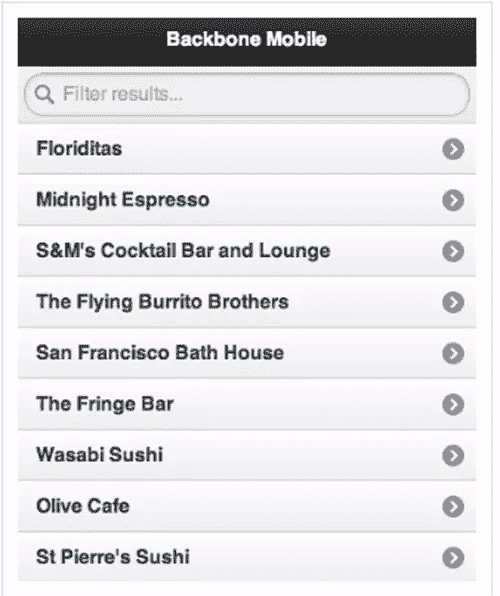
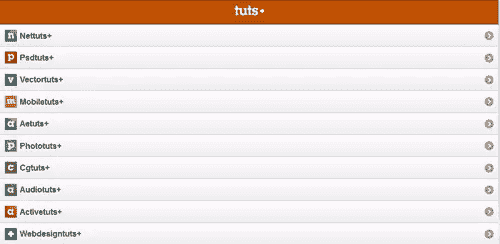
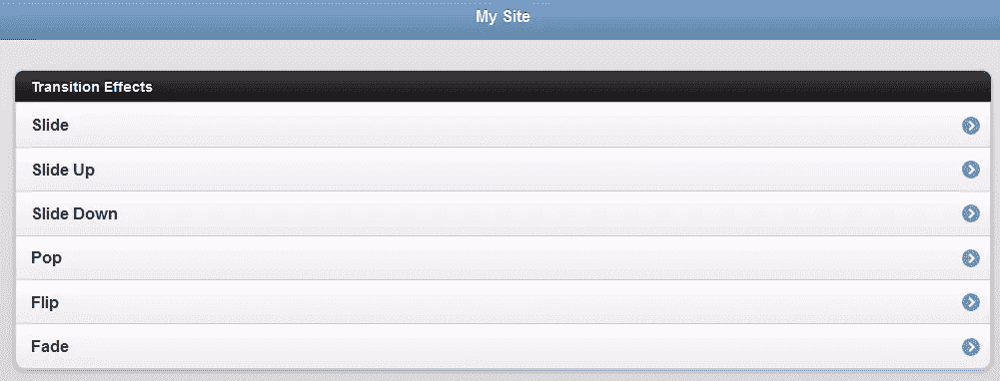
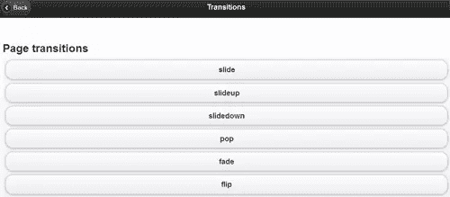
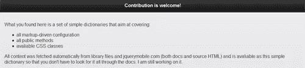
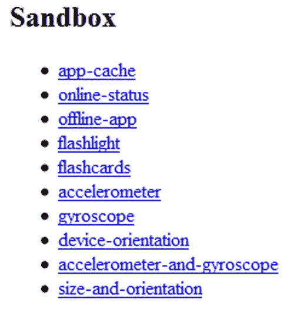

# 10 个 jQuery 移动演示网站示例

> 原文：<https://www.sitepoint.com/10-jquery-mobile-demo-websites/>

这是一些使用 jQuery mobile 的演示网站的集合，我想与你分享，以尝试和促进 jQuery mobile 的使用(我们喜欢它！)并让更多的人使用它！jQuery mobile framework 将“写得更少，做得更多”的口号推向了一个新的高度:而不是为每个移动设备或操作系统编写独特的应用程序。如果您对移动开发感兴趣，您可能想看看:

*   [50 个 jQuery 移动开发技巧](http://www.jquery4u.com/mobile/50-jquery-mobile-development/)
*   [10 个 jQuery 手机插件](http://www.jquery4u.com/mobile/10-jquery-mobile-plugins/)

## 1.使用 jQuery 移动框架的 PhoneGap 演示

与 MDS 鼓掌插件捆绑在一起。安装完成后，点击几下，这个演示就可以在任何 Android 设备上运行了。

[来源](http://www.mobiledevelopersolutions.com/home/download/demos-and-tutorials)

## 2.主干移动示例

在 Safari 中运行的主干移动应用程序。

## 3.带有 jQuery Mobile 的 RSS 阅读器

只需点击一个按钮，你就可以将这个简单的项目添加到你的 iPhone 或 Android 手机上，同时还能掌握构建网络应用的技巧！

[来源](http://demo.jeffrey-way.com/tutsMobile/)

## 4.使用 jQuery Mobile 的简单应用程序

使用框架的简单移动网站，包括动态(AJAX)页面加载、iOS 风格的设计和流畅的页面过渡。

[来源](http://devgrow.com/examples/jquerymobile/)

## 5.使用 jQuery Mobile 和 Android SDK 的联系人应用程序

这是一个带有原生 Android 应用程序的 jQuery 移动教程系列，其中用户界面是使用 jQuery 移动框架实现的。

[来源](http://jquerymobile.com/demos/1.0a3/#docs/pages/page-template.html)

## 6.使用 JQuery Mobile 的网站

这些效果可以应用于任何对象或页面变化事件。这些效果在导航到新页面时应用所选的过渡，并为后退按钮应用相反的过渡。

[来源](http://jquerymobile.com/demos/1.0a2/#docs/pages/docs-transitions.html)

## 7.jQuery Mobile 上的两个专栏

你在这里找到的是一套简单的字典，旨在涵盖:
>所有标记驱动的配置
>所有公共方法
>可用 CSS 类

[源](http://jquerymobiledictionary.dyndns.org/twocolumn.html#about)

## 8.jquery mobile–简单对话框演示(1.0a4.1 基础版)

SimpleDialog 特性:
>两种显示模式，要么是按钮选择(bool)，要么是文本输入(string)。
>试图将自己定位在输入的中心，但是，对于小屏幕，它会打开一个对话框。
>在小工具外点击关闭。
>选项可以通过数据-选项属性

[来源](http://dev.jtsage.com/jQM-SimpleDialog/)进行配置

## 9.iPhone HTML5 离线应用程序演示

特点:沙盒开发。

[来源](http://coolaj86.info/iphone-html5-offline-app-demo/)

## 10.与 jQuery Mobile 集成的照片擦除

此外，它还可以独立运行，并且可以轻松集成到您的非 jQuery/jQuery 移动网站中。

[来源](http://www.photoswipe.com/latest/examples/jquery-mobile.html)

## 分享这篇文章