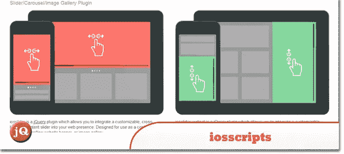
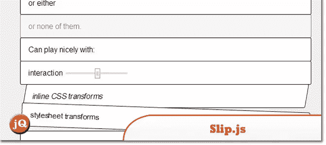
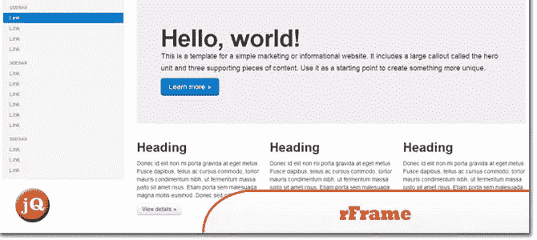
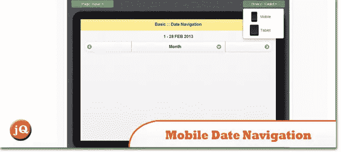
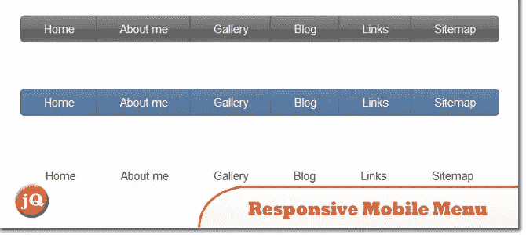

# 10 个最好的 jQuery 移动设备插件

> 原文：<https://www.sitepoint.com/10-jquery-mobile-device-plugins/>

移动网络的重要性每年都在增长。移动访问目前占网络访问的五分之一，到 2014 年底将超过四分之一，因此确保您的网站或网络应用程序在移动网络上良好运行变得前所未有的重要。这里有一些优秀的 jQuery 插件会有所帮助。

## 1.IOs 脚本

一对支持触摸、响应灵敏的 jQuery 内容滑块插件——它们有水平和垂直两种风格。

## 2.Slip.js

支持在触摸屏上滑动和重新排序元素列表，没有任何麻烦。Kornel 的一个小图书馆。

## 3.jQuery Finger

[该插件](http://ngryman.sh/jquery.finger/)通过消除触摸设备上的 300 毫秒延迟，统一了点击和触摸事件。

## 4.来吧，js

[一个超级轻量级脚本](http://gianlucaguarini.github.io/Tocca.js/demo-fun.html) (1kb)，通过 Javascript 检测任何类型设备上的事件，如“tap”“dbl tap”“swipeup”“swipedown”“swipe left”“swiperight”。

## 5.rFrame

帮助移动开发的响应式框架仿真器。

## 6.Leader.js

这是一个概念，旨在让用户能够在移动设备上尽可能快速、简单地填写表格。

 
[来源](https://github.com/pea/Leader.js)

## 7.jQuery 移动日期导航

[这个插件](http://victor-valencia.github.io/jquery-mobile-date-navigation/)提供了一个日期范围内的导航，或者是一个定义的范围(周、月、年)。非常适合通过 AJAX 调用精确查询信息。

## 8.jQuery 移动电话

使移动导航变得简单的 jQuery 插件。这个页面也是插件的演示，所以继续调整你的浏览器。

## 9.响应式移动菜单

[使用 HTML5、CSS3 和 jQuery 实现针对移动设备优化的用户友好响应导航的最简单方法](http://responsivemobilemenu.com/demo/)

 
[来源](http://responsivemobilemenu.com/en/)

## 10.照片擦除

[一个基于 HTML/CSS/JavaScript 的免费图片库](http://photoswipe.com/latest/examples/jquery-mobile.html)专门针对移动设备。

 
[来源](http://photoswipe.com/)

## 分享这篇文章