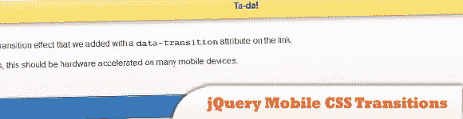
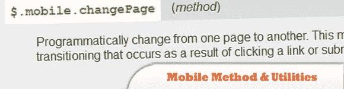
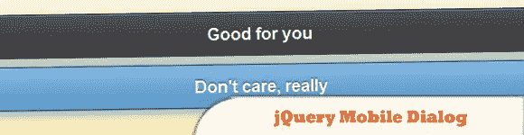
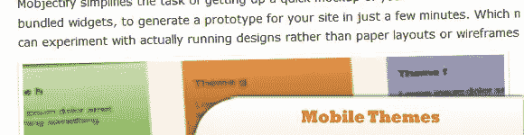
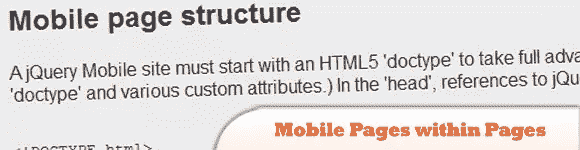
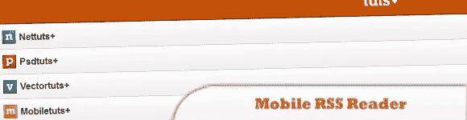
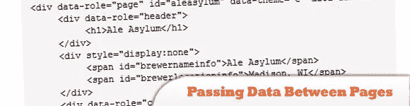
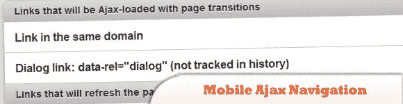
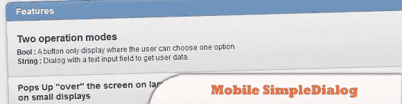

# 10 个 jQuery 移动特性

> 原文：<https://www.sitepoint.com/10-jquery-mobile-features/>

今天的帖子是关于 jQuery mobile 的，它将重点介绍移动框架的不同**特性，并用 jQuery 制作一个移动网页。玩得开心！**

相关帖子:

*   [**50 jQuery 移动开发技巧**](http://www.jquery4u.com/mobile/50-jquery-mobile-development/)
*   [**免费 jQuery 手机 WordPress 主题**](http://www.jquery4u.com/mobile/free-jquery-mobile-wordpress-themes/)
*   [**10 款免费移动应用开发图标套装**](http://www.jquery4u.com/mobile/10-free-mobile-application-development-icon-sets/)

## 1.jQuery 移动 CSS 转换

jQuery Mobile framework 包括一组六个基于 CSS 的过渡效果，可以应用于任何对象或页面更改事件，当导航到新页面时应用所选的过渡，对于后退按钮应用相反的过渡。默认情况下，框架应用从右到左的幻灯片过渡。

  
[源+演示](http://jquerymobile.com/demos/1.0a2/#docs/pages/docs-transitions.html)

## 2.类似 Android 的 jQuery 移动日期选择器

目标是获得 Android 日期选择器的外观。

  
[源+演示](http://toddmhorst.wordpress.com/2010/12/30/android-like-date-picker-with-jquery-mobile-2/)

## jquery 移动方法和实用程序(包括:jquery 移动更改页面和 jQuery 移动后退按钮)

jQuery Mobile 在$上公开了一些方法和属性。在应用程序中使用的移动对象。

  
[源+演示](http://jquerymobile.com/demos/1.0b3/docs/api/methods.html)

## 4.jQuery 移动对话

这是一个常规页面，样式为对话框。要创建一个对话框，只需链接到一个普通页面，并包含一个转换和 data-rel="dialog "属性。

  
[源+演示](http://jquerymobile.com/test/docs/pages/dialog-alt.html)

## 5.jQuery 移动主题

手机不再是为了娱乐了！由于每天都在改进的移动技术，你现在可以随时随地获得信息。

  
[源+演示](http://www.jquery4u.com/mobile/10-free-jquery-mobile-themes/)

## 6.页面中的 jQuery 移动页面

jQuery Mobile“页面”结构已经过优化，可以支持单个页面，也可以支持页面中的本地内部链接“页面”。

  
[源+演示](http://jquerymobile.com/demos/1.0a4.1/docs/pages/docs-pages.html)

## 7.jQurery 移动 RSS 阅读器

学习如何使用 PHP 和 jQuery Mobile 构建一个简单的 Tuts+ RSS 阅读器。

  
[来源](http://net.tutsplus.com/tutorials/javascript-ajax/how-to-build-an-rss-reader-with-jquery-mobile-2/) [演示](http://demo.jeffrey-way.com/tutsMobile/)

## 8.jQuery Mobile 在页面之间传递数据

来自 Flex 的我一直在努力解决的一个问题是在我的 jQuery 移动应用程序的视图之间传递数据。使用 Mustache 的模板方法工作得非常好，但是它也有很多开销。

  
[源+演示](http://blog.digitalbackcountry.com/2011/12/passing-data-between-pages-in-jquery-mobile/)

## 9.jQuery 移动 Ajax 导航

jQuery Mobile 旨在使用简单的页面链接约定。本质上，您可以像平常一样链接页面和资产，jQuery Mobile 将在单页面模型中自动处理页面请求，在可能的情况下使用 Ajax。

  
[源+演示](http://jquerymobile.com/demos/1.0rc1/docs/pages/page-links.html)

## 10.jQuery 移动简单对话框

SimpleDialog 旨在替代为 jQM 编写的 javascript dialog()。

  
[源+演示](http://dev.jtsage.com/jQM-SimpleDialog/)

## 分享这篇文章