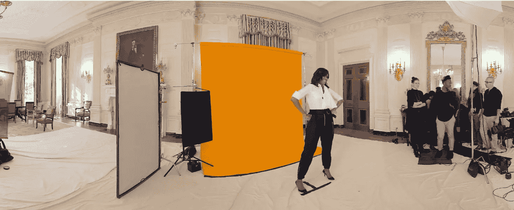

# 10 个 jQuery 全景图像显示插件

> 原文：<https://www.sitepoint.com/10-jquery-panorama-image-display-plugins/>

**这篇受欢迎的文章于 2016 年 9 月 1 日更新，以反映图像全景插件的当前状态。**

通过集成这些很酷的 jQuery 全景图像显示插件，让您的访问者**享受您网站图像的 360 度视图**。可能的用途包括虚拟旅游，全景浏览器/滚动，图像立方体，无尽的照片滑块等等。尽情享受吧！

相关帖子:

*   [**8 jQuery 360 度图像显示插件**](https://www.sitepoint.com/jquery-360-degrees-image-display-plugins/)
*   [**33 兆 jQuery 图片插件收藏**](https://www.sitepoint.com/33-mega-jquery-image-plugins-collection/)

## 1.三十六滑板

Threesixtyslider 是一个使用 jQuery 创建 360 度图像的插件。使用这个插件的人会很高兴地发现，它在所有主流浏览器(包括 IE6+)上都得到了支持，而且响应速度也很快！

这与 SpriteSpin 库一起，都提供了类似的功能，用户可以通过它们完全旋转图像。当在电子商务网站上显示图像时，这尤其有效，因为 360 度全方位视图对用户是有益的。

对于配置，360slider 提供了从`height`和`width`到`playSpeed`和`disableSpin`的几个选项，允许用户打造完全定制的体验。

[360 slider 主页](http://www.360slider.com)

[三十六滑块演示](http://www.360slider.com/default_control.html)

## 2.铺路石

我们列表中的下一个是 Paver，这是一个 jQuery 插件，旨在使全景和宽屏图像更容易访问。铺路机的创造者特里·门(Terry Mun)从 iPhone 4 升级到了 iPhone 6，并被这款手机捕捉全景图像的能力惊呆了。

虽然他迷恋全景图像，但看到这些图像在 iPhone 上显示的扭曲方式，Mun 感到沮丧。如果全景照片不能被炫耀，那它有什么用？

为了确保图像正确渲染，Paver 致力于在各种设备之间提供兼容的宽高比，以便宽屏和全景图像能够正常渲染。

事实上，Paver 做得如此之好，以至于新闻网站 The Verge 依靠该插件来显示美国第一夫人米歇尔·奥巴马在一篇关于她掌握社交媒体的文章中的宽屏图像。

[摊铺机 GitHub](https://github.com/terrymun/paver)

[教宗演示](https://terrymun.github.io/paver/)

## 3.jQuery 球形全景查看器

jQuery 球形全景视图是 Open Studio 实验室的两个库中的第一个。jQuery 球形全景图允许用户展示一幅图像的完整 360 度视图，这使得这个插件非常适合展示餐馆、公寓等。

使用这个插件非常简单，因为它甚至不需要编写任何 JavaScript。你所要做的就是将`panorama`类添加到任何你想要应用效果的图像中。需要注意的是，`.panorama`类是为这个库保留的。

如果你想定制这个插件，你必须使用一个新的类名，比如`img`或者`panoramaImage`。在那里，您可以指定使用生成的视图数，以及图像的视图列数(每行的视图数)。

jQuery 简易全景主页

## 4.jQuery 虚拟旅游

jQuery 虚拟旅游库是上述插件的扩展，它依赖于前面提到的库来运行。也就是说，这个插件更进一步，为用户提供了创建交互式虚拟旅游的能力。为此，该库利用`<map>`和`<area>` HTML 标签向页面添加交互坐标。依靠这些 HTML 元素，可以在关闭了 JavaScript 的浏览器中呈现旅游！

当查看这个插件的例子时，我们看到它创建了一个类似于谷歌地图街景的效果。它允许我们单击照片中的特定点，并导航到该点的坐标，这样我们就可以从刚刚单击的部分查看图像。

jQuery 虚拟旅游主页

[jQuery 虚拟旅游演示](http://www.openstudio.fr/jquery-virtual-tour/)

## 5.斯普利特平

SpriteSpin 是一个 jQuery 插件，可以从图像目录或拼接的 sprite-sheet 创建动画。一旦创建了一个动画，它就会像翻书一样一帧一帧地循环。

这个插件的目的是提供任何产品的 360 度视图，类似于 360 度滑块。SpriteSpin 更进一步，提供了一些额外的功能，所有这些功能都允许用户自定义动画的行为和呈现方式。

[SpriteSpin 主页](http://spritespin.ginie.eu/)

SpriteSpin 演示

## 6.帕诺人（秘鲁、玻利维亚、巴西的南美印第安部族）

Pano 是一个用于创建全景图像的可靠、简单的库。它的未混合代码库包含不到 250 行，使得使用 Pano 作为嵌入图像的极轻量级资源。代码越少，功能越少，所以 pano 只提供三个选项也就不足为奇了:`img,` `interval`，`speed`。

[Pano 主页](https://github.com/seancoyne/pano)

[Pano 演示](http://blog.n42designs.com/pano/)

## 7.Panorama 360 jQuery 插件

接下来是 Panorama 360 jQuery 插件。作为另一个插件的分支，Panorama 360 库的创建者对滚动效果感到不满，并创建了这个库，专注于从一张图像的一张幻灯片平滑移动到下一张幻灯片的能力。

该插件可以很容易地创建一个令人惊叹的网页部分，以及整个页面，除了全景以外什么也没有，就像下面的演示链接。

[全景 360 jQuery 首页](http://likov.me/jquery-panorama-plugin/)

[全景 360 jQuery 演示](http://likov.me/jquery-panorama-plugin/demo.html)

## 8.jQuery Image Cube

我们列表中的下一个是 jQuery image cube library，这是一个与列表中其他插件不同的插件。顾名思义，它允许用户以类似立方体的方式显示图像。

更好的是，有十几个选项可以用最少的代码行轻松定制。这些选项中有`beforeRotate`和`afterRotate`，它们都是回调函数，并且提供了这个库为开发人员提供的控件的一个例子。此外，用户可以修改立方体的方向，速度，缓解，并真正自定义的方式显示图像立方体通过一些选项。

[jQuery 图片魔方主页](http://keith-wood.name/imageCubeRef.html)

jQuery 图像立方体演示

## 9.回旋加速器

回旋加速器因其能够显示从一边旋转到另一边的全景图像而得名。当使用回旋加速器时，我们可以点击并拖动鼠标到一个方向，然后观察图像在那个方向旋转。鼠标或手指拖动的速度设置旋转的速度；在最初的阻力之后，回旋加速器将在图像中连续旋转，同时始终保持相同的速度。

回旋加速器提供了像`dampingFactor`和`autorotation`这样的选项来配置回旋加速器的旋转行为，你可以在这里阅读更多关于[的内容。](https://github.com/quelbs/cyclotron#options)

[回旋加速器主页](https://github.com/quelbs/cyclotron)

[回旋加速器演示](https://quelbs.de/cyclotron/)

## 10.jQuery 简单全景查看器

我们列表中的最后一个插件是简单的全景浏览器。像回旋加速器一样，用户可以在这个插件显示的图像中移动，但是它并不打算显示连续旋转的图像。

相反，根据插件的滚动速度，浏览者可以向左或向右(或上下)滚动。默认情况下，插件会执行一个`ease-in`动画，以`700ms`的速度从右向左滚动。要改变这一点，用户可以将自定义值传递给`animationTime`和`easing`选项。要了解更多关于这个库的选项，请点击[这里](https://github.com/peachananr/panorama_viewer#basic-usage)。

[jQuery 简单全景浏览器主页](https://github.com/peachananr/panorama_viewer)

[jQuery 简单全景查看器演示](http://www.thepetedesign.com/demos/panorama_viewer_demo.html#)

## 最后的想法

希望到现在为止，您已经了解了一些用于创建全景图像的新 jQuery 插件。你知道我没有提到的吗？除了你可能有的任何问题之外，请在下面随意评论他们的名字！

## 分享这篇文章