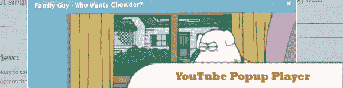
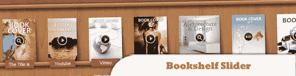
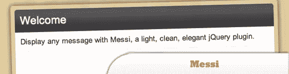
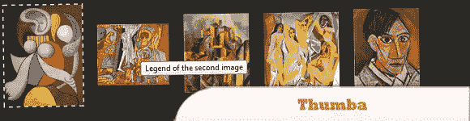
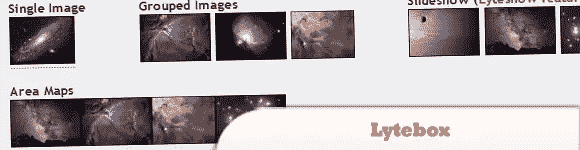

# 最佳 10 个 jQuery 弹出窗口教程

> 原文：<https://www.sitepoint.com/10-jquery-popup-window-image-slider-plugins/>

我相信你对脸书、Twitter 等大多数社交网站上弹出的常规对话框很熟悉……本文汇集了 10 个 jQuery 弹出窗口教程，你会发现非常有用，尤其是如果你想将其中一个集成到你的网站中。尽情享受吧！

**相关帖子:**

*   [**14 jQuery 模态对话框**](http://www.jquery4u.com/windows/14-jquery-modal-dialog-boxes/)

**2013 年 6 月 13 日更新:**新增 11 条。jQuery Speedo 弹出菜单

## 1.闪光

一个自定义响应、支持触摸、移动优化的 lightbox jQuery 插件，可用于显示单个图像/视频或整个图库。

  
[来源](http://codecanyon.net/item/flare-responsive-mobileoptimized-lightbox-plugin/2392703?ref=jqueryrain) [演示](http://pixelentity.com/previews/components/flare/)

## 2.bPopup

是一个轻量级的 jQuery 模态弹出插件(只有 1.26KB gzipped)。它不创建或样式化你的弹出窗口，但是为你提供所有的逻辑，比如居中、模态叠加、事件等等。

  
[来源](http://dinbror.dk/blog/bPopup/) [演示](http://dinbror.dk/bpopup/)

## 3.FueledWeb Pro 缩略图滚动条

是一个先进的多用途 jQuery 插件，html5 缩略图滚动条和图像库。

  
[来源](http://codecanyon.net/item/fueledweb-pro-thumbnail-scroller/2381286?ref=jqueryrain) [演示](http://fueledweb.com/codecanyon/fueledweb-pro-thumbnail-scroller/)

## 4.jQuery YouTube 弹出播放器插件

这是一个易于使用的 jQuery 插件，通过在弹出对话框中显示 YouTube 视频来将它们嵌入到您的页面中。

  
[源+演示](http://lab.abhinayrathore.com/jquery_youtube/)

## 5.多用途书架滑块

适用于展示书籍、杂志、DVD/CD 等产品。

  
[来源](http://codecanyon.net/item/multipurpose-bookshelf-slider-jquery-plugin/1985655?ref=jqueryrain) [演示](http://srvalle.com/plugins/bookshelf_slider/bookshelf_slider.html)

## 6.梅西

是一个 jQuery 插件，以简单的方式显示干净、优雅的消息。

  
[来源](https://github.com/marcosesperon/Messi) [演示](http://marcosesperon.es/apps/messi/)

## 7.jQuery gzoom 外挂程式

gzoom 是一个新的 jquery zoom 插件，具有以下特性:

>点击加号和减号进行缩放
>拖动滑块进行缩放
>使用鼠标滚轮悬停图像进行缩放
>移动鼠标悬停图像改变平移
>点击图像以 lightbox 样式显示
> jquery.ui 框架样式

  
[源+演示](http://lab.gianiaz.com/jquery/gzoom/)

## 8\. Thumba

是一个图库 jQuery 插件，将缩略图显示为 Google 图片。

  
[来源](http://www.myjqueryplugins.com/Thumba) [演示](http://www.myjqueryplugins.com/Thumba/demo)

## 9.jQuery PopBox

是一个简单的气球 UI 元素，灵感来自 37Signals Highrise CRM。

  
[来源](http://gristmill.github.com/jquery-popbox/) [演示](http://gristmill.github.com/jquery-popbox/example.html)

## 10.Lytebox

是一个轻量级的，跨浏览器兼容和移动友好的 JavaScript 库和内容浏览器。

  
[源+演示](http://lytebox.com/index.php)

## 11.jQuery Speedo 弹出菜单

peedo Popup 是一个小而强大的真正可定制的 jQuery popup 插件。

## 分享这篇文章