# 10+ jQuery 滑动边栏面板插件

> 原文：<https://www.sitepoint.com/10-jquery-sliding-sidebar-panel-plugins/>

在这篇文章中，我们将会给你一个 **10+ jQuery 滑动侧边栏面板插件**的列表。这些帖子对于想要找到一个像样的滑动面板插件的开发者来说非常有用。滑动面板现在非常流行，它可以帮助我们通过点击或悬停来切换/隐藏我们的内容。尽情享受吧！

**相关帖子: [10+ jQuery 粘性卷轴插件](http://www.jquery4u.com/plugins/10-jquery-sticky-scroll-plugins/)**

## 1.mb.jquery

向下/向上/向左/向右滑动您的内容！

[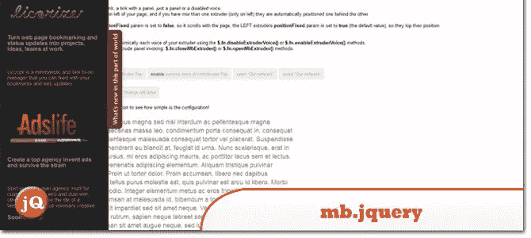](http://pupunzi.com/#mb.components/mb.extruder/extruder.html) 
[来源](http://pupunzi.com/#mb.components/mb.extruder/extruder.html) [演示](http://pupunzi.com/mb.components/mb.extruder/demo/demo.html)

## 2.页面幻灯片

一个 jQuery 插件，滑动网页以显示额外的交互窗格

[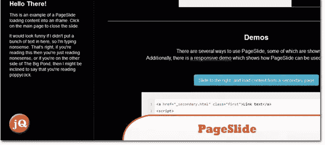](http://srobbin.com/jquery-plugins/pageslide/) 
[源+演示](http://srobbin.com/jquery-plugins/pageslide/)

## 3.幻灯片面板

一个快速简单的方法来添加一个上下文 ajax 滑动面板到您的网站。

[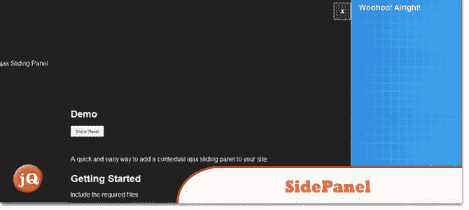](http://codebomber.com/jquery/slidepanel/) 
[源+演示](http://codebomber.com/jquery/slidepanel/)

## 4.打开面板

在任何地方打开响应面板

[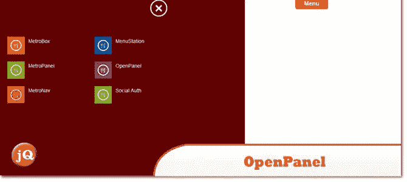](http://codecanyon.net/item/openpanel-open-responsive-panel-anywhere/3409557?ref=sdeering) 
[来源](http://codecanyon.net/item/openpanel-open-responsive-panel-anywhere/3409557?ref=sdeering) [演示](http://demo.siterepo.com/openpanel/demo.php)

## 5.jQuery 侧栏插件

它显示侧边栏菜单。

[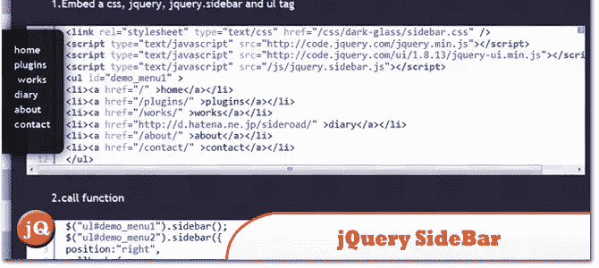](http://sideroad.secret.jp/plugins/jQuerySideBar/) 
[源+演示](http://sideroad.secret.jp/plugins/jQuerySideBar/)

## 6.tabSlideOut jQuery 插件

这个插件可以让你很容易地将其中一个添加到你的页面上。

[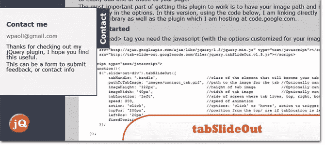](http://www.building58.com/examples/tabSlideOut.html) 
[源+演示](http://www.building58.com/examples/tabSlideOut.html)

## 7.Jquery 端内容

jQuery Side Content 项目是一个插件，它将内容停靠在浏览器窗口的一侧，带有“拉出”手柄来打开和关闭面板。

[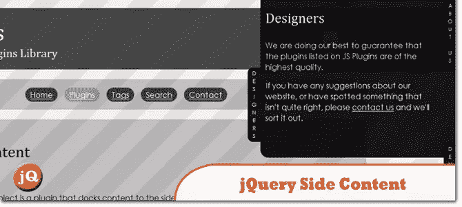](http://www.jsplugins.com/Scripts/Plugins/View/Jquery-Side-Content/) 
[源+演示](http://www.jsplugins.com/Scripts/Plugins/View/Jquery-Side-Content/)

## 8.jQuery 简单滑动面板插件

jQuery slidePanel 插件让您可以轻松地从左侧或右侧打开包含默认内容或使用 Ajax 加载的内容的幻灯片面板。

[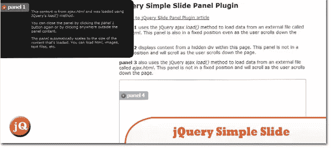](http://www.jqeasy.com/jquery-slide-panel-plugin/demo/) 
[源+演示](http://www.jqeasy.com/jquery-slide-panel-plugin/demo/)

## 9.Sticklr

粘性侧面板，jQuery & WordPress 插件

[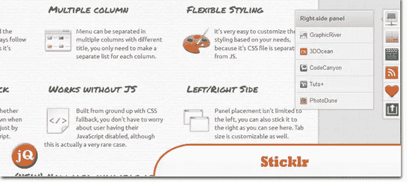](http://www.sticklr.net/) 
[源+演示](http://www.sticklr.net/)

## 10.MetroTab

一个轻量级的 jQuery 插件来创建 metro 风格的标签。您可以在任何您喜欢的位置对齐制表符。内容可以是任何东西(段落、图像、视频、iframe 等等)。

[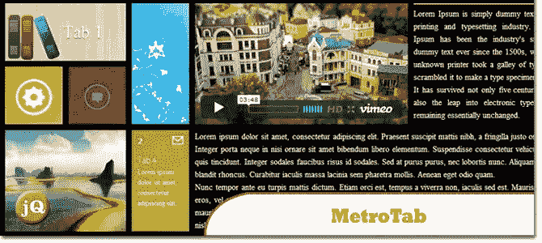](http://codecanyon.net/item/metrotab-responsive-tab-for-metro-ui/2439434?ref=sdeering) 
[来源](http://codecanyon.net/item/metrotab-responsive-tab-for-metro-ui/2439434?ref=sdeering) [演示](http://demo.siterepo.com/metrotabs/demo1.php)

## 11.jPanelMenu

一个 jQuery 插件，创建一个面板风格的菜单(就像在脸书和谷歌的移动版本中看到的类型..

[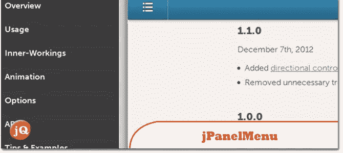](https://jpanelmenu.com/) 
[来源](jpanelmenu.com) [演示](http://jpanelmenu.com/examples/jrespond/)

## 分享这篇文章