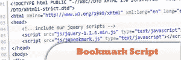
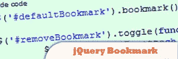
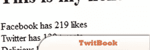
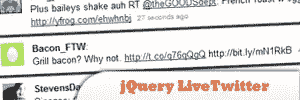

# 10 个 jQuery 社会化书签插件

> 原文：<https://www.sitepoint.com/10-jquery-social-bookmarking/>

Today we listed a Collection of 10 Incredibly Useful of JQuery and Ajax social bookmark plugins, widgets & tutorials. Features such as twitter, apple dock, Google buzz & Google plus one.

## 1.用 jQuery 和 CSS 发起翻转墙

我们将 PHP、CSS 和 jQuery 与 jQuery Flip 插件结合使用，就是为了做到这一点。由此产生的代码可以用来展示你的赞助商，客户或投资组合项目。

[来源](http://tutorialzine.com/2010/03/sponsor-wall-flip-jquery-css/)

## 2.jQuery 书签脚本

曾经需要在你的网站上添加一个按钮或链接，让用户将你的网站保存到他们的书签/收藏夹中吗？这是给你的剧本。使用 jQuery，它可以在 Firefox 2+(已测试)、IE 6(未测试)、IE7(已测试)和 Opera 7+(未测试)中工作。不幸的是，并不是所有的浏览器都支持这个动作，所以添加了一个通用的“警告”来通知用户。

[来源](http://calisza.wordpress.com/2008/11/03/javascript-jquery-bookmark-script/)

## 3.jQuery 书签

一个 jQuery 插件，它设置了一个 div，允许在各种书签网站上共享你的页面。

[来源](http://keith-wood.name/bookmark.html)

## 4.TwitBook

一个 jQuery 插件，允许你在你的标记中的任何地方插入脸书赞、推文和美味书签。全部在 77 个光荣的字节里！

[来源](http://plugins.jquery.com/project/twitbook)

## 5.Twitter 好友 Widget

有一个脸书粉丝窗口小部件，谷歌好友窗口小部件，那么推特好友窗口小部件呢？！这里有一个 jQuery 插件，你可以将它嵌入到任何地方，显示你的 Twitter 关注者或朋友(你关注的人)的图片，以及他们最新的推文。

[来源](http://code.google.com/p/twitter-friends-widget/)

## 6.关注和发布小部件

这个插件显示最近关注你的 twitter 账户并发布你的链接的人的头像。当你有一个新项目发布，你需要通过展示他们的 Twitter 头像来鼓励人们关注它时，这将是有用的！

[来源](http://code.google.com/p/follow-tweet-widget/)

## 7.Google Buzz 小工具

这是一个 jQuery 小部件，用于全新的社交网络——Google Buzz——你可以将它嵌入到任何地方，将你的 Buzz 流集成到你的页面中。

[来源](http://www.moretechtips.net/2010/02/google-buzz-widget-jquery-plugin.html)

## 8.jTweetsAnywhere 插件

一个 jQuery Twitter 小部件，它简化了 Twitter 服务到您站点的集成。

## 9.jQuery LiveTwitter

LiveTwitter 是一个轻量级的、实时更新的 LiveTwitter 插件。你可以使用它来显示基于搜索查询的推文流，来自特定用户或列表的推文。你也可以通过地理位置、语言等
过滤推文

## 10.苹果码头 OSX 菜单

这个菜单插件类似于苹果的 Dock 菜单。您可以将它用作图像幻灯片或显示社交网络的链接。该脚本是一个 jQuery 插件，所以您还需要包含 jQuery 库。

[来源](http://plugins.jquery.com/project/Dock)

## 分享这篇文章