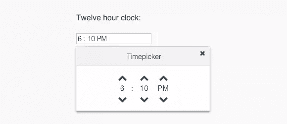
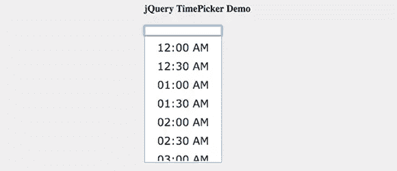
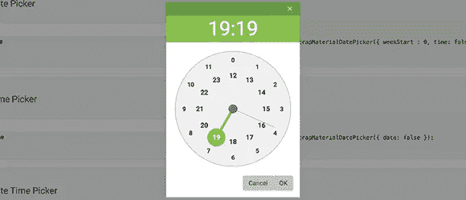
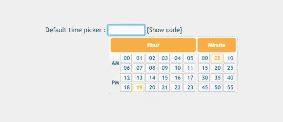
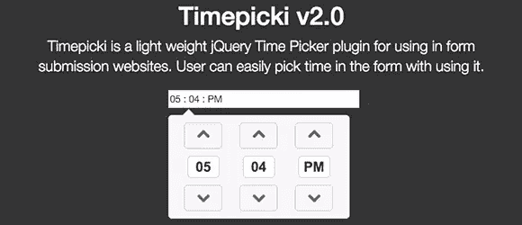
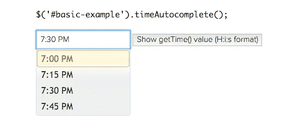
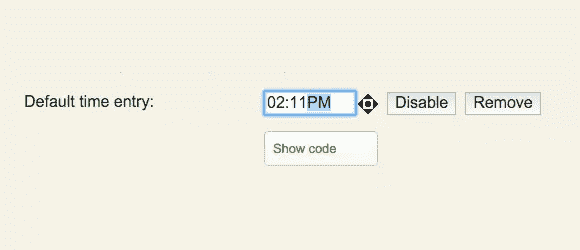
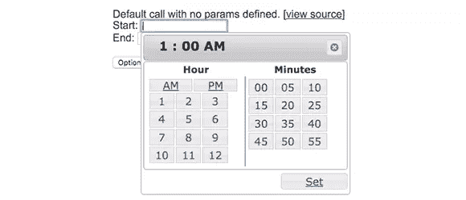

# 10 个 jQuery 时间选择器插件

> 原文：<https://www.sitepoint.com/10-jquery-time-picker-plugins/>

现在几点了？是时候为你的网页准备 10 个超酷的 jQuery 时间选择器插件了！我们看到很多日期选择者和日历选择者，但没有那么多时间选择者，所以是时候给你展示一些了！玩得开心！

**更新时间:2016 年 3 月 24 日**移除过时、损坏或弃用的插件。根据当前的设计趋势和标准更新了整个列表，包括几个新增内容。

## 1.jquery time picker

寻找简单的东西？受 Google Calendar 的启发，jquery.timepicker 是一个健壮的库，旨在使时间输入尽可能自然。

[主页/演示](http://jonthornton.github.io/jquery-timepicker/) | [GitHub](https://github.com/jonthornton/jquery-timepicker)

## 2.维克皮克

作为最好看的主题之一，Wickedpicker 将为你的网站增加一个简单的界面。

[主页/演示](http://ericjgagnon.github.io/wickedpicker/) | [GitHub](https://github.com/ericjgagnon/wickedpicker)

## 3.jQuery Timepicker

允许用户以自由格式或通过添加一个简单易用的下拉菜单输入他们的时间。不要把这个插件和我们列表中的第一个混淆，这是一个完全不同的同名插件！

[主页/演示](http://timepicker.co/) | [GitHub](https://github.com/wvega/timepicker)

## 4.引导材料日期选择器

不要让名字迷惑了你，这个插件不需要引导程序了！这个外观简洁的时钟时间选择器最初是为 Boostrap 而创建的，只需要 jQuery。

[主页/演示](http://t00rk.github.io/bootstrap-material-datetimepicker/) | [GitHub](https://github.com/T00rk/bootstrap-material-datetimepicker)

## 6.jQuery UI Timepicker

是一个 jQuery UI 时间选择器插件，用于匹配其他官方 jQuery UI 小部件。基于现有的日期选择器，它将很好地与您的表单融合，并使用您选择的 jQuery UI 主题。这个插件很容易集成到你的表单中，用于你的时间(小时/分钟)输入。

[主页/演示](https://fgelinas.com/code/timepicker/) | [GitHub](https://github.com/fgelinas/timepicker)

## 6.TimePicki

如果你的网页需要更多的风格，TimePicki 可能适合你。用这个设计良好的现代外观插件给你的用户留下深刻印象。

[主页/演示](http://senthilraj.github.io/TimePicki/) | [GitHub](https://github.com/senthilraj/TimePicki)

## 7.jQueryTimeAutocomplete

jQueryTimeAutocomplete 不仅仅是一个时间选择器，它还允许开发人员轻松地实现时间范围选择器。

[主页/演示](http://7shifts.com/blog/better-time-drop-downs-jquery-timeautocomplete/) | [GitHub](https://github.com/7shifts/jQueryTimeAutocomplete)

## 8.jQuery 时间条目

让你的用户以多种不同的方式改变他们的时间输入，甚至是他们的鼠标滚轮！

[主页/演示](http://keith-wood.name/timeEntry.html) | [GitHub](https://github.com/kbwood/timeentry)

## 9.ptTimeSelect

是一个 jQuery 插件，它为用户提供了一个 UI 来定义和设置用户表单上的时间。它需要 jQuery(显然)和 dimmention.js 插件(也可以从 jQuery 获得)。

[主页/演示](http://pttimeselect.sourceforge.net/example/index.html) | [GitHub](https://sourceforge.net/projects/pttimeselect/)

## 10.很久以前

Timeago 本身并不是一个时间选择器，但是它可以通过自动更新模糊的时间戳来帮助您轻松地构建一个时间选择器。(例如“4 分钟前”或“大约 1 天前”)

[主页/演示](http://timeago.yarp.com/) | [GitHub](https://github.com/gregersrygg/jquery.timeInput)

## 分享这篇文章