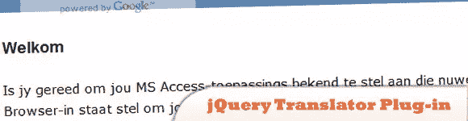
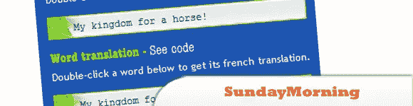
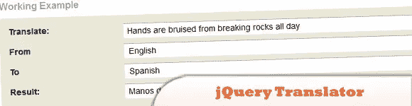
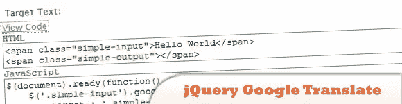
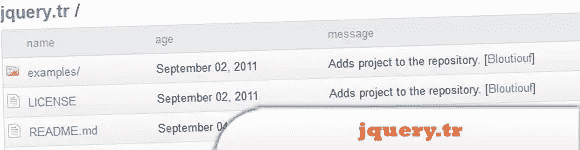
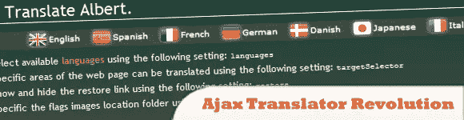
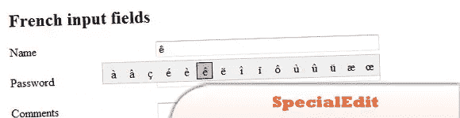
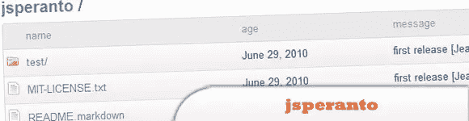

# 10 个 jQuery 语言翻译器插件

> 原文：<https://www.sitepoint.com/10-jquery-translator-plugins/>

就像 Google Translate 一样， **jQuery 插件也可以用来在你的网站中集成你自己的语言翻译器**。看看这些很酷的 jQuery 翻译插件。尽情享受吧！

相关帖子:

*   [**jQuery 屏幕键盘插件**](http://www.jquery4u.com/plugins/jquery-screen-keyboard-plugin/)

## 1.jQuery 翻译器插件

使用 jQuery translator 插件，无需修改任何 HTML，就可以轻松地将网页翻译成多种语言。您只需要提供脚本引用并初始化翻译器插件。

  
[来源](http://jquery.bunkerhill.com/)
[演示](http://msaccess2web.com/)

## 2.jTextTranslate:一个 jQuery 翻译插件

该插件与 Google Language API 一起工作，可以用来翻译 API 提供的所有语言的文本。

  
[来源](http://tympanus.net/codrops/2009/11/30/jtexttranslate-a-jquery-translation-plugin/)
[演示](http://tympanus.net/jTextTranslate/)

## 3.周日早上

是一个 jQuery 插件，它允许网站所有者为他们的访问者提供一些简单而有趣的方法，将他们的内容翻译成 30 多种语言。它使用谷歌翻译 API。您可以通过菜单进行内嵌翻译、单词翻译或通过远程触发进行翻译。

  
[源+演示](http://sundaymorning.jaysalvat.com/)

## 4.jQuery 翻译器

偶然发现了 Google 的便捷的 Ajax translator API，我想我应该为它写一个快速的 jQuery 插件。

  
[源+演示](http://charlesmarshall.co.uk/jquery/2010/01/24/jquery-translator.html)

## 5.jQuery 谷歌翻译插件

jQuery Google Translate 插件允许网站和应用程序以编程方式将 jQuery 插件的简单性与 Google Translate API 集成在一起。

  
[来源](http://www.superawesomejquery.com/plugins/2_jquery-google-translate-plugin/)
[演示](http://www.superawesomejquery.com/plugins/2_jquery-google-translate-plugin/demos/)

## 6.jquery . tr–翻译插件

是一个 jQuery 插件，可以让你在客户端翻译文本。
功能:
>使用预定义的字典。
>翻译成有多个复数的语言。
>如果 jQuery.cookie 可用，则使用 cookie 信息。
>为 CouchApps 设计使用。

  
[源+演示](https://github.com/Bloutiouf/jquery.tr)

## 7.Ajax Translator Revolution Lite jQuery 插件

是一个翻译网站的脚本，有一个很好的用户界面。

提供一组选项来定制翻译器以完成任何翻译任务，例如:
>准确选择页面中应该翻译的部分并排除其他部分
>记住用户选择的语言和自动翻译功能
>显示语言标志和名称，或仅显示名称，或仅显示标志

  
[来源](http://codecanyon.net/item/ajax-translator-revolution-lite-jquery-plugin/246175?ref=jtop)
[演示](http://codecanyon.net/item/ajax-translator-revolution-lite-jquery-plugin/full_screen_preview/246175)

## 8.Lingua 本地化插件

Lingua 是一个 jQuery 插件，它通过自动处理包含特定语言的键/值对的文本文件来简化 web 应用程序的本地化。创建文本文件非常简单，翻译人员很容易更新它们，并且它们很容易部署和使用。该插件还通过指定与 HTML 中的元素 id 相匹配的带#前缀的 keynames 来支持一定程度的自动翻译。

  
[来源](http://www.mindmagma.com/lingua/)
[演示](https://web.archive.org/web/20171202193812/www.mindmagma.com/jquery/lingua/demo.htm)

## 9.特殊编辑

jQuery 插件，在文本输入框中添加按钮，允许用户轻松输入特殊字符。这个插件对语言学习网站、翻译网站等特别有用。任何不希望用户有硬件来轻松输入特殊字符的情况。

  
[来源](http://www.ganzogo.com/projects/specialedit)
[演示](http://www.ganzogo.com/static/specialedit/demos/languages.html)

## 10.jsperanto

简单翻译你的 javascripts，用你最喜欢的模板引擎如 EJS 美味。
>复数化、插值&【嵌套查找】支持您的翻译
>使用 XHR 获取 JSON 字典(或以您自己的方式加载它&格式)
> JSLint-ed、QUnit-ed
>类似于 Rails 的 i18n 但不需要 sans 后端
>无全局污染(隐藏在 jQuery.jsperanto 下)
>适用于:IE6+、Firefox 3+、Safari 3+、Chrome、ajax，$。每个，美元。延伸)

  
[源+演示](https://github.com/jpjoyal/jsperanto)

## 分享这篇文章