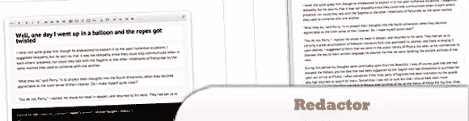
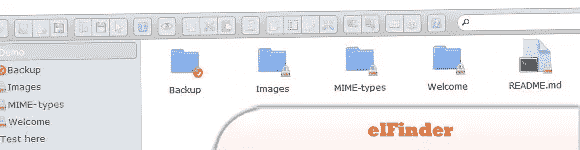
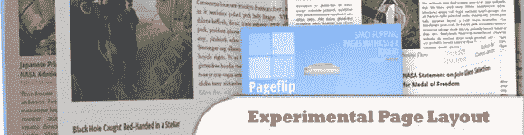
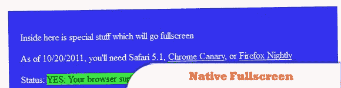
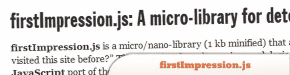
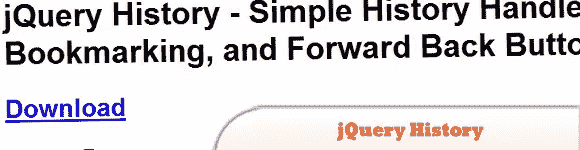
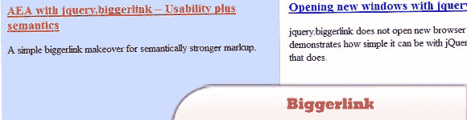

# 10 用于 Web 交互插件的 jQuery

> 原文：<https://www.sitepoint.com/10-jquery-web-plugins/>

通过查看我们为 web 插件编写的 **10 jQuery，了解使用 jQuery 应用 Web 交互是多么快速和简单！插件#3 (jQuery 实验页面)、#4 (jQuery 社交媒体标签)和#8 (Joyride)绝对值得一试！享受吧。**

**相关帖子:**

*   [**10 JavaScript Chrome 实验展示区**](http://www.jquery4u.com/javascript/10-javascript-chrome-experiments-showcase/)
*   [**十大 jQuery 数据库插件**](http://www.jquery4u.com/plugins/top-10-jquery-database-plugins/)

## 1.编校器:jQuery 上奇妙的所见即所得编辑器

一个好的 API。可定制。根据需要定制编辑器的所有工具。小心，你的想象力可以发挥很大作用。

  
[来源](http://redactorjs.com/ru)
[演示](http://redactorjs.com/en/examples/)

## 2.El finder:jQuery Web 文件管理器

一个用于 web 的开源文件管理器，使用 jQuery UI 用 JavaScript 编写。

  
[来源](https://github.com/Studio-42/elFinder)
[演示](http://www.jqueryrain.com/?rtyCJbH2)

## 3.受 Flipboard 启发的 jQuery 实验性页面布局

它的灵感来自著名的 Flipboard 应用程序，当滑动时，无缝的“正常”页面会像书中的一页一样翻转。

  
[来源](http://tympanus.net/codrops/2012/05/07/experimental-page-layout-inspired-by-flipboard/)
[演示](http://tympanus.net/Development/FlipboardPageLayout/)

## 4.jQuery 社交媒体标签

将你最喜欢的社交网络个人资料和订阅整合到光滑的滑出式或静态标签中。jQuery 社交媒体标签插件可以添加到任何网站上——不需要 PHP！

  
[来源](http://codecanyon.net/item/jquery-social-media-tabs/1932796?ref=jqueryrain)
[演示](http://codecanyon.net/item/jquery-social-media-tabs/full_screen_preview/1932796)

## 5.本机全屏 jQuery API

在 MediaElement.js HTML5 视频播放器中全屏显示，它在 Safari 5.1+，Chrome 15+或 Firefox 中运行良好，并计划在 Firefox 10 中运行。

  
[来源](http://johndyer.name/native-fullscreen-javascript-api-plus-jquery-plugin/)
[演示](http://johndyer.name/lab/fullscreenapi/)

## 6.左轮手枪

是一个用于创建全屏滑动网站的 jQuery 插件。它可以集成到任何网站模板。

  
[来源](http://codecanyon.net/item/revolver-sliding-website-plugin/2278396?ref=jqueryrain)
[演示](http://2.s3.envato.com/files/27577254/index.html#/homepage)

## 7.第一印象. js

它是一个微/纳米库(1 kb 缩小版)，回答简单的问题，“这个用户以前访问过这个站点吗？”检测不需要太多逻辑，所以大部分代码只是流行的 jquery.cookie 插件的普通 JavaScript 移植。

  
[源+演示](http://www.ravelrumba.com/blog/firstimpression-js-library-detecting-new-visitors/)

## 8.兜风

jQuery 特性漫游插件。Joyride 是一个很棒的 jQuery 插件，它可以让你带用户对你的应用程序进行定制之旅。

  
[来源](https://github.com/zurb/joyride)
[演示](http://www.zurb.com/playground/jquery-joyride-feature-tour-plugin)

## 9.jQuery 历史记录

允许您通过跟踪 URL 哈希来轻松跟踪页面状态的变化。支持由书签、后退和前进按钮触发的更改，以及跨浏览器支持。

  
[来源](https://github.com/balupton/jquery-history)
[演示](http://balupton.github.com/jquery-history/demo/)

## 10.Biggerlink

一个 jQuery 插件，使得指定的元素可以很容易地充当它们第一个包含的链接的代理。

  
[来源](http://www.ollicle.com/projects/jquery/biggerlink/)
[演示](http://www.ollicle.com/projects/jquery/biggerlink/eg/)

## 分享这篇文章