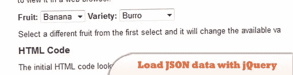
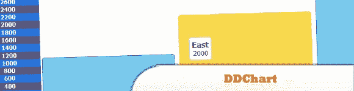
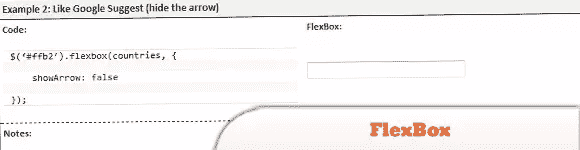

# 10 个带有 jQuery 插件、脚本和 tut 的 JSON 数据

> 原文：<https://www.sitepoint.com/10-json-data-jquery/>

今天的帖子是一组带有 jQuery 插件、脚本& Tuts 的 **10 JSON 数据。了解如何使用 DDChart (JSON 驱动的可缩放的向下钻取条形图)和更多工具创建带有 flash 动画效果的经典条形图…尽情享受吧！**

**相关帖子:**

*   **在线 JSON 树查看器工具**
*   [**10 在线 JSON 工具**](http://www.jquery4u.com/json/10-online-json-tools/)

## 1.用 jQuery，PHP 和 MySQL 加载 JSON 数据

这篇文章展示了如何基于另一个选择框的值来填充选择框，方法是用 jQuery 从 PHP 脚本中获取 JSON 数据，该脚本从 MySQL 数据库中获取数据。

  
[源+演示](http://www.electrictoolbox.com/json-data-jquery-php-mysql/)

## 2.jQuery JSON Ajax 请求和缓存

这篇文章着眼于哪些浏览器缓存请求，以及如何确保它不被缓存。

  
[源+演示](http://www.electrictoolbox.com/jquery-json-ajax-caching/)

## 3.双重建议

jQuery 插件将建立一个用户界面，在你输入时给出结果建议。它将显示两种类型的建议，第一种(更快)是本地数据，第二种(更慢)是 AJAX 搜索查询的结果。

  
[来源](https://github.com/hernantz/doubleSuggest#readme)
[演示](http://hernantz.github.com/doubleSuggest/)

## 4.DDChart: JSON 驱动的可缩放下钻条形图

是一个 JSON 数据驱动的条形图插件，它创建了一个带有 flash 动画效果的经典条形图。

  
[源+演示](http://kiersimmons.com/DDChart/index.html)

## 5.如何使用 jQuery 构建 web 小部件

有趣的地方将是:
>确保小部件的代码不会意外地与页面的其余部分混淆，
>动态加载外部 CSS 和 JavaScript 文件，
>使用 JSONP 绕过浏览器的单起源策略。

  
[来源](http://alexmarandon.com/articles/web_widget_jquery/)
[演示](http://alexmarandon.com/articles/web_widget_jquery/examples/web_widget_example_2/)

## 6.jQuery Tokeninput

jQuery 插件，允许你的用户从一个预定义的列表中选择多个条目，当他们输入时使用自动完成来找到每个条目。

  
[源+演示](http://loopj.com/jquery-tokeninput/)

## 7.jQuery quickie

使用 jQuery 无限滚动。我用 Twitter API 来举例，所以你也会学到一些关于 JSON 的知识…

  
[来源](http://www.marcofolio.net/webdesign/jquery_quickie_unlimited_scroll_using_the_twitter_api.html)
[演示](http://www.jqueryrain.com/?6mvy_ofp)

## 8.jQuery 图表表格插件

它使用 PHP + GD 将字符转换成图像，然后转换成包含字形矩阵的 JSON 对象。

  
[来源](http://hovinne.com/articles/jquery-chartotable-plugin)
[演示](http://dev.hovinne.com/jquery/chartotable/)

## 9.FlexBox–基于 jQuery Ajax 的文本框和选择框

一个 jQuery 插件，旨在非常灵活地替代 html 文本框和下拉菜单，使用 AJAX 检索和绑定 JSON 数据。

  
[来源](http://www.fairwaytech.com/flexbox/)
[演示](http://www.fairwaytech.com/flexbox/flexbox-demos/)

## 10.jQuery 随机旋转图片库 Mosaiqy

Mosaiqy 是一个 jQuery 插件，用于在类似马赛克的网格界面中呈现图像。它从 JSON/JSONP 数据源中检索图像，这使得与图像托管服务的集成非常容易，并且已经有了 Flickr、Instagram 和 Panoramio 的演示。

  
[源+演示](http://www.fabriziocalderan.it/mosaiqy/)

## 分享这篇文章