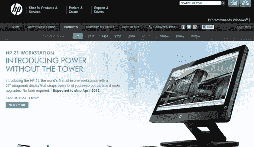
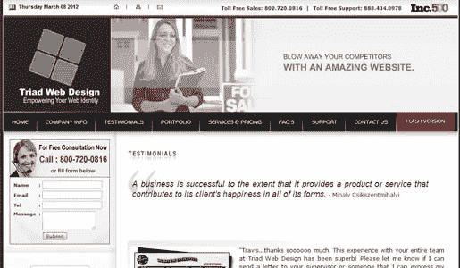
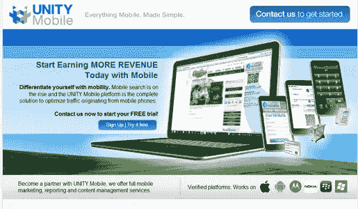
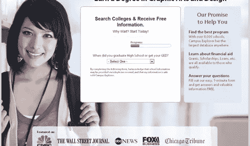
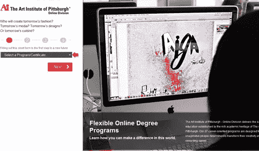
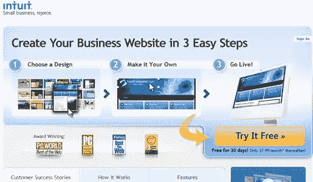
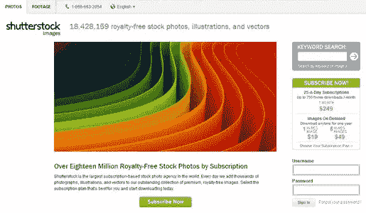
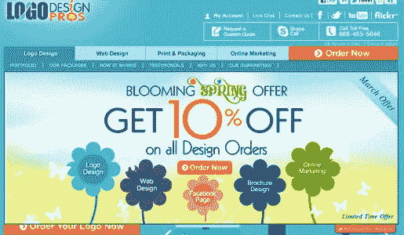

# 有效登录页面的属性:10 个登录页面评论

> 原文：<https://www.sitepoint.com/10-landing-page-reviews/>

登录页面是为点击广告、促销或产品列表的访问者精心设计的目的地。有效的登陆页面经过了几十次迭代的提炼和打磨。不太有说服力的登陆页面仅仅是基于直觉和观点而不是严格的测试。一些广告没有提供合适的登录页面，而是简单地将客户引向一个未经修饰的主页，这很少有效，并且经常达不到原始广告的预期。

一个登陆页面有一个单一的目标:强迫你完成一个动作，这在市场营销术语中通常被称为“转化”。这个动作可以是许多选项中的一个:“转换”可以是购买一个项目，注册一个服务的免费试用，或者可能只是捕获一个电子邮件地址用于招揽和促销。

高质量的登陆页面应该易于理解，并且应该让下一步变得非常简单。本文中的登陆页面是通过在谷歌中搜索“图形设计”，然后在侧边栏上浏览结果广告而找到的。我想仔细检查这些登录页面是如何设计的。我发现的是各种各样的设计，这是一个很好的比较和对比研究。

我对每个网站都进行了爱恨交加的评论，这似乎很合适，因为我对登录页面又爱又恨。我提供了每个页面的源 URL 以及每个登录页面的截图，因为这些页面可能会很快改变。

* * *

### 惠普 Z1 工作站

[来源](http://www.hp.com/united-states/campaigns/workstations/z1_features.html) | [截图](https://www.sitepoint.com/wp-content/uploads/2012/03/01-hp-large.png)

**爱情:**

简单的设计和布局有助于清晰地传递预期的信息。我很感激价格被包含在这个登陆页面上——你很快就会知道你将进入什么样的状态，以后也不会感到惊讶。页面上的 lightbox 便于探索产品，并发现它的独特之处。

**恨:**

过多的导航元素会分散访问者对他们所要购买的特定产品的了解。移除整个标题区域可能会导致更多的转换。读完这份材料后，我发现这款产品还要一个月才能上市，所以行动号召只是为了收到产品上市的通知。“通知我”按钮非常小，和其他所有东西的颜色一样，因此不像它应该的那样突出。简而言之，行动号召很难找到，如果没有上面的文本背景，它就没有意义。

* * *

### 雅虎！小型企业

[来源](http://smallbusiness.yahoo.com/offer/webhosting/WH5MIH50Off) | [截图](https://www.sitepoint.com/wp-content/uploads/2012/03/02-yahoo-large.png)

**爱情:**

这是一个顶级的登录页面。页面右侧的行动号召清晰、直观、突出。大大的“节省 50%”贴纸在其他信息中显得很突出。你可以看到你正在得到什么，如何得到它，以及期待什么。

**恨:**

穿围裙的男人。选择不当的库存照片会疏远你的大部分客户。

* * *

### 三元网页设计

[截图](https://www.sitepoint.com/wp-content/uploads/2012/03/03-123triad-large.jpg)

**爱情:**

背景是灰色的？

**恨:**

几乎所有的事情。登陆页面只是一个修饰过的推荐页面，不知名的支持者在这里为公司的质量和价值担保。它也有一英里长，有 7300 多个单词适合我们微观的注意力范围。沾沾自喜的页面以“更多 Triad 推荐”的链接结束，这可能对那些以某种方式集中注意力阅读第一百篇的客户来说不是很有吸引力。而且，很难忽视一个具有讽刺意味的事实，即“Triad”品牌选择了方形标志

为了更有建设性(这对我来说很难)，我将指出 Triad 可以快速改进该页面的几种方法:

*   丢掉超高速旋转的“我甚至没有时间去阅读邮件标题”的图片。
*   失去导航条。
*   保留一两条推荐，但丢掉其他 98 条(我没有夸张——他们在登陆页面放了 100 条推荐)。
*   用更大的颜色对比来突出行动号召，并把它放在折页上方。

* * *

### 统一手机

[来源](http://www.unitymobile.com/lp/seo-sem/) | [截图](https://www.sitepoint.com/wp-content/uploads/2012/03/04-unity-large.png)

**爱情:**

这个登陆页面有几个行动号召，设计简单，没有导航元素引导你离开页面。而在设计的一般方面，它是干净和清晰的。我也喜欢他们整合认证移动平台标志的方式——这通过将他们的品牌与这些主要参与者联系起来显示了稳定性和实力。

**恨:**

太忙了。上面写着“移动”，但最大的图像是一台笔记本电脑。这让我很困惑，尽管我大多数时候都很容易困惑。行动号召按钮与背景融合得有点过了，使它们不那么突出。例如，使用绿色按钮可能会使它们远离背景，更容易被发现。

总的来说，这是一个可靠的登录页面。小的改进可能会导致更多的转换和更少的反弹。

* * *

### 校园探险家

[来源](http://www.campusexplorer.com/programs/l/56C241FD) | [截图](https://www.sitepoint.com/wp-content/uploads/2012/03/05-colleges-large.png)

**爱情:**

这是一个设计非常好的登陆页面。行动号召正中央有一个漂亮的进度条，指示你在“探索”过程中的位置。页面底部的“特色”标志也增加了网站的可信度。

**恨:**

没什么。对于这一页，我唯一能做的吹毛求疵的事情就是行动号召表格可能过于简单。对于我的口味来说，有太多的空白，但这只是我在寻找一些可以批评的东西。非常喜欢这个登陆页面。

* * *

### 99 项设计

[来源](http://99designs.com/) | [截图](https://www.sitepoint.com/wp-content/uploads/2012/03/07-99designs-large.png)

**爱情:**

这是一个简单的设计，我真的很喜欢颜色编码，因为它都联系在一起。导航条很简单，详细说明了产品，而不是用不相关的信息分散访问者的注意力。行动号召非常突出，页面上有几个选项可供选择。“以…为特色”建立可信度。

**恨:**

给视频添加一个海报框架会比空白的黑屏更有效，特别是对于高度可视化的服务。

总的来说，这是一个赢家，因为清晰的行动号召和干净的布局。

* * *

### 匹兹堡艺术学院

[来源](http://lp.aionline.edu/graph-design-program) | [截图](https://www.sitepoint.com/wp-content/uploads/2012/03/08-art-large.png)

**爱情:**

这个网站钉突出呼吁行动，他们包括一个奇妙的步骤计数器，所以你知道你还有多少步骤才完成。毫无疑问，这个网站卖的是什么，书面文本支持行动号召。我特别感谢这个高等教育机构包括他们的认证信息，这增加了可信度。

**恨:**

所选的红色色调非常强烈。而且，照片中的学生作品应该更令人印象深刻，如果他们卖的是顶尖的设计课程的话。

否则，这就是一个突出重点、清晰的登陆页面的绝佳例子。

* * *

### 直觉

[来源](http://websitebuilder.intuit.com/get-a-website2-stpc) | [截图](https://www.sitepoint.com/wp-content/uploads/2012/03/09-intuit-large.png)

**爱情:**

这可能是最好的登陆页面了！导航是极简的，给你三个简洁的描述性步骤，这样你就知道会发生什么。价格就在页面上，行动号召超级容易找到。在页面的折页中也很好地使用了“获奖”标志。他们使用了证明材料，但没有过度使用。近乎完美。

**恨:**

我唯一的建议是在顶部制作一个链接到主页的标志。

* * *

### 快门架

[来源](http://www.shutterstock.com/) | [截图](https://www.sitepoint.com/wp-content/uploads/2012/03/06-shutterstock-large.png)

**爱情:**

右边的行动号召上可以立即看到价格，我非常感谢。这个页面在导航条中只剩下很少的导航元素。这是一个全是图形的网站，所以这是为数不多的几个我会赞同在标题中使用旋转图像的网站之一。该网页上还有许多相关资源。

**恨:**

导航条虽然简单，但仍然应该完全取消。右上角的关键词搜索表单应该移到行动号召的下方，因为它远没有行动号召重要。也许是因为我的屏幕分辨率，但我不喜欢徽标挂在页面其余部分左侧的方式——它破坏了平衡和对齐。最后，这是该网站的主页。我们已经建立了我对登陆页面不同于主页的感觉。

* * *

### 标志设计专业人士

[来源](http://www.logodesignpros.com/#) | [截图](https://www.sitepoint.com/wp-content/uploads/2012/03/10-logodesignpros-large.jpg)

**爱情:**

我真的很感谢在这个页面的设计上所付出的努力，就图形本身而言。定价包含在页面上，这对于此类业务来说是令人耳目一新的。在整个页面中有多个行动号召，这使得它很容易响应。

**恨:**

页面非常杂乱——导航条有多个层次，主图形是一个弹出窗口，覆盖了页面上的一些元素，在设计中有太多分散注意力的东西。在你坐在页面上阅读一分钟后，一个弹出广告跳了出来，这相当烦人。

建议包括但不限于:

*   剪切整个导航栏区域。
*   失去噱头图形弹出。
*   丢掉弹出广告。

* * *

你有什么想法？你认为这些登陆页面哪些有用，哪些没用？你是否同意一个主页不应该成为登陆页，或者一些主页可以有效地作为登陆页？

## 分享这篇文章