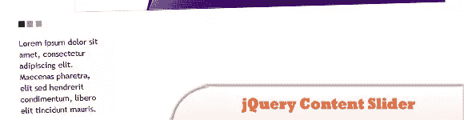
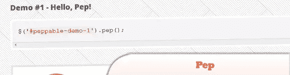
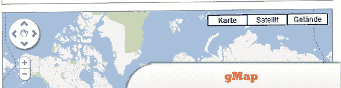
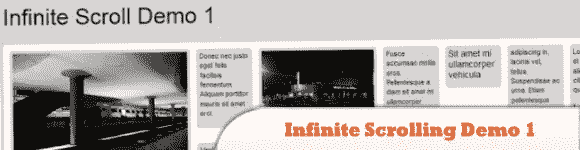
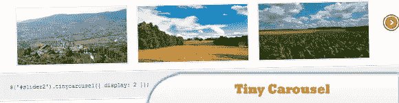
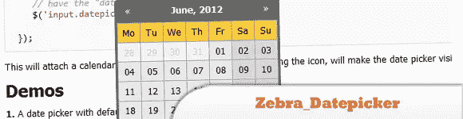
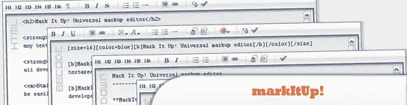
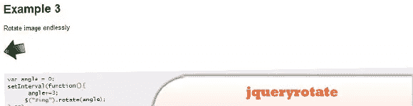
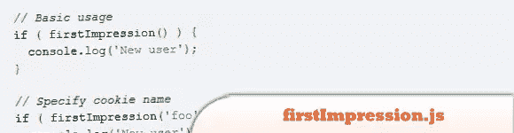

# 10 多个最轻的轻量级 jQuery 插件

> 原文：<https://www.sitepoint.com/10-lightest-lightweight-jquery-plugins/>

今天，我们收集了 10 个令人难以置信的轻量级 jQuery 插件,帮助 web 开发者让他们的生活变得更加轻松。为什么要使用轻量级插件？这是显而易见的，因为浏览器加载的 JavaScript 越少，网页的加载速度就越快。因此，通过使用轻量级 jQuery 插件的缩小版本，您可以用最小的开销获得最大的能力。很好，看看他们。尽情享受吧！

【2012 年 7 月更新:新增 12。手工艺滑梯

**相关帖子:**

*   [**10 款轻量级开源 CMS**](http://www.jquery4u.com/user-interface/10-light-easy-open-source-cms/)
*   [**10 必须知道的 CSS3 资源和工具**](http://www.jquery4u.com/dynamic-css-2/10-css-css3-resources-tools/)

## 1.jQuery 内容滑块

最轻的 jQuery 内容滑块——380 字节。

  
[来源](http://www.webdeveloperjuice.com/2010/01/12/lightest-jquery-content-slider-ever-made-380-bytes/) [演示](http://www.webdeveloperjuice.com/demos/jquery/simple-slide.html)

## 2.活力

它使用了 jQuery 最好的动画功能和 CSS3 动画，带来了在所有支持 HTML5 的设备上都能工作的成熟的动态拖动。

  
[来源](http://pep.briangonzalez.org/) [演示](http://pep.briangonzalez.org/demo)

## 3.Gmail

一个轻量级的 jQuery 插件，可以帮助你将谷歌地图嵌入到你的网站中。只有 2 KB 的大小，它非常灵活，高度可定制。

  
[源+演示](http://gmap.nurtext.de/)

## 4.无限滚动演示 1

这个演示使用了 jQuery Masonry 插件和无限滚动插件。

  
[来源](http://www.jquery4u.com/tutorials/jquery-infinite-scrolling-demos/#.T-PmKpFMiSo)

## 5.小旋转木马

一个轻量级的转盘，用于滑动基于 html 的内容。它是使用 JavaScript jQuery 库构建的。

  
[源+演示](http://baijs.nl/tinycarousel/)

## 6.斑马 _Datepicker

一个轻量级的 datepicker jQuery 插件。这个 jQuery 插件将自动在指定的输入字段中添加一个日历图标，单击该图标将打开附加的日期选择器。

  
[源+演示](http://stefangabos.ro/jquery/zebra-datepicker/)

## 7.color box-颜色方块

用于 jQuery 的轻量级可定制 lightbox 插件

  
[来源](http://www.jacklmoore.com/colorbox) [演示](http://www.jacklmoore.com/colorbox/example2/)

## 8.马克图普。

基于 jQuery 库构建的 JavaScript 插件。它允许你把任何文本区域变成一个标记编辑器。

  
[源+演示](http://markitup.jaysalvat.com/home/)

## 9.jqueryrotate

这是 jQuery 的一个小插件，增加了一个很好的功能，可以在网页上按给定的角度旋转图像(img html 对象)。

  
[来源](http://code.google.com/p/jqueryrotate/) [演示](http://code.google.com/p/jqueryrotate/wiki/Examples)

## 10.第一印象. js

检测新访客的微型图书馆。

  
[源+演示](http://www.ravelrumba.com/blog/firstimpression-js-library-detecting-new-visitors/)

## 第 11 个 jsAnim

这个项目的目标是使网站看起来像是用 Flash 制作的，但所有用户都可以轻松访问。

  
[源+演示](http://jsanim.com/)

## 12.手工艺滑梯

Craftyslide 是一个基于 jQuery 的小幻灯片(只有 2kb)。

[源+演示](http://projects.craftedpixelz.co.uk/craftyslide/)

## 分享这篇文章