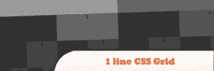
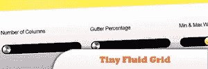
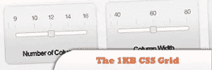
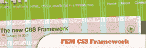
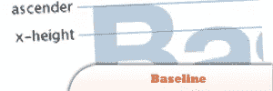
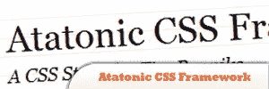

# 10 个轻量级和最小的 CSS 框架

> 原文：<https://www.sitepoint.com/10-lightweight-minimal-css-frameworks/>

The CSS framework should be based on your current web design projects complexity and functionality requirements, and not be based only on a personal preference, as most web designers tend to do. In this post, we collected **10 lightweight and minimal CSS frameworks**. Enjoy!Related posts:

*   [**10 jQuery 增强 CSS 按钮**](http://www.jquery4u.com/plugins/10-jquery-enhanced-css-buttons/)
*   [**jQuery 动态改变 CSS 文件**](http://www.jquery4u.com/dynamic-css-2/jquery-change-css-file-2/)

## 线条 CSS 网格框架

这是用一行 CSS 类编写整个 CSS 布局系统的挑战。

来源

## 微小流体网格

Tiny Fluid Grid 附带了一个带有演示代码的 index.html，以及包含您创建的网格的 css 的 grid.css。

来源

## 1KB CSS 网格

不需要博士学位的简单、轻便的方法。

来源

## 感觉

代表合理的标准 CSS 基线，(读作“sense”)。它为 CSS 中所有重复的部分提供了合理的样式，并且不会强迫你使用一个布局系统。

来源

## 有限元 CSS 框架

基于 960.gs 的固定布局，但其理念有所改变，使其更灵活、更快速地使用盒子。它只有一个 12 列的网格，各列每边有 10px 的边距，形成一个 20px 的装订线，让各框之间有一些空隙。

## 基线

Baseline 以排版标准为基础，使得开发一个具有令人愉悦的网格和良好排版的网站变得非常容易。

来源

## 共济失调 CSS 框架

工作就像任何其他网格系统，但只有大约 10 行的 CSS，它的主要重点是排版。这个项目背后的想法是提供一个坚实的，但最小的，开始每个开发项目的基础。

## 正方形网格

基于 35 个等宽列的简单 CSS 框架。您可以在各种列中使用网格:18、12、9、6、4、3、2，网格的总宽度为 994 像素，这是大多数现代显示器都支持的。

来源

## 少框架 3

已经过构建，因此您可以正常设计默认布局，然后使用内嵌媒体查询设计所有附加布局。

## 分享这篇文章