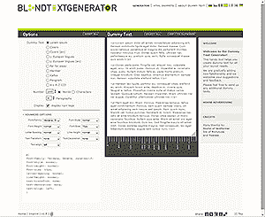
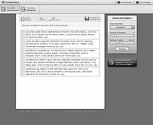
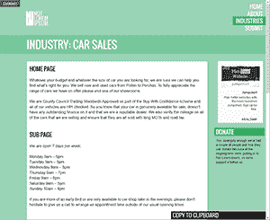
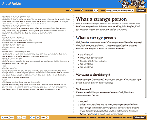
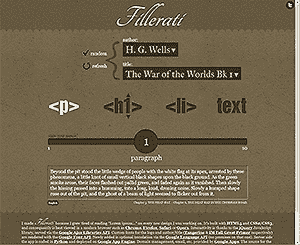
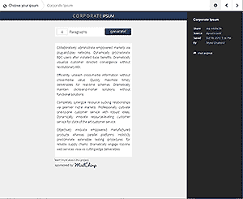
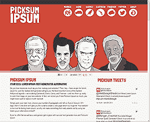
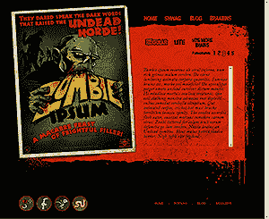
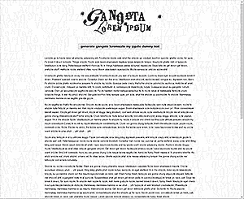
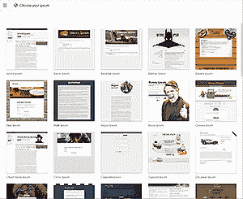

# 10 个最佳 Lorem Ipsum 替代方案

> 原文：<https://www.sitepoint.com/10-lorem-ipsum-alternatives/>

您的网站需要文本。很少有客户预先提供内容(或者实际上在开发过程中的任何时候)，所以我们很多人依赖忠实的网站，如 Lipsum.com。但是我们不需要用糟糕的拉丁语来加重我们精心制作的模型的负担…

## [盲文生成器](http://www.blindtextgenerator.com/)

盲文本生成器是一个有用的工具，它提供了 Lorem Ipsum 和一些替代品。字符、单词和段落的数量很容易控制，并且您可以设置字体来欣赏它在您的设计中的外观。

## [随机正文](http://www.randomtext.me/)

允许控制元素和字的另一种功能工具。结果可以以纯文本或 HTML 格式复制或下载。

## [不是 Lorem Ipsum](http://notloremipsum.com/)

Not Lorem Ipsum 提供基于特定行业的真实文本。看起来像真的文字，闻起来像真的文字。你的客户永远不会改变它。

## [ Fillerama](http://chrisvalleskey.com/fillerama/)

Fillerama 从包括《星球大战》、《神秘博士》、《未来》、《辛普森一家》、《巨蟒组》和《圣杯》在内的邪教剧本中获得灵感。！倪！倪！倪！倪！”

## 填充

使用儒勒·凡尔纳、赫伯特·乔治·威尔斯和刘易斯·卡罗尔等作家的过版权书籍的摘录，让你的模型更精致、更经典。结构恰当的文本可以给人以“真实”内容的更好印象。

## [企业 Ipsum](http://idsgn.dropmark.com/107/1130454)

你的客户或老板会用毫无意义的商业套话说话吗？Corporate Ipsum 允许您通过即插即用网络协同管理授权市场。

## [【pick sum ipsum】](http://www.picksumipsum.co.uk/)

Picksum Ipsum 是一个新网站，包含了最难的好莱坞传奇人物的最佳台词:伊斯特伍德，凯恩，弗里曼和，呃，凯瑞？

## [僵尸 Ipsum](http://www.zombieipsum.com/)

僵尸很时髦。他们是新的吸血鬼。僵尸 Ipsum 是一个很棒的网站，比其他产品多 50%的 braaiinnns。

## [黑帮 Lorem Ipsum](http://lorizzle.nl/)

如果你经常使用“打破僵局”和“fo shiznit dizzle”这样的短语，Gangsta Lorem Ipsum 可能会迷惑你。

## [选择你的 ipsum](http://chooseyouripsum.com/)

你没有足够的选择？前往[选择你的 ipsum](http://chooseyouripsum.com/) 寻找一系列奇怪的选择。

我错过了你的最爱吗？

## 分享这篇文章