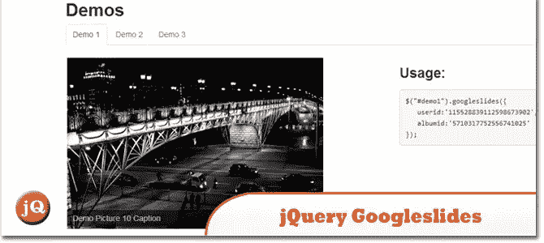
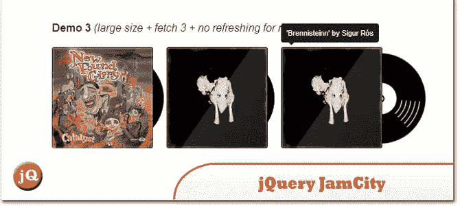
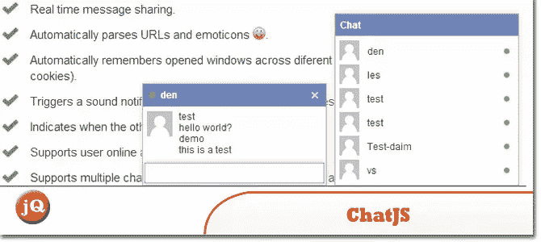
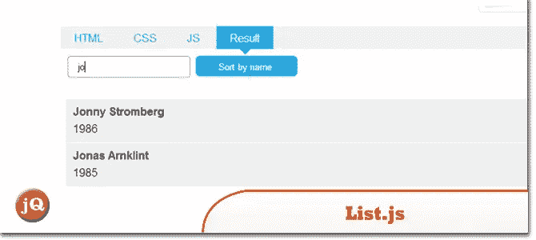
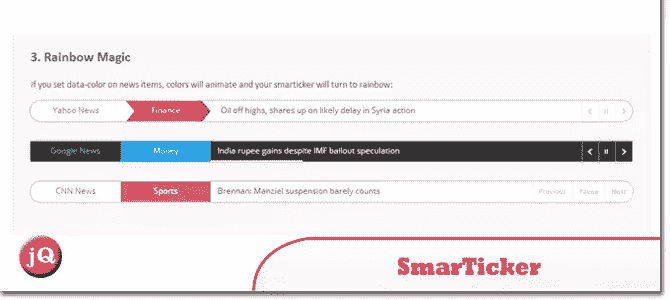
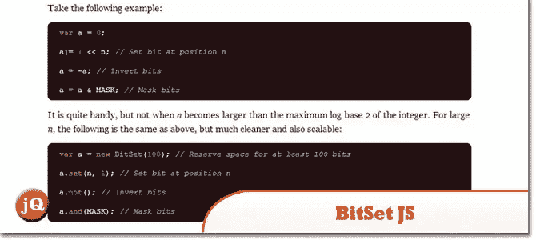
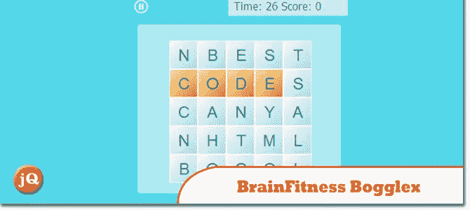
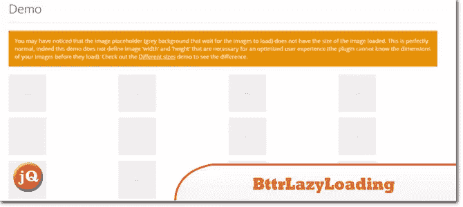

# jQuery 抓取包:10 个新插件

> 原文：<https://www.sitepoint.com/10-new-jquery-plugins/>

无论您是否热衷于使用 jQuery 来显示照片、聊天、Instagram feeds 或列表，这个最新的 jQuery 插件包都有适合每个人的东西。

## 1.jQuery googleslides

一个显示你的谷歌照片的 jQuery 插件。

## 2.jquery(即时查询)。詹姆斯市

[jquery。JamCity v. 2.0.0](http://bluetidepro.github.io/jQuery.JamCity/)

## 3.ChatJS

一个全功能、轻量级、脸书风格的即时消息 jQuery 插件。ChatJS 还提供了开箱即用的 ASP.NET/SignalR 服务器端实现。

## 4.Pongstagr.am

这是一个 jQuery 插件,可以让你使用引导前端样式和模态插件在你的网站上显示你的 Instagram 媒体。

## 5.List.js

微小、不可见且简单，但功能强大且速度惊人[普通 Javascript](http://listjs.com/) 为普通 HTML 列表、表格或任何东西增加了搜索、排序、过滤和灵活性。查看一个[演示](http://listjs.com/examples)

## 6.聪明人

一个智能 jQuery Rss 阅读器&新闻报价插件。

## 7.BitSet.js

JavaScript 中的[位向量](https://github.com/infusion/BitSet.js)实现

## 8.Bootstrap YouTube 弹出播放器插件

这个插件顾名思义，做得很好。查看一个[演示](https://www.youtube.com/watch?v=4eYSpIz2FjU)。要求:您需要 Bootstrap 3 . 0 . 0 或更高版本。引导 CSS 和 JavaScript(完整的或模态的)。引导所需的 jQuery 库。

## 9.健脑益智拼图

[html 5 brain fitness bog lex](http://codecanyon.net/item/html5-brainfitness-bogglex/full_screen_preview/7262585?ref=sdeering)。类似于流行游戏的风格，如凸版印刷，Ruzzle，争夺和拼字游戏。

## 10.BttrLazyLoading

一个 [jQuery 插件](http://jquer.in/responsive/bttrlazyloading/)，允许你的 web 应用程序只在视窗中加载图像。它还允许你有 4 个不同屏幕尺寸的不同版本的图像。查看一个[演示](http://bttrlazyloading.julienrenaux.fr/demo/)。

## 分享这篇文章