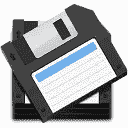
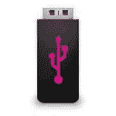
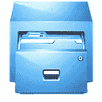
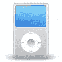
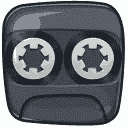
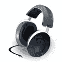
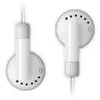
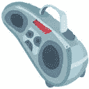

# 从你的设计中排除 10 个过时的符号

> 原文：<https://www.sitepoint.com/10-outdated-symbols-to-exclude-from-your-designs/>

时代在变…很快。事实上，如此之快，以至于网页和图形设计者经常忘记他们在设计中放置的某些符号或图标可能不再是可识别的或相关的。一代人能立即识别的符号可能对年轻一代的用户来说是完全陌生的。

像我一样，你可能还记得一个时代，那时每个人都有一部家庭电话，使用 1.44 兆的磁盘存储数据，在你的汽车里播放[录音带](https://www.sitepoint.com/create-a-retro-mixtape-in-photoshop/ "Create a Retro Mixtape in Photoshop")。然而，这些就像设计师错误使用的许多其他图标一样，应该早就消失了。

尤其是在网页设计和软件程序中，使用正确的图标至关重要。[图标常用于移动](https://www.sitepoint.com/15-great-icon-sets-for-web-mobile-apps/)或网页设计中作为导航按钮来增加吸引力，或用作软件程序中工具的按钮。但是，如果使用的符号不再有效或有意义，那么它们会让你的设计看起来过时。更糟糕的是，不相关的符号可能会给不理解符号表示的用户带来可用性问题。

所以，看看下面的十个过时的图标，你可能应该从你的设计中排除。确保这些都不会出现在你的设计中——除非在非常特殊的情况下——这样你就更有可能保持你作为一个现代的、有前瞻性思维的设计师的声誉。

* * *

### 1.)3.5 英寸/ 1.44 MB 软盘

你们中的许多人正处于千禧年一代的开端，在此之前的几代人可能在学校或工作中使用 3.5 英寸的软盘来传输和存储文件。所以，你可能知道一个 1.44 MB 软盘的图标被用来象征一个“保存”功能。大多数年轻用户不知道这个图标是什么，所以用 u 盘图标代替。

* * *

### 2.)剪贴板

还记得人们用剪贴板做笔记和携带信息的日子吗？今天，除非你是足球教练，否则我们只用手机或平板电脑。使用剪贴板图标进行剪切/粘贴的诱惑可能很大，但是使用剪刀和胶水图标会更好。

* * *

### 3.)调色板

许多软件程序仍然使用调色板图标来表示某种颜色功能。然而，今天的年轻一代可能并不喜欢在调色板上画画，这仅仅是因为图形设计师在电脑或触摸屏上画画，而你肯定*不想*在上面画画。请改用色轮。

* * *

### 4.)文件柜

是的，有些办公室确实还在使用文件柜；小企业不愿意转向数字存档。然而，事实是，如果你为一个图标放一个文件柜，没有人会认为你的设计是现代的。文件夹也可能看起来过时，但它们仍然被大量使用。避免文件柜的形象，使用更新的文件夹外观。

* * *

### 5.)路标

仍然有路标有效的例子。但是反对在设计中为[按钮使用这种图标的理由是，许多界面用户太年轻而不能开车，所以他们将无法识别特定的路标图标或从图像中收集内涵。例外情况是常见的，无处不在的路标，如“停止”但是，除了懒洋洋地扔出一个普通的停车标志，还有许多更有创意、更有效的选择。](https://www.sitepoint.com/15-free-button-and-ui-kit-psds-for-your-web-projects/)

* * *

### 6.)电话

 

越来越多的家庭将座机换成了手机。事实上，许多年轻用户可能甚至不知道一部老式家用手机是什么样子的。有这么多优秀的手机图标，那么你为什么不用它们来代替电话图标呢？

 

* * *

### 7.)录音带/光盘

 

我时不时会碰到用 CD 听音乐的人；我甚至很少看到有人使用录音带。大多数界面用户从 iTunes 或类似的数字市场下载歌曲，在他们的智能手机或 iPods 上播放音乐。所以，用一个更现代的图标代替。跟上苹果产品的发展是令人抓狂的，但是向前跳跃 20 年到任何基本的 iPod 都是一个巨大的进步。

* * *

### 8.录音机/录音机

再说一次，很少有人仍然使用录音机或录音机来记录音频笔记或电话。电话公司通过他们自己的录音站转接未接来电。而且，人们使用他们的智能手机或数字录音设备，可以将它们插入笔记本电脑或 iPods。您可能只想使用麦克风图标或红色录音按钮图标来代替。

* * *

### 9.)耳机

如今，很少看到有人戴着全录音棚耳机走在街上。大多数耳机都配有一套耳塞，方便随时收听。如果你需要一个图标来象征音乐或其他相关动作，那么使用耳塞图标或简单的向右箭头。

* * *

### 10.)过时的机器

 

仅仅在五年或十年前广泛使用的许多机器现在占据了垃圾填埋场的大量空间。一个永远不应该使用的老式机器图标是一个大的、盒状的 CRT 电脑显示器。许多用户已经转向笔记本电脑或平板显示器，并将笨重、陈旧的电脑显示器视为一个笑话。其他要避免的过时的机器符号是传真机、旧收银机、打字机、“音箱”和电唱机。

* * *

随着技术的快速发展，你可能会想每隔几年就检查一下你对某些图标的使用。当新技术出现时，旧版本不再使用只是时间问题。你能想到今天设计师应该避免的图标/符号吗？

## 分享这篇文章